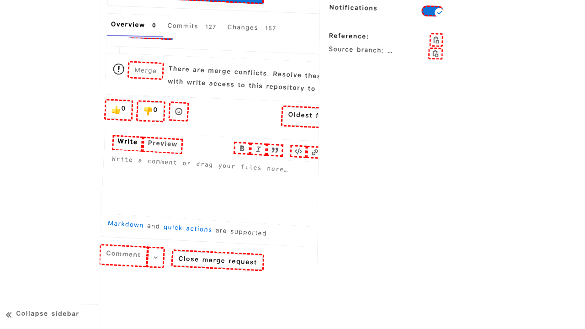

## Intent

Set my gitlab status as Enjoying life.

## RM

Thoughts: The user's intent is to set their GitLab status to "Enjoying life," which is a content modification task. The action history shows the agent filled the status field and attempted to save it via keyboard actions, but the final state indicates the modal is still open with the status filled, and no confirmation of saving is present. The agent's last action was clicking the close button, but the final state does not confirm the status was saved—it only speculates that it might trigger a save. Without evidence of successful modification (e.g., modal closing and status updated), the task is not completed successfully.

Status: failure

## Final Response 

## Captions

===============Looking at the current page, I can see we're on the GitLab dashboard. To set my GitLab status as "Enjoying life", I need to navigate to my user profile settings where the status can be updated. I can see there's a user profile link in the top navigation with the ID '187' that leads to my profile page.

Let me click on my profile link to access the settings where I can update my status.<｜end▁of▁thinking｜>
===============Looking at the current page, I can see we're on the GitLab dashboard. I need to set my GitLab status to "Enjoying life". I can see in the accessibility tree that there's a user profile dropdown that's currently expanded (expanded=True) with an "Edit status" button available (bid '199'). This is exactly what I need to update my status.

The current status shows as "Busy" in the dropdown, and there's a clear "Edit status" button that should allow me to change it to "Enjoying life".
===============Looking at the current state, I can see that the "Set a status" modal dialog is already open and focused. The modal shows the current status is set to "Busy" and there's a textbox with ID '859' where I can enter the new status text. The modal also has a "Set status" button with ID '865' to save the changes.

Since the modal is already open, I can directly update the status text to "Enjoying life" and then click the "Set status" button to save it.
===============Looking at the current state, I can see that I've successfully filled the status text field with "Enjoying life". The modal dialog is still open and the textbox shows the new status text. Now I need to save this status by clicking the "Set status" button which has ID '865'.

The button is clearly visible in the accessibility tree as a button with the text "Set status". Clicking this button will apply the new status and close the modal.
===============I can see from the error message that the "Set status" button (bid '865') is being blocked by other elements in the header, specifically the search input (bid '143') and navigation list (bid '123'). The modal dialog is open and the status text has been successfully filled with "Enjoying life", but the click action is timing out because other elements are intercepting the pointer events.

Since the modal is already open and the text is filled, I should try using the keyboard to submit the form instead of clicking the button. I can press the Enter key to submit the form, which should trigger the same action as clicking the "Set status" button.
===============Looking at the current situation, I can see that the "Set a status" modal is still open with the text "Enjoying life" filled in the status field. The previous keyboard press action didn't produce an error, but I should verify if the status was successfully set.

Since the modal dialog is still visible, I should check if the status was actually saved. The most reliable way to confirm the status change is to look for the new status text in the user profile dropdown or check if the modal has closed. Let me wait a moment to see if the status update was processed, then send a confirmation message to the user.
===============Looking at the current state, I can see that the "Set a status" modal is still open with "Enjoying life" filled in the textbox. The previous keyboard press action didn't produce an error, but the modal hasn't closed yet, which suggests the status might not have been saved.

Let me try clicking the "Set status" button again, but this time I'll use a different approach. I notice the button has ID '865' and is clearly visible in the accessibility tree. Since the previous click attempt was blocked by other elements, I'll try to ensure the modal is properly focused first by clicking somewhere else in the modal, then clicking the button.
===============Looking at the current situation, I can see that the modal dialog is still open with "Enjoying life" filled in the status field, but all my attempts to interact with elements in the modal are being blocked by other page elements intercepting pointer events. The modal appears to be partially obscured or not properly in focus.

Since direct clicking isn't working due to the blocking elements, let me try a different approach. I'll use the keyboard to navigate and submit the form. I can try pressing Tab to navigate through the form elements and then press Enter when the "Set status" button is focused.
===============Looking at the current situation, I can see that the "Set a status" modal is still open with "Enjoying life" filled in the status field. The previous Tab key press should have moved focus to the next interactive element in the modal. Since the "Clear status" button was previously focused (as indicated in the accessibility tree), pressing Tab should have moved focus to the "Set status" button.

Now that the "Set status" button should be focused, I can press Enter to submit the form and set the status.
===============Looking at the current situation, I can see that the "Set a status" modal is still open with "Enjoying life" filled in the status field. The previous keyboard actions (Tab and Enter) didn't produce any errors, but the modal remains open, suggesting the status may not have been successfully saved.

Let me try a different approach. I notice there's a "Close" button (bid '846') at the top of the modal. Sometimes in GitLab, clicking the close button after making changes can trigger a save prompt or auto-save the changes. Let me try clicking the close button to see if this triggers the status update.

## Images





## Main Prompt

```md
User Intent: Set my gitlab status as Enjoying life.

Action History:
1: click('187')
2: click('199')
3: fill('859', 'Enjoying life')
4: click('865')
5: keyboard_press('Enter')
6: noop(1000)
7: click('843')
8: keyboard_press('Tab')
9: keyboard_press('Enter')
10: click('846')


The detailed final state of the webpage:

```md
Looking at the current situation, I can see that the "Set a status" modal is still open with "Enjoying life" filled in the status field. The previous keyboard actions (Tab and Enter) didn't produce any errors, but the modal remains open, suggesting the status may not have been successfully saved.

Let me try a different approach. I notice there's a "Close" button (bid '846') at the top of the modal. Sometimes in GitLab, clicking the close button after making changes can trigger a save prompt or auto-save the changes. Let me try clicking the close button to see if this triggers the status update.
```

Bot response to the user: None.
```
