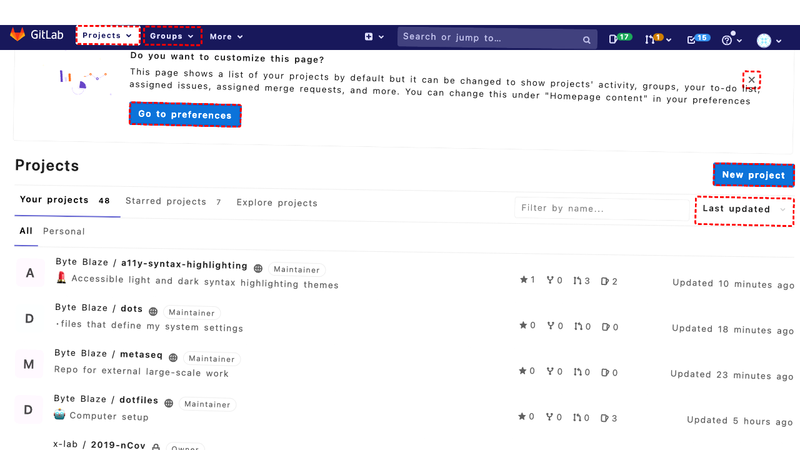
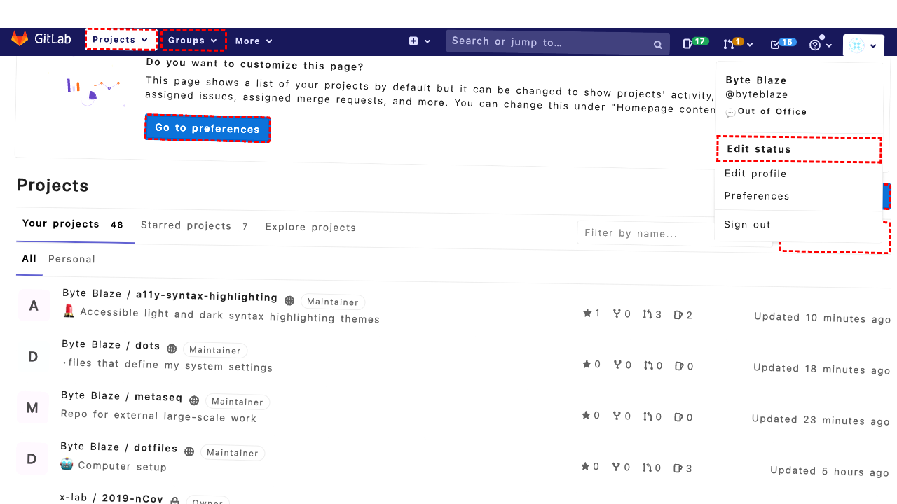
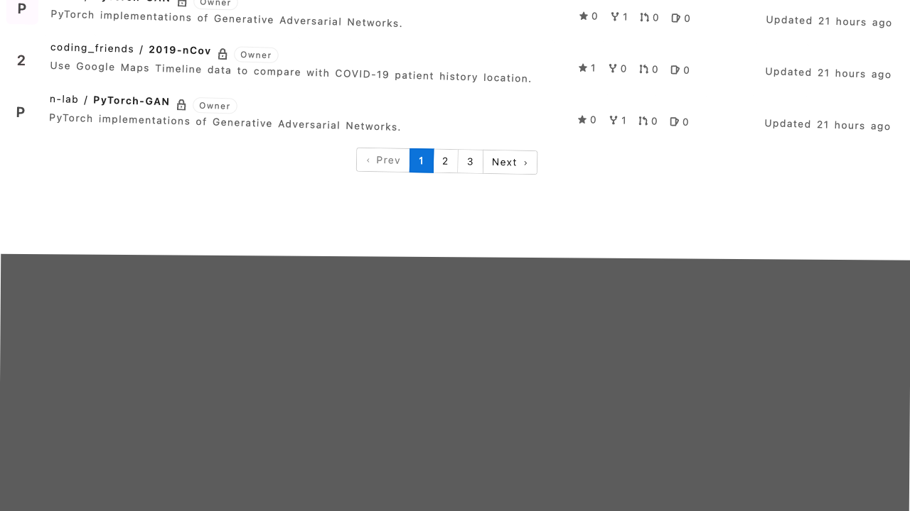

## Intent

Open the article 'Ruby 4.0 update brings ZJIT, isolation features, and more' and check if it contains an image related to 'iPad Mini'.

## RM

Thoughts: The user's intent is to open a specific article and check if it contains an image related to 'iPad Mini'. This is an information-seeking task. The agent's action history shows it performed a search (actions 1-3) and then clicked on the article (action 4). The final state confirms the agent is on the correct article page and has identified an image with alt text "Hand holding an iPad Mini." The bot's response correctly states that the article contains the relevant image and provides a description. The actions taken (searching, navigating to the article, and examining the content) are sufficient to answer the query accurately.

Status: "success"

## Final Response "Yes, the article contains an image related to 'iPad Mini'. The image shows a hand holding an iPad Mini and is located in the article content."

## Captions

===============Looking at the current page, I need to open the article titled "Ruby 4.0 update brings ZJIT, isolation features, and more". This article is not visible in the current list of posts on the homepage. I should use the site search to find it. The search bar is present with bid "370" and the search button with bid "371". I'll search for "Ruby 4.0 update brings ZJIT, isolation features, and more" and then click the result.

First, click the search bar to focus it, then fill with the article title, then click search, wait for results, and click the link.
===============Looking at the current page, I've already clicked the search bar (bid 370). Now I need to fill it with the article title "Ruby 4.0 update brings ZJIT, isolation features, and more" to search for it.
===============Looking at the current state, I've already clicked the search bar and filled it with the article title. The next step is to click the search button (bid "371") to submit the query and get the search results.
===============Looking at the current page, I can see that the search has already been executed successfully. The page title is "Search Results for 'Ruby 4.0 update brings ZJIT, isolation features, and more'", and the search results show the exact article I need. The article link is present with bid "85" (the link inside the heading). I should click that link to open the article, then I can check for an image related to 'iPad Mini'.
===============Looking at the current page, I can see that I'm already on the article page for "Ruby 4.0 update brings ZJIT, isolation features, and more" (the URL is `http://localhost:8000/?p=5`). The goal is to check if this article contains an image related to 'iPad Mini'.

Scrolling through the accessibility tree, I can see several images in the article content. Specifically, I notice an image with the alt text "Hand holding an iPad Mini." at index [130] (inside paragraph [129]). This is exactly what I'm looking for.

Since I'm already on the correct page and can see the iPad Mini image is present, I should report this finding to the user.

## Images






## Main Prompt

```md
User Intent: Open the article 'Ruby 4.0 update brings ZJIT, isolation features, and more' and check if it contains an image related to 'iPad Mini'.

Action History:
1: click("370")
2: fill("370", "Ruby 4.0 update brings ZJIT, isolation features, and more")
3: click("371")
4: click("85")
5: send_msg_to_user("Yes, the article contains an image related to 'iPad Mini'. The image shows a hand holding an iPad Mini and is located in the article content.")


The detailed final state of the webpage:

```md
Looking at the current page, I can see that I'm already on the article page for "Ruby 4.0 update brings ZJIT, isolation features, and more" (the URL is `http://localhost:8000/?p=5`). The goal is to check if this article contains an image related to 'iPad Mini'.

Scrolling through the accessibility tree, I can see several images in the article content. Specifically, I notice an image with the alt text "Hand holding an iPad Mini." at index [130] (inside paragraph [129]). This is exactly what I'm looking for.

Since I'm already on the correct page and can see the iPad Mini image is present, I should report this finding to the user.
```

Bot response to the user: "Yes, the article contains an image related to 'iPad Mini'. The image shows a hand holding an iPad Mini and is located in the article content.".
```
