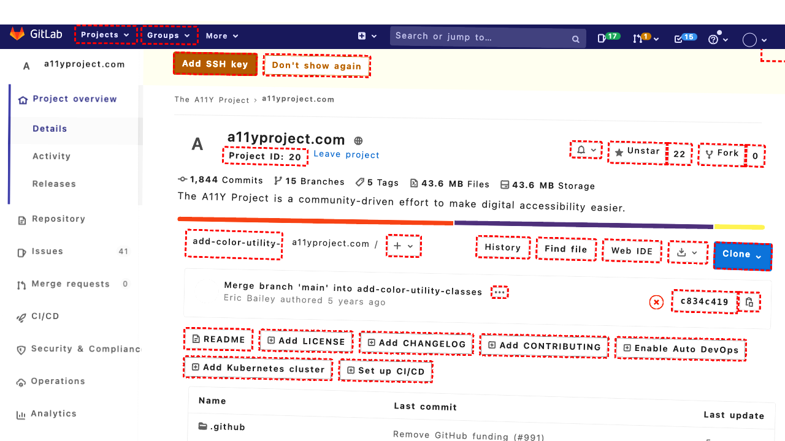
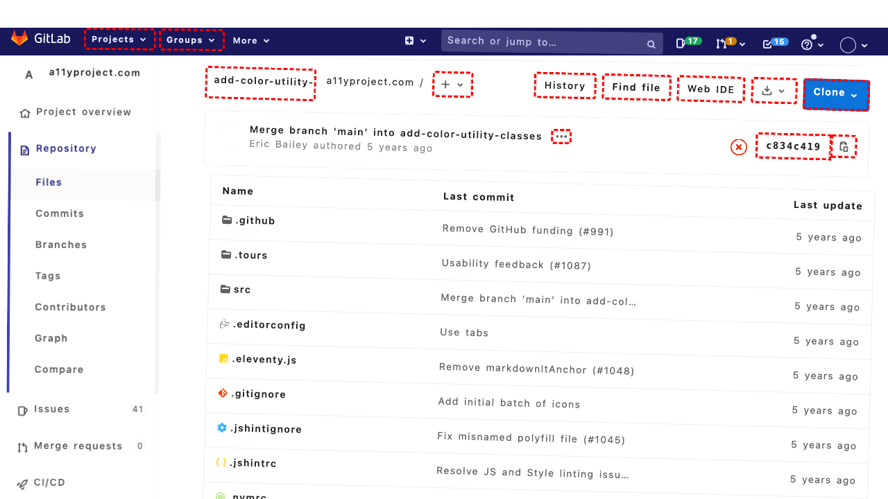

## Intent

Find the article titled '40 Of Our Most Helpful AI Tips From 2025'.

## RM

Thoughts: The user's intent is to find the article titled '40 Of Our Most Helpful AI Tips From 2025'. This is an information-seeking task where the agent must locate and present the article. The action history shows the agent performed a search (fill and click) and then clicked on element '85', which from the final state description is the link to the article. The final state indicates the agent successfully identified the correct article link and clicked it, which should navigate to the article page. However, the bot's response to the user is "None", meaning no information was provided to the user. For an information-seeking task, the bot must respond with the requested information or state it's unavailable. Since the bot didn't respond, the task fails despite the agent's actions likely leading to the correct page.

Status: failure

## Final Response 

## Captions

===============Looking at the current page, I can see it's a blog homepage with multiple articles. The goal is to find the article titled "40 Of Our Most Helpful AI Tips From 2025". I don't see this article in the current list of articles on the main page. I should use the search functionality to find this specific article.

I can see there's a search box in the complementary section with bid 370. I'll use that to search for the article.
===============Looking at the accessibility tree, I can see that the search box (bid 370) already has the text "40 Of Our Most Helpful AI Tips From 2025" in it. This suggests my previous fill action was successful. Now I need to submit the search by either pressing Enter or clicking the search button. The search button has bid 371. I'll click it to perform the search.
===============Looking at the current page, I can see it's already showing search results for "40 Of Our Most Helpful AI Tips From 2025". The first article in the results is exactly the one we're looking for: "40 of our most helpful AI tips from 2025" with a link to http://localhost:8000/?p=103. The goal is to find this article, which means we should navigate to it. I can click on the article title link to open the full article.

From the accessibility tree, I can see the link for the article title has bid 85. I'll click on it to open the article.

## Images




## Main Prompt

```md
User Intent: Find the article titled '40 Of Our Most Helpful AI Tips From 2025'.

Action History:
1: fill('370', '40 Of Our Most Helpful AI Tips From 2025')
2: click('371')
3: click('85')


The detailed final state of the webpage:

```md
Looking at the current page, I can see it's already showing search results for "40 Of Our Most Helpful AI Tips From 2025". The first article in the results is exactly the one we're looking for: "40 of our most helpful AI tips from 2025" with a link to http://localhost:8000/?p=103. The goal is to find this article, which means we should navigate to it. I can click on the article title link to open the full article.

From the accessibility tree, I can see the link for the article title has bid 85. I'll click on it to open the article.
```

Bot response to the user: None.
```
