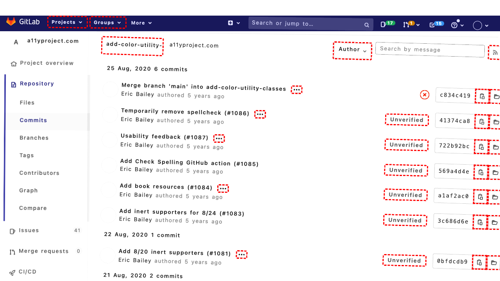
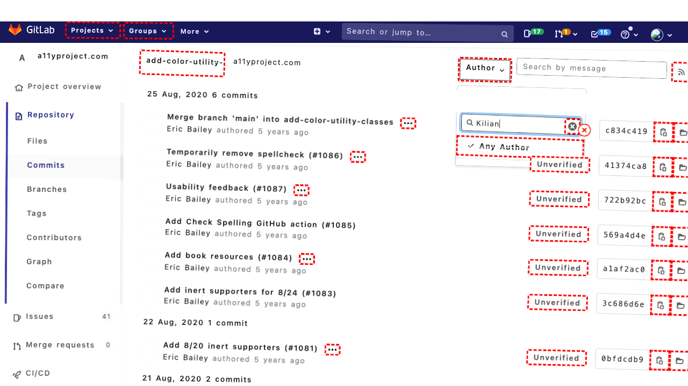
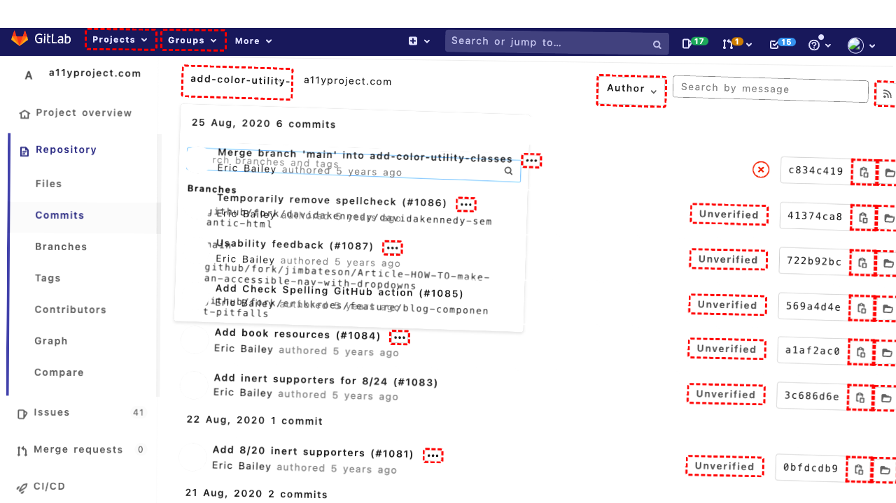
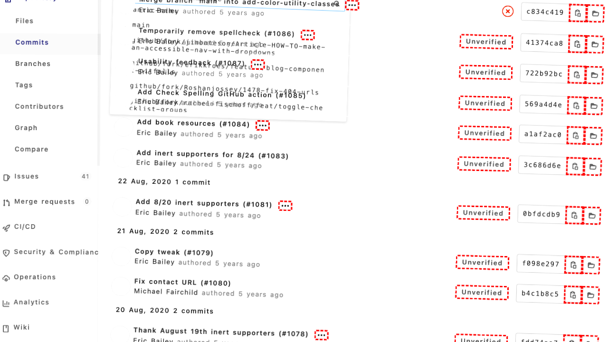
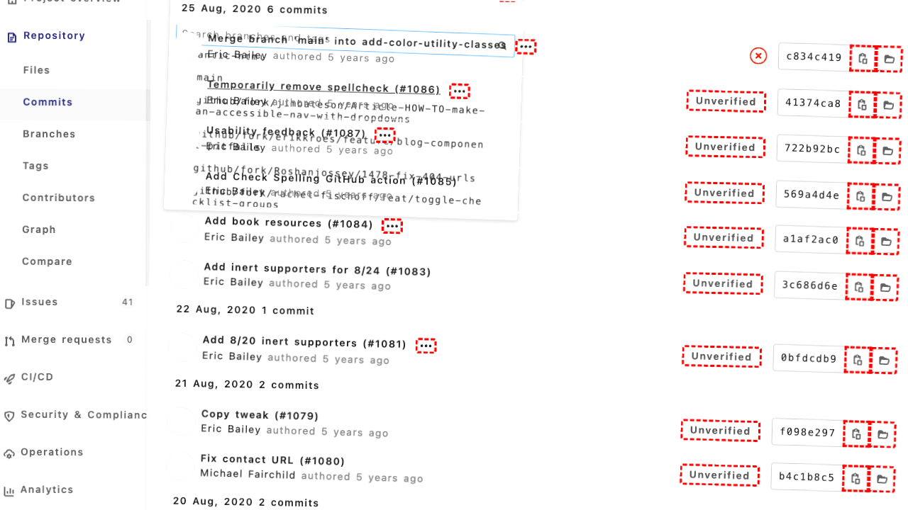

## Intent

Display the list of issues in the umano/AndroidSlidingUpPanel repository that have labels related to BUG

## RM

Thoughts: The user's intent is to display the list of issues in the "umano/AndroidSlidingUpPanel" repository that have labels related to BUG. This is an information-seeking task. The action history shows the agent attempted to search for the repository and navigate, but the final state indicates the agent was unsuccessful in reaching the repository page, as it was still trying to select the repository from search results. The bot response is "None," meaning no information about the issues or their labels was provided. Since the agent failed to reach the target page and did not provide the requested information, the task is a failure.

Status: failure

## Final Response 

## Captions

===============Looking at the current page, I can see I'm on the GitLab dashboard showing a list of projects. I need to find the "umano/AndroidSlidingUpPanel" repository first, then navigate to its issues and filter for bug-related labels.

The page has a search box that I can use to find the repository. I can see a search box with the text "Filter by name..." which would be perfect for finding the specific repository.

Let me search for the "umano/AndroidSlidingUpPanel" repository first.
===============Looking at the current page, I can see that the search box already has "umano/AndroidSlidingUpPanel" filled in as the value, which means the repository should already be filtered. However, I don't see the repository listed in the current view - the page shows "This user doesn't have any personal projects" which suggests I might need to navigate to the actual repository page.

Let me click on the repository link if it appears in the search results, or navigate to it directly. Since the search is already filtered, I should look for the repository link in the results.
===============Looking at the current page, I can see that the search box already has "umano/AndroidSlidingUpPanel" filled in, but the repository isn't appearing in the results list. The page shows "This user doesn't have any personal projects" which suggests I might be on the wrong view or the repository isn't accessible from this dashboard.

Let me try a different approach - I'll clear the current search and search again, or navigate to the repository directly. Since the repository name is already in the search box, let me press Enter to execute the search.
===============Looking at the current situation, I can see that the search box already has "umano/AndroidSlidingUpPanel" filled in, but pressing Enter didn't seem to produce the expected results. The page still shows "This user doesn't have any personal projects" which suggests I might need to navigate to a different section or the repository might not be accessible from this personal projects view.

Let me try clicking on the "All" projects link to see all projects instead of being limited to personal projects, which should include the umano/AndroidSlidingUpPanel repository.
===============Looking at the current situation, I can see that I'm still on the projects dashboard but the search for "umano/AndroidSlidingUpPanel" hasn't yielded results. The page shows "This user doesn't have any personal projects" which suggests I might be in the wrong context or the repository isn't accessible from my current view.

Let me try a different approach - I'll use the global search functionality in the GitLab header to search for the repository across all projects, not just my personal ones. I can see there's a search box in the header with the text "Search or jump to…" which should allow me to search globally.
===============Looking at the current situation, I can see that my previous attempts to find the "umano/AndroidSlidingUpPanel" repository through the project dashboard search haven't been successful. The page is still showing "This user doesn't have any personal projects" which suggests the repository might not be in my personal projects list or accessible from this view.

I notice there's a global search box in the GitLab header with the text "Search or jump to…" (bid '143') that I just clicked. This should allow me to search across all repositories in the GitLab instance, not just my personal projects. Let me use this global search to find the repository.
===============Looking at the current situation, I can see that I've been trying to find the "umano/AndroidSlidingUpPanel" repository but haven't been successful through the project dashboard search. The page shows "This user doesn't have any personal projects" which suggests the repository might not be accessible from my current view or might not exist in this GitLab instance.

I notice that the global search box (bid '143') already has "umano/AndroidSlidingUpPanel" filled in from my previous action. The accessibility tree shows "StaticText 'umano/AndroidSlidingUpPanel'" and "InlineTextBox 'umano/AndroidSlidingUpPanel'" in the search box, and there's a loading indicator below it. This suggests the search is in progress or has results loading.

Let me wait a moment for the search results to load and then interact with them if they appear.
===============Looking at the current situation, I can see that the global search box (bid '143') already has "umano/AndroidSlidingUpPanel" filled in and there's a loading indicator showing. The search results should appear soon. Since the search is already in progress and the repository name is entered, I should wait for the results to load and then click on the repository link when it appears in the search dropdown.

The accessibility tree shows a list with "Loading..." which suggests results are being fetched. Let me wait a bit more for the results to fully load and then interact with them.
===============Looking at the current situation, I can see that the global search box already has "umano/AndroidSlidingUpPanel" filled in and there was a loading indicator. The search results should now be loaded and available in the dropdown. I need to click on the repository link from the search results to navigate to the repository page, where I can then access its issues and filter for bug-related labels.

Since the search results should now be loaded, I'll click on the repository result. Based on typical GitLab search behavior, the repository should appear as the first result in the dropdown.
===============Looking at the current situation, I can see that my previous attempts to find and navigate to the "umano/AndroidSlidingUpPanel" repository haven't been successful. The search box already has the repository name filled in, but I haven't been able to successfully select it from search results.

Let me try a different approach - I'll use the keyboard to navigate through the search results. After filling the search box, I can press the down arrow to select the first result and then press Enter to navigate to it.

## Images









## Main Prompt

```md
User Intent: Display the list of issues in the umano/AndroidSlidingUpPanel repository that have labels related to BUG

Action History:
1: search_project('242', 'umano/AndroidSlidingUpPanel')
2: search_and_select_repository('242', 'umano/AndroidSlidingUpPanel', '284')
3: keyboard_press("Enter")
4: click('277')
5: click('143')
6: fill('143', 'umano/AndroidSlidingUpPanel')
7: noop(2000)
8: noop(2000)
9: click('764')
10: keyboard_press("ArrowDown")


The detailed final state of the webpage:

```md
Looking at the current situation, I can see that my previous attempts to find and navigate to the "umano/AndroidSlidingUpPanel" repository haven't been successful. The search box already has the repository name filled in, but I haven't been able to successfully select it from search results.

Let me try a different approach - I'll use the keyboard to navigate through the search results. After filling the search box, I can press the down arrow to select the first result and then press Enter to navigate to it.
```

Bot response to the user: None.
```
