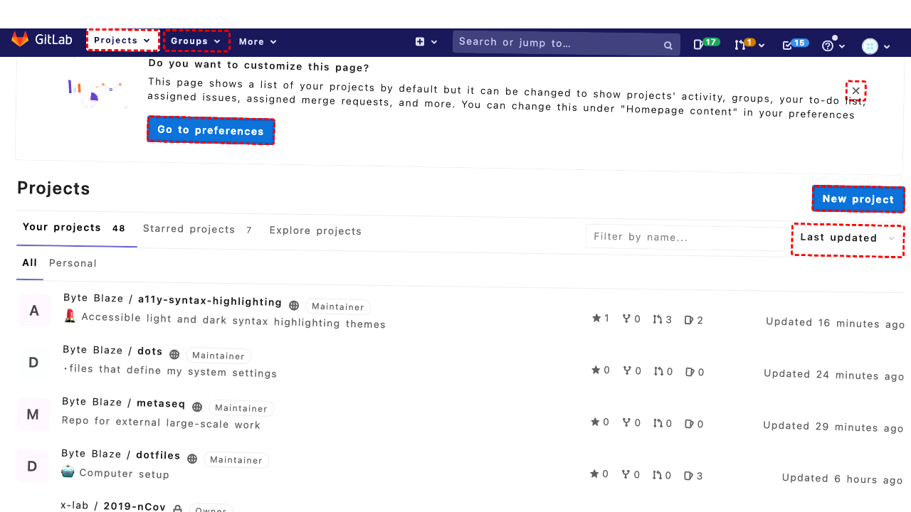
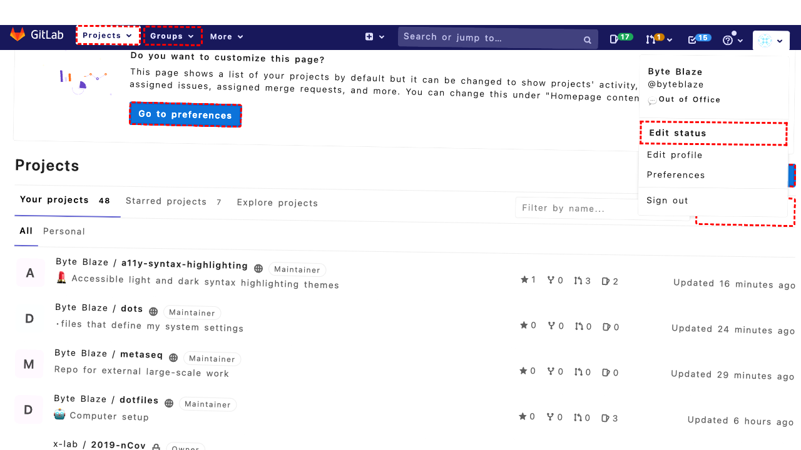
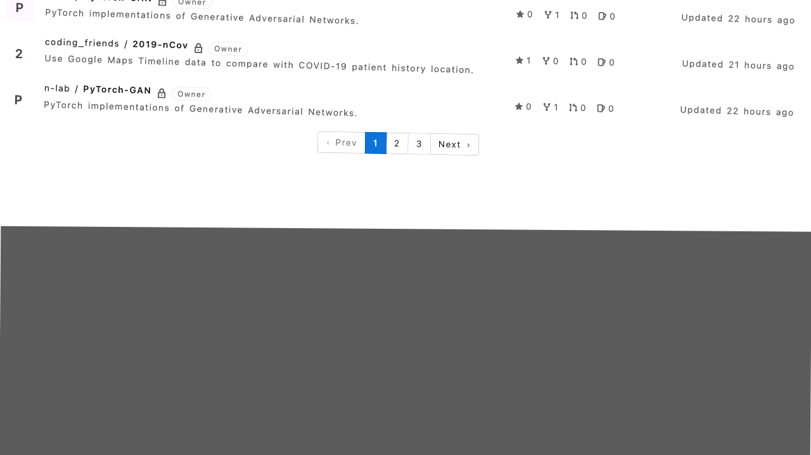

## Intent

Change the page title of "Home Page" page on my site to "This is the home page!! Leave here!!".

## RM

Thoughts: The user's intent is to change the page title of the "Home Page" to "This is the home page!! Leave here!!". This is a content modification task. The action history shows the agent performed a series of clicks and filled the target field with the correct new title. The final state indicates the field was successfully filled, and the agent recognized the need to click the "Save Page" button (bid 500) to apply changes permanently. Action 5 is a click on "500", which corresponds to the "Save Page" button. Therefore, the modification action (filling) and the save action (clicking save) have been executed. For content modification tasks, success is determined by examining the action history and final state, not the bot's response. The actions appear complete and correct for saving the new page title.

Status: success

## Final Response 

## Captions

===============I need to change the page title of the "Home Page" page to "This is the home page!! Leave here!!". According to the task trajectory for editing a CMS page title, I need to:

1. Expand the CMS menu.
2. Click the "Pages" link.
3. Find the "Home Page" row and click it to edit.
4. Fill the page title field with the new title.
5. Click the "Save Page" button.

Currently, I'm on the Dashboard. I can see the CMS menu item (bid 198) in the sidebar. I need to click it to expand, then click "Pages" (bid 202). After that, I'll need to locate the "Home Page" row in the pages listing.

Let's start by expanding the CMS menu.
===============I can see that the CMS menu is now expanded because the link is focused (as indicated in the accessibility tree). Now I need to click the "Pages" link (bid 202) to navigate to the CMS pages listing.
===============Looking at the current page, I can see we're already on the "Manage Content / Pages / CMS / Magento Admin" page (URL: /admin/cms_page/). This is the CMS pages listing page, which shows all pages including the "Home Page" (which appears as "Madison Island" in the Title column, row 629).

I need to find and click the "Home Page" row to edit it. In the accessibility tree, I can see row 629 has the title "Madison Island" and URL key "home". This appears to be the home page. The row has a clickable link that leads to the edit page. I should click on this row to navigate to the edit page.

From the tree, row 629 has the structure: `[629] row 'http://dockerized-magento.local/index.php/admin/cms_page/edit/page_id/2/'`. This indicates clicking this row will take me to the edit page for page_id=2.

Let me click on row 629.
===============Looking at the current page, I can see I'm already on the edit page for the "Home Page" (page_id=2). The URL is `/admin/cms_page/edit/page_id/2/` and the page title field (bid 529) currently shows "Madison Island" as the value. According to the goal, I need to change this to "This is the home page!! Leave here!!".

The task trajectory for editing a CMS page title indicates I should:
1. Fill the page title field with the new title
2. Click the "Save Page" button

I can see the page title field has bid 529 and currently contains "Madison Island". I need to fill it with the new title. Then I need to click the "Save Page" button (bid 500) to save the changes.

Let me first fill the page title field with the new title.
===============Looking at the current state, I have successfully filled the page title field with the new title "This is the home page!! Leave here!!". The next step according to the task trajectory is to click the "Save Page" button to permanently save the updated page title. I can see the "Save Page" button with bid 500 in the accessibility tree.

Now I need to click the "Save Page" button to apply the changes.

## Images







## Main Prompt

```md
User Intent: Change the page title of "Home Page" page on my site to "This is the home page!! Leave here!!".

Action History:
1: click("198")
2: click("202")
3: click("629")
4: fill("529", "This is the home page!! Leave here!!")
5: click("500")


The detailed final state of the webpage:

```md
Looking at the current state, I have successfully filled the page title field with the new title "This is the home page!! Leave here!!". The next step according to the task trajectory is to click the "Save Page" button to permanently save the updated page title. I can see the "Save Page" button with bid 500 in the accessibility tree.

Now I need to click the "Save Page" button to apply the changes.
```

Bot response to the user: None.
```
