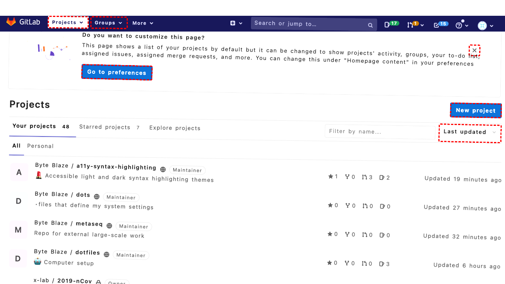
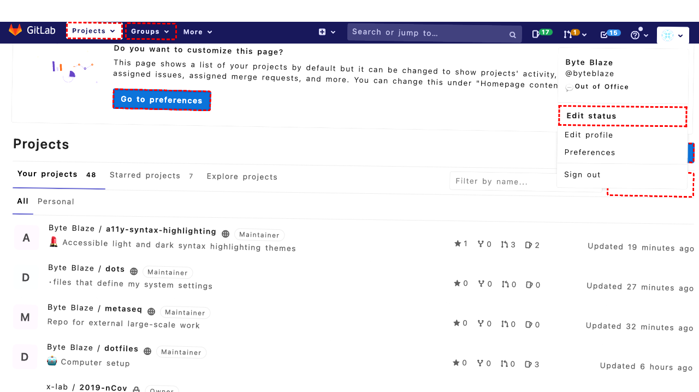

## Intent

Change the page title of "Privacy Policy" page on my site to "No privacy policy is needed is this dystopian world".

## RM

Thoughts: The user's intent is to change the page title of the "Privacy Policy" page to a specific new title. This is a content modification task. The action history shows the agent performed a series of actions: clicking various elements, filling the field with the new title (action 6), and finally clicking the "Save Page" button (action 7). The final state of the webpage indicates that the page title field already contains the new title and the agent recognized the need to save changes. Since the agent successfully filled the title and clicked the save button, the content modification should be complete. For content modification tasks, we examine the action history and final state to determine success; the bot's response is not needed. The actions appear to have successfully executed the modification.

Status: success

## Final Response 

## Captions

===============I need to change the page title of the "Privacy Policy" page. I'm currently on the Magento admin dashboard. To edit a page, I need to navigate to the CMS pages section. Looking at the accessibility tree, I can see there's a "CMS" menu item (bid 198) that likely contains a "Pages" link (bid 202). I should click on that to access the page management.

First, I'll hover over the CMS menu to expand it, then click on Pages.
===============Looking at the accessibility tree, I can see that after clicking the "CMS" menu (bid 198), I should now see the expanded submenu. I need to click on "Pages" (bid 202) to navigate to the page management section where I can find and edit the Privacy Policy page.
===============Looking at the accessibility tree, I can see that after clicking "Pages" (bid 202), I'm now on the "Manage Pages" page. I can see a table listing all CMS pages, and I can see "Privacy Policy" listed in row 659 (with cell text "Privacy Policy"). To edit this page, I need to click on the row or find an edit link. Looking at the row structure, each row appears to be a clickable link (the row has a URL pattern like `/admin/cms_page/edit/page_id/6/`). I should click on the "Privacy Policy" row to edit it.

From the accessibility tree, row 659 has the URL pattern and contains the "Privacy Policy" text. I'll click on that row to navigate to the edit page.
===============Looking at the current state, I can see I'm already on the edit page for the Privacy Policy page (URL: `/admin/cms_page/edit/page_id/6/`). The goal is to change the page title from "Privacy Policy" to "No privacy policy is needed is this dystopian world".

From the accessibility tree, I can see there's a textbox with bid 529 that currently has the value "Privacy Policy" and is labeled "Page Title *". This is the field I need to edit. I should focus on this field, clear its current content, and enter the new title.
===============Looking at the current state, I can see that the page title field (bid 529) already contains the new title "No privacy policy is needed is this dystopian world" according to the accessibility tree. This suggests my previous fill action was successful. Now I need to save the changes. I can see several buttons at the top of the page: "Save Page" (bid 500), "Save and Continue Edit" (bid 504), etc. I should click "Save Page" to save the changes and complete the task.

## Images





## Main Prompt

```md
User Intent: Change the page title of "Privacy Policy" page on my site to "No privacy policy is needed is this dystopian world".

Action History:
1: click('198')
2: noop(500)
3: click('202')
4: click('202')
5: click('659')
6: fill('529', 'No privacy policy is needed is this dystopian world')
7: click('500')


The detailed final state of the webpage:

```md
Looking at the current state, I can see that the page title field (bid 529) already contains the new title "No privacy policy is needed is this dystopian world" according to the accessibility tree. This suggests my previous fill action was successful. Now I need to save the changes. I can see several buttons at the top of the page: "Save Page" (bid 500), "Save and Continue Edit" (bid 504), etc. I should click "Save Page" to save the changes and complete the task.
```

Bot response to the user: None.
```
