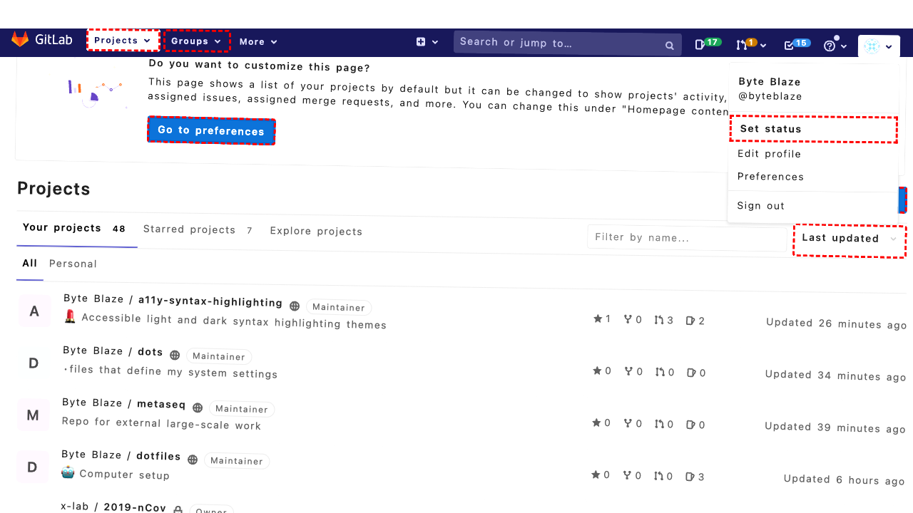

## Intent

Set my gitlab status as Resting due to leg injury.

## RM

Thoughts: The user's intent is to set their GitLab status to "Resting due to leg injury," which is a content modification task. The action history shows that the agent filled the status text correctly and attempted to navigate using Tab keys, but the final state indicates the modal dialog is still open and the "Set status" button has not been clicked. Without clicking the "Set status" button, the status modification is not actually applied. Therefore, the task is not successfully completed.

Status: failure

## Final Response 

## Captions

===============Looking at the current page, I can see we're on the GitLab dashboard. To set a GitLab status, I need to navigate to user settings where the status can be updated. I notice there's a user profile link in the top right corner (the "Byte Blaze" link with ID 225), which should lead to user settings where I can set the status.

Let me click on the user profile link to access the settings menu.<｜end▁of▁thinking｜>
===============Looking at the accessibility tree, I can see that after clicking the user profile link (ID 225), the menu expanded and now shows a "Set status" button with ID 235. This is exactly what I need to set the GitLab status. I should click this button to open the status setting interface.
===============Looking at the current state, I can see that a modal dialog has appeared with the heading "Set a status" (ID 1021). This is the status setting interface I need. The modal contains:

- An "Add status emoji" button (ID 1030, currently focused)
- A textbox for "What's your status?" (ID 1036)
- A "Busy" checkbox (ID 1043)
- A "Clear status after" dropdown (ID 1052)
- Action buttons at the bottom including "Set status" (ID 1092)

To set my status as "Resting due to leg injury", I need to:
1. Fill the status textbox with the message
2. Click the "Set status" button

Let me first fill the status textbox with the required message.
===============Looking at the current state, I can see that the status textbox (ID 1036) already has the value "Resting due to leg injury" filled in from my previous action. The textbox is focused and the status message is ready. Now I just need to click the "Set status" button at the bottom of the modal to apply this status.

The "Set status" button has ID 1092, which is clearly visible in the accessibility tree as part of the modal's footer.
===============Looking at the error message, I can see that the "Set status" button (ID 1092) is being blocked by a modal backdrop (ID 1094). This is a common UI pattern where a modal dialog has an overlay that prevents clicking on elements behind it. The button is visible and enabled, but the backdrop is intercepting the click events.

To resolve this, I should try a different approach. Since the modal is already open and the status text is filled in, I can try using the keyboard to submit the form by pressing Enter, which should trigger the same action as clicking the "Set status" button.
===============Looking at the current state, I can see that the modal dialog for setting the status is still open and the status text "Resting due to leg injury" is filled in the textbox. The keyboard press action should have submitted the form, but let me verify if the status was successfully set by checking if the modal has closed.

If the status was successfully set, the modal should have closed and we should be back on the main dashboard page. Let me wait a moment to allow any page updates to complete, then check the current state.
===============Looking at the current state, I can see that the modal dialog for setting the status is still present and the status text "Resting due to leg injury" remains filled in the textbox. The keyboard press action didn't successfully submit the form and close the modal.

Let me try a more direct approach. I can see the "Set status" button clearly in the accessibility tree (ID 1092). Since the modal backdrop was interfering before, let me try clicking the button directly again, as the modal structure might have changed after the keyboard interaction.
===============Looking at the error message, I can see that the "Set status" button (ID 1092) is still being blocked by the modal backdrop (ID 1094). The button is visible and enabled, but the backdrop is intercepting pointer events, preventing the click from reaching the button.

Since direct clicking and keyboard submission haven't worked, let me try a different approach. I notice there's a "Close" button (ID 1022) at the top of the modal. Let me close the modal first and then try to reopen the status setting interface, as there might be an issue with the current modal state.
===============Looking at the current situation, I can see that the modal backdrop (ID 1094) is consistently blocking all click attempts on elements within the modal, including both the "Set status" button and the "Close" button. This is a common UI pattern where modal dialogs have an overlay that prevents interaction with elements behind them, but in this case it seems to be interfering with the modal's own buttons.

Since direct interaction with the modal buttons isn't working due to the backdrop intercepting pointer events, let me try a different approach. I notice that the status textbox (ID 1036) is focused and already contains the correct status message "Resting due to leg injury".

Let me try using keyboard navigation to move focus to the "Set status" button and then press Enter. I can use the Tab key to navigate through the form elements until I reach the button.
===============Looking at the current state, I can see that the modal dialog for setting the status is still open with the status text "Resting due to leg injury" already filled in. The previous Tab key press should have moved focus from the textbox to the next interactive element in the modal.

Let me continue pressing Tab to navigate through the form elements until I reach the "Set status" button. Based on the accessibility tree, the tab order likely goes from the textbox to the "Clear status" button, then the "Busy" checkbox, then the "Clear status after" dropdown, and finally to the action buttons at the bottom.

## Images





## Main Prompt

```md
User Intent: Set my gitlab status as Resting due to leg injury.

Action History:
1: click("225")
2: click("235")
3: fill("1036", "Resting due to leg injury")
4: click("1092")
5: keyboard_press("Enter")
6: noop(1000)
7: click("1092")
8: click("1022")
9: keyboard_press("Tab")
10: 
11: keyboard_press("Tab")


The detailed final state of the webpage:

```md
Looking at the current state, I can see that the modal dialog for setting the status is still open with the status text "Resting due to leg injury" already filled in. The previous Tab key press should have moved focus from the textbox to the next interactive element in the modal.

Let me continue pressing Tab to navigate through the form elements until I reach the "Set status" button. Based on the accessibility tree, the tab order likely goes from the textbox to the "Clear status" button, then the "Busy" checkbox, then the "Clear status after" dropdown, and finally to the action buttons at the bottom.
```

Bot response to the user: None.
```
