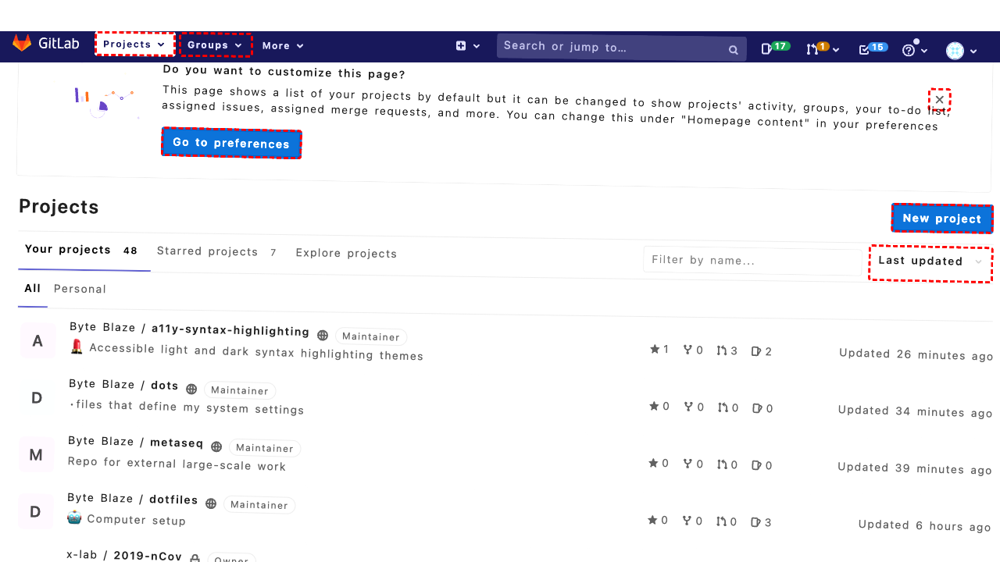
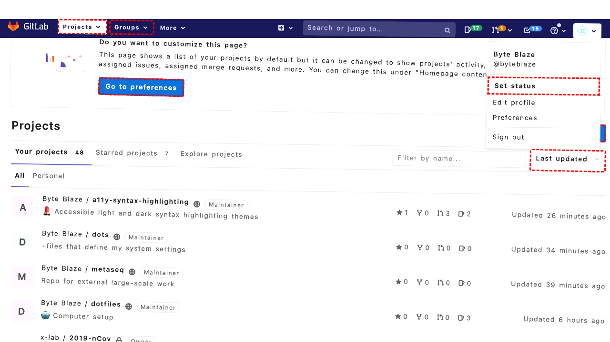
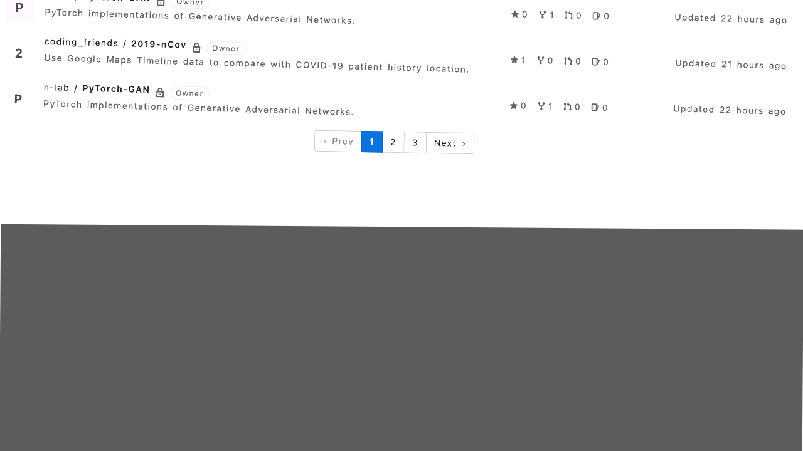

## Intent

Change the page title of "About us" page on my site to "Secret".

## RM

Thoughts: The user's intent is to change the page title of the "About us" page to "Secret", which is a content modification task. The action history shows the agent performed a series of clicks and filled the field with "Secret", but the final click (action 5) was on "Save Page" (bid 497). The final state description indicates the agent recognized the need to save and intended to click "Save Page", but it describes this as a future action rather than a completed one. The action history includes click("497") as step 5, which should be the save action. However, the final state is presented as a narrative of the agent's thoughts ("Now I need to save... I should click..."), suggesting the save may not have been executed or confirmed. For content modification tasks, success requires the modification to be saved and reflected. Since the final state is a description of intent and not a confirmation of the saved state (e.g., no indication the page was actually saved or the title updated on the site), and the bot response is "None", I cannot verify the change was persisted. Therefore, the task is likely incomplete and a failure.

Status: failure

## Final Response 

## Captions

===============I need to change the page title of the "About us" page to "Secret". This involves navigating to the CMS pages section, finding the "About us" page, editing it, and updating the page title.

Looking at the current page (Dashboard), I can see the navigation menu. The CMS section is available in the menu. I need to:
1. Click on "CMS" to expand it.
2. Click on "Pages" to go to the pages listing.
3. Find the "About us" page in the list.
4. Click to edit it.
5. Change the page title field to "Secret".
6. Save the changes.

From the accessibility tree, I can see:
- "CMS" is at bid 198 (link with text "CMS")
- Under it, "Pages" is at bid 202 (link with text "Pages")

Let me start by clicking on "CMS" to expand the menu, then click on "Pages".
===============Looking at the current state, I've clicked on "CMS" (bid 198) to expand the menu. Now I need to click on "Pages" (bid 202) to navigate to the pages listing where I can find and edit the "About us" page.
===============I can see the page has changed to the "Manage Pages" listing. I can see the table of pages, and "About Us" is listed in the first row (bid 571). To edit the page, I need to click on the "About Us" link (or the row). Looking at the accessibility tree, the row for "About Us" has a link to edit: the row itself has a URL pattern indicating it's clickable (http://dockerized-magento.local/index.php/admin/cms_page/edit/page_id/3/). The cell containing "About Us" is bid 572 (cell). However, the row (bid 571) is likely clickable as a whole. I'll click on the "About Us" text cell to open the edit page.
===============Looking at the current page, I can see I'm now on the "Edit Page 'About Us'" page. The page title field is visible in the accessibility tree as a textbox with bid 526 and value "About Us". I need to change this value to "Secret". I'll use the fill action to update the textbox.
===============Looking at the current state, I've successfully filled the "Page Title" field with "Secret". Now I need to save the changes. I can see several buttons at the top of the page: "Back", "Reset", "Delete Page...", "Save Page", and "Save and Continue Edit". To persist the title change, I should click the "Save Page" button (bid 497).

## Images






## Main Prompt

```md
User Intent: Change the page title of "About us" page on my site to "Secret".

Action History:
1: click("198")
2: click("202")
3: click("572")
4: fill("526", "Secret")
5: click("497")


The detailed final state of the webpage:

```md
Looking at the current state, I've successfully filled the "Page Title" field with "Secret". Now I need to save the changes. I can see several buttons at the top of the page: "Back", "Reset", "Delete Page...", "Save Page", and "Save and Continue Edit". To persist the title change, I should click the "Save Page" button (bid 497).
```

Bot response to the user: None.
```
