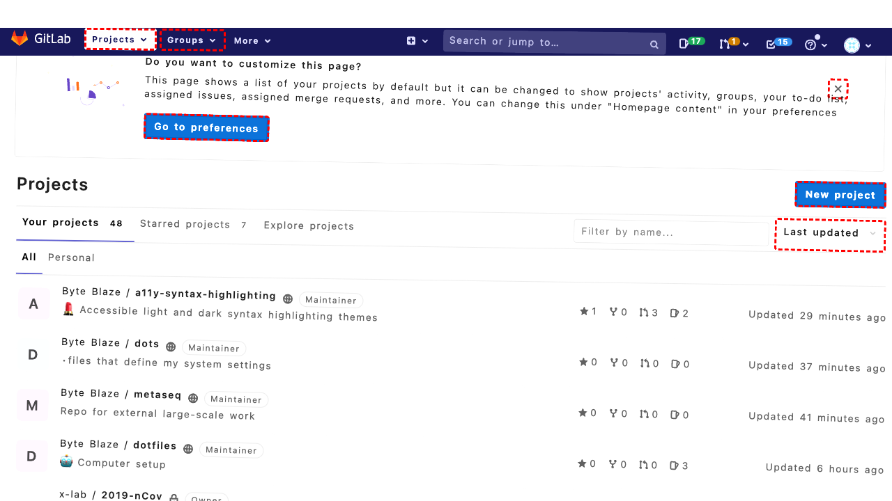
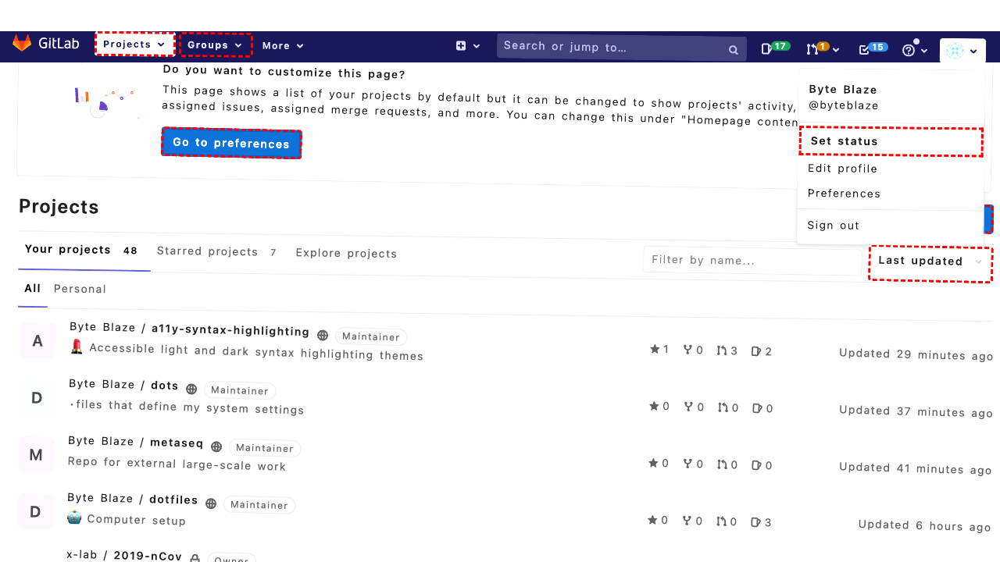

## Intent

Make Taurus Elements Shell as out of stock

## RM

Thoughts: The user's intent is to modify the content of a webpage by setting the stock availability of "Taurus Elements Shell" to "Out of Stock". This is a content modification task. The action history shows the agent performed three actions: clicking on element "508", then clicking on element "1646" (the "Stock Availability" combobox), and finally selecting the "Out of Stock" option from that combobox. The final state description indicates that the combobox was expanded and the "Out of Stock" option was present, but it does not confirm that the selection was successfully applied or that the webpage state changed accordingly. However, the action history explicitly includes `select_option("1646", "Out of Stock")`, which should have executed the modification. Since this is a content modification task, we rely on the action history and final state to determine success. The final state description is from the agent's perspective during the process, not a confirmation of the final outcome, but the last action was the selection, which likely completed the task. There is no indication of failure in the actions or state. Therefore, the task is successful.

Status: success

## Final Response 

## Captions

===============Looking at the current page, I'm on the product edit page for "Taurus Elements Shell-XS-Blue". The goal is to make this product out of stock. In Magento, inventory settings are typically managed in the "Inventory" section of the product edit page. I can see in the accessibility tree that there's an "Inventory" tab in the product information section (bid 508). I need to click on that tab to access inventory settings where I can set the stock status to "Out of Stock".
===============Looking at the current page, I can see that the "Inventory" tab is already focused (as indicated by "focused" in the accessibility tree for bid 508). This means I'm already on the inventory settings section. I can see the "Stock Availability" combobox (bid 1646) with the current value "In Stock". To make the product out of stock, I need to change this to "Out of Stock". I'll click on the combobox to open the dropdown and then select "Out of Stock".
===============Looking at the current state, I clicked on the "Stock Availability" combobox (bid 1646) which should have opened a dropdown. The accessibility tree shows that the combobox is expanded (expanded=True) and has a MenuListPopup with two options: "In Stock" (selected) and "Out of Stock". Now I need to select the "Out of Stock" option.

## Images





## Main Prompt

```md
User Intent: Make Taurus Elements Shell as out of stock

Action History:
1: click("508")
2: click("1646")
3: select_option("1646", "Out of Stock")


The detailed final state of the webpage:

```md
Looking at the current state, I clicked on the "Stock Availability" combobox (bid 1646) which should have opened a dropdown. The accessibility tree shows that the combobox is expanded (expanded=True) and has a MenuListPopup with two options: "In Stock" (selected) and "Out of Stock". Now I need to select the "Out of Stock" option.
```

Bot response to the user: None.
```
