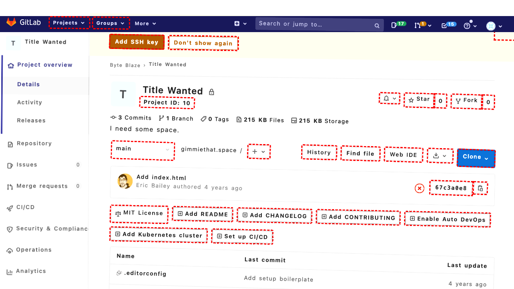
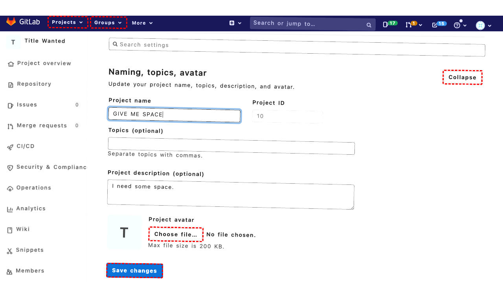

## Intent

Update the project site's title to "GIVE ME SPACE"

## RM

Thoughts: This is a content modification task where the user wants to update the project site's title to "GIVE ME SPACE". The action history shows the agent filled the appropriate field with the new title and clicked to save/submit. The final state of the webpage confirms the project name has been successfully updated to "GIVE ME SPACE" with a success message and the field showing the new value. The bot's response to the user is consistent with the successful completion.

Status: success

## Final Response "The project site's title has been successfully updated to 'GIVE ME SPACE'."

## Captions

===============Looking at the current page, I can see this is a GitLab repository page for a project called "Title Wanted". The goal is to update the project site's title to "GIVE ME SPACE".

From the accessibility tree, I can see this is a repository view showing files. To change the project title, I need to navigate to the project settings. I can see a "Settings" link in the sidebar navigation with bid "509".

Let me click on the Settings link to access the project settings where I can modify the project title.
===============Looking at the current page, I can see I'm already on the General Settings page for the project "Title Wanted". I can see the "Project name" field with bid "595" that currently has the value "Title Wanted". To update the project title to "GIVE ME SPACE", I need to fill this field with the new title.
===============Looking at the current state, I can see that I'm already on the General Settings page and the "Project name" field (bid "595") has been filled with "GIVE ME SPACE". The field shows it's currently focused and contains the correct value. Now I need to save the changes by clicking the "Save changes" button, which has bid "618".
===============Looking at the error message, I can see that the click action on bid "618" timed out. The element was found and the click was performed, but there seems to be some navigation or processing delay. Let me check the current accessibility tree again - I can see there's a "Save changes" button with bid "623" that appears to be disabled, and another "Save changes" button with bid "835" that is enabled. The bid "618" mentioned in the error doesn't appear in the current accessibility tree, suggesting the page may have changed.

Let me try clicking the enabled "Save changes" button with bid "835" instead.
===============Looking at the current accessibility tree, I can see that the project name has already been successfully updated to "GIVE ME SPACE" - there's a success message at the top that says "Project 'GIVE ME SPACE' was successfully updated." The project name field (bid "600") shows the value "GIVE ME SPACE", confirming the change has been saved.

Since the goal has been accomplished and the project title is now "GIVE ME SPACE", I should notify the user that the task is complete.

## Images






## Main Prompt

```md
User Intent: Update the project site's title to "GIVE ME SPACE"

Action History:
1: click("509")
2: fill("595", "GIVE ME SPACE")
3: click("618")
4: click("835")
5: send_msg_to_user("The project site's title has been successfully updated to 'GIVE ME SPACE'.")


The detailed final state of the webpage:

```md
Looking at the current accessibility tree, I can see that the project name has already been successfully updated to "GIVE ME SPACE" - there's a success message at the top that says "Project 'GIVE ME SPACE' was successfully updated." The project name field (bid "600") shows the value "GIVE ME SPACE", confirming the change has been saved.

Since the goal has been accomplished and the project title is now "GIVE ME SPACE", I should notify the user that the task is complete.
```

Bot response to the user: "The project site's title has been successfully updated to 'GIVE ME SPACE'.".
```
