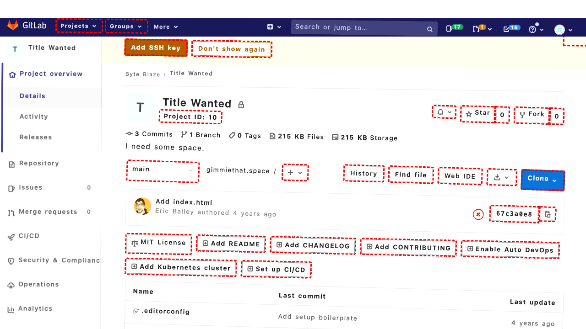
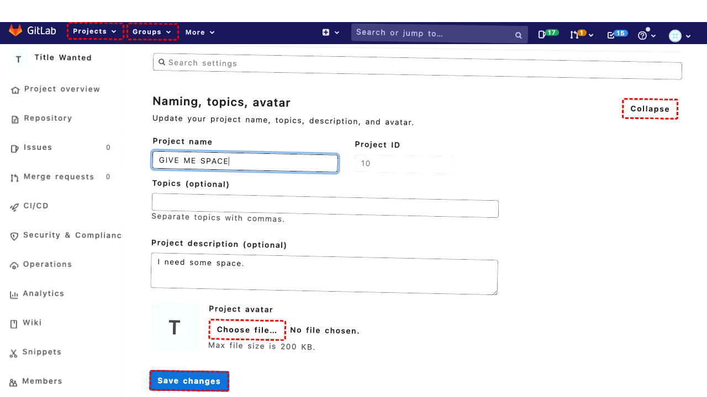
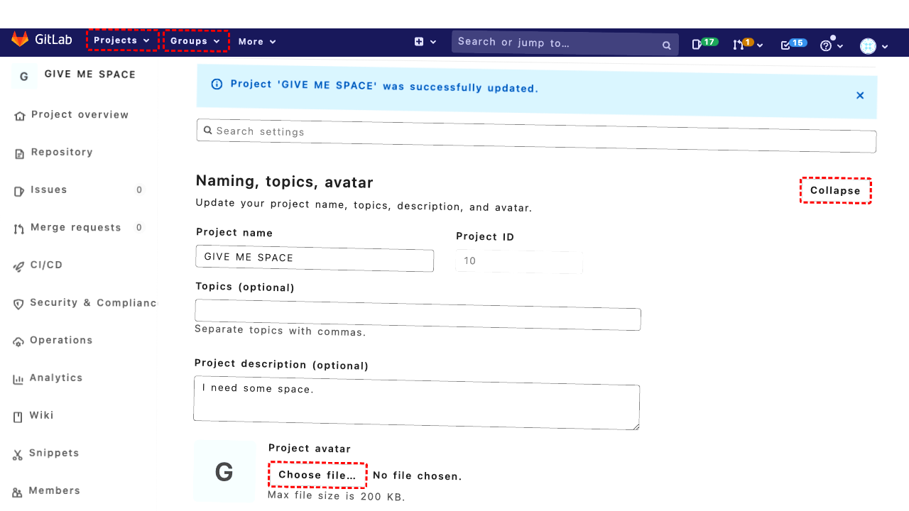

## Intent

Update the project site's title to "Not an interesting site"

## RM

Thoughts: This is a content modification task where the user wants to update the project site's title to "Not an interesting site". The action history shows the agent clicked an element (likely to access the edit mode), filled the project name field with the desired title, and clicked the save button. The final state confirms the project name field contains "Not an interesting site" and the page shows a success message indicating the update was successful. The agent's actions directly led to the intended modification, so the task is successful.

Status: success

## Final Response "The project site's title has been successfully updated to 'Not an interesting site'."

## Captions

===============Looking at the current page, I can see this is a GitLab project page for "GIVE ME SPACE". To update the project site's title to "Not an interesting site", I need to access the project settings where I can modify the project name/description.

From the accessibility tree, I can see there's a "Settings" link in the sidebar with bid 395. This should lead me to the project settings where I can update the project title.

Let me click on the Settings link to navigate to the project settings page.<｜end▁of▁thinking｜>
===============Looking at the current page, I can see we're already on the project settings page (the URL ends with "/edit" and the page title is "General · Settings"). The project name field is visible in the accessibility tree with bid 481 and currently has the value "GIVE ME SPACE".

To update the project site's title to "Not an interesting site", I need to modify the project name field. I'll use the fill action to update this field with the new title.
===============Looking at the current state, I can see that:

1. I successfully navigated to the settings page
2. The project name field (bid 481) is currently focused and has the value "Not an interesting site" (which matches our goal)
3. There's a "Save changes" button with bid 503 available

Since the project name field already contains the desired value "Not an interesting site", I don't need to fill it again. I should now save the changes by clicking the "Save changes" button to ensure the new title is applied to the project site.
===============Looking at the current state, I can see that:

1. The project name field (bid 481) already contains the desired value "Not an interesting site"
2. The "Save changes" button (bid 503) is currently disabled (as indicated by "disabled=True" in the accessibility tree)
3. The page shows a success message: "Project 'Not an interesting site' was successfully updated."

This suggests that the project title has already been successfully updated to "Not an interesting site" and no further action is needed. The disabled "Save changes" button indicates there are no pending changes to save.

Since the goal has been accomplished (the project site's title is now "Not an interesting site"), I should inform the user that the task is complete.

## Images






## Main Prompt

```md
User Intent: Update the project site's title to "Not an interesting site"

Action History:
1: click("395")
2: fill("481", "Not an interesting site")
3: click("503")
4: send_msg_to_user("The project site's title has been successfully updated to 'Not an interesting site'.")


The detailed final state of the webpage:

```md
Looking at the current state, I can see that:

1. The project name field (bid 481) already contains the desired value "Not an interesting site"
2. The "Save changes" button (bid 503) is currently disabled (as indicated by "disabled=True" in the accessibility tree)
3. The page shows a success message: "Project 'Not an interesting site' was successfully updated."

This suggests that the project title has already been successfully updated to "Not an interesting site" and no further action is needed. The disabled "Save changes" button indicates there are no pending changes to save.

Since the goal has been accomplished (the project site's title is now "Not an interesting site"), I should inform the user that the task is complete.
```

Bot response to the user: "The project site's title has been successfully updated to 'Not an interesting site'.".
```
