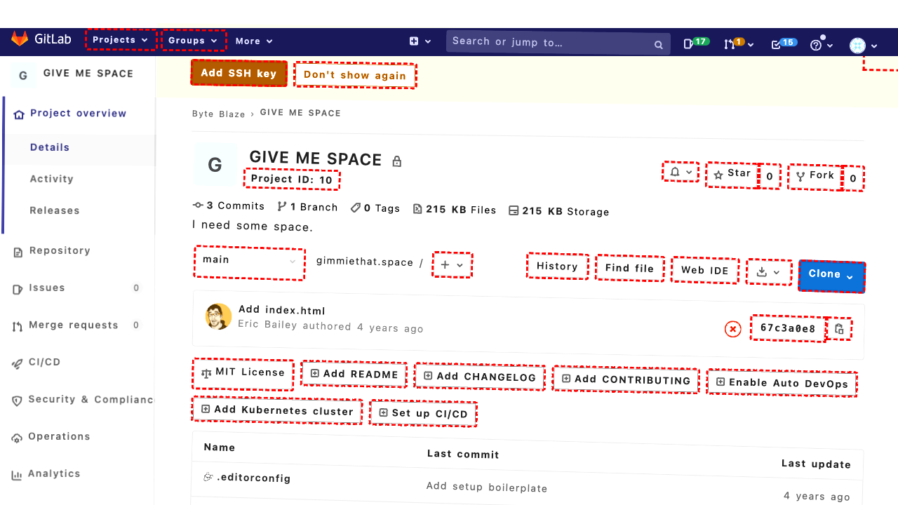
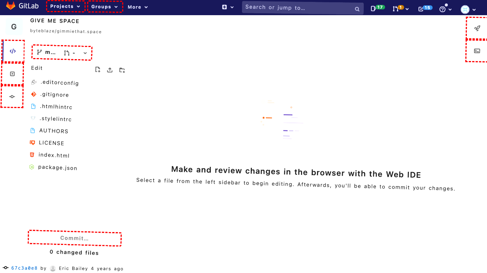
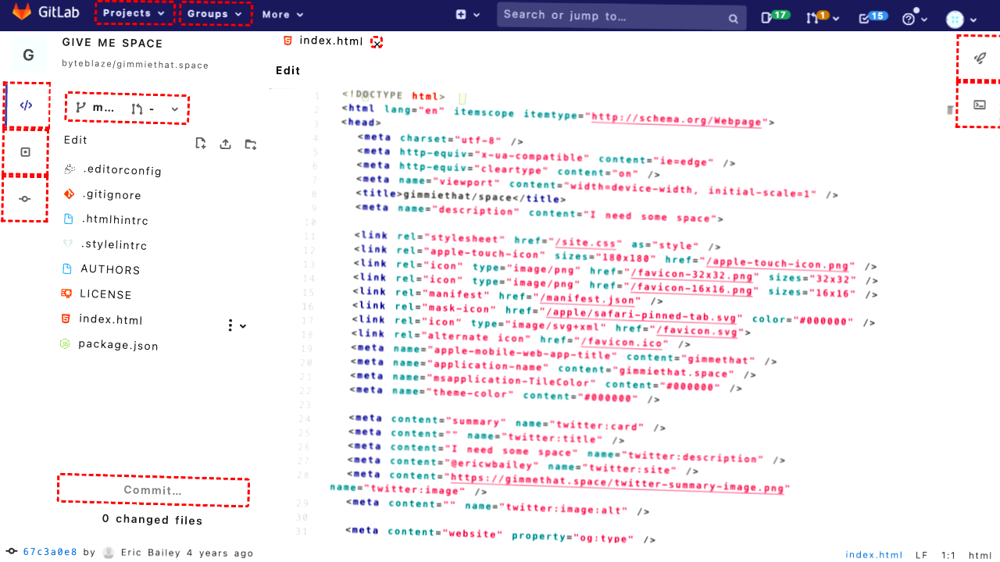
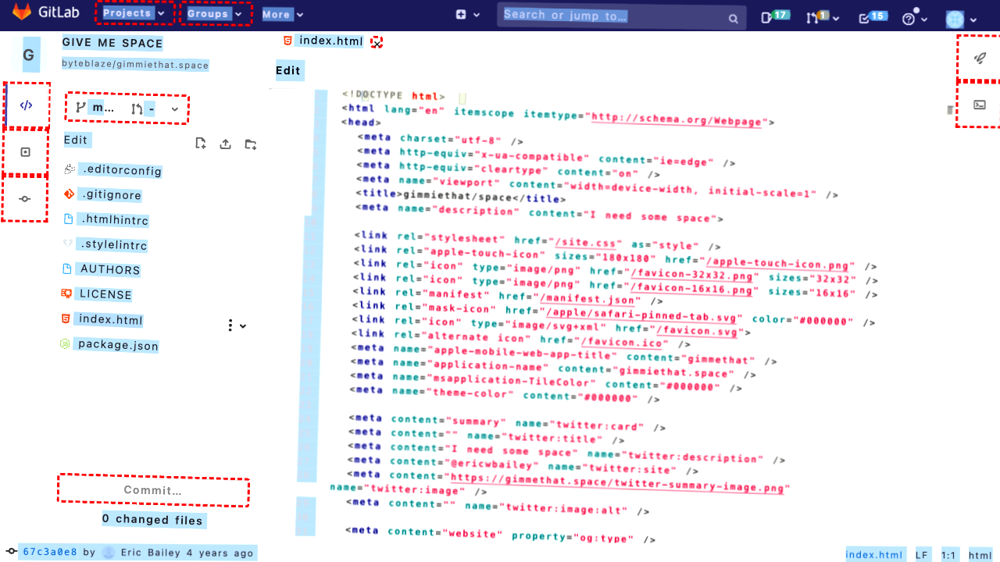
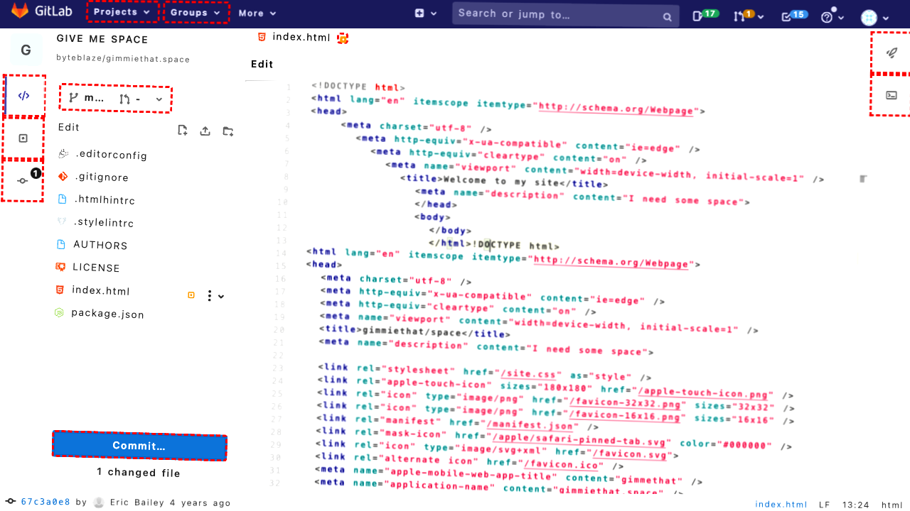

## Intent

Update the project site's title to "Title Wanted"

## RM

Thoughts: The user's intent is to update the project site's title to "Title Wanted", which is a content modification task. The action history shows the agent clicked an element (likely to access the edit form), filled the title field with "Title Wanted", and clicked another element (likely to submit/save). The final state confirms the project title was updated to "Title Wanted" and a success message is displayed. The agent's actions and the final state align with the user's intent, so the task is successful.

Status: success

## Final Response "Successfully updated the project site's title to 'Title Wanted'."

## Captions

===============Looking at the accessibility tree, I can see this is a GitLab project page for "Not an interesting site". To update the project title to "Title Wanted", I need to access the project settings. I can see there's a "Settings" link in the sidebar with bid 395.

The Settings page is where project configuration including the project name/title can be changed. Let me click on the Settings link to navigate to the project settings page.
===============Looking at the current page state, I can see we're already on the project settings page (the URL ends with "/edit" and the accessibility tree shows we're in the "General Settings" section). I can see the project name field with bid 481 that currently has the value "Not an interesting site". To update the project title to "Title Wanted", I need to modify this field.

The field appears to be a textbox with the current value displayed, so I can use the fill action to update it. After changing the value, I'll need to save the changes using the "Save changes" button (bid 503), though I notice it's currently disabled - it should become enabled once I modify the field.
===============Looking at the current state, I can see that the project name field (bid 481) already has the value "Title Wanted" according to the accessibility tree. This suggests that my previous fill action was successful in updating the field. Now I need to save these changes by clicking the "Save changes" button (bid 503), which should now be enabled since the field value has been modified.

The accessibility tree shows the button is present and should be clickable now that the project name has been changed from its original value.
===============Looking at the current state, I can see from the accessibility tree that the project title has already been successfully updated to "Title Wanted" - there's a success message displayed: "Project 'Title Wanted' was successfully updated." This indicates that my previous actions were successful and the goal has been accomplished. The project name field (bid 484) also shows the value "Title Wanted", confirming the update. Since the goal has been achieved, I should notify the user of the successful completion.

## Images






## Main Prompt

```md
User Intent: Update the project site's title to "Title Wanted"

Action History:
1: click("395")
2: fill("481", "Title Wanted")
3: click("503")
4: send_msg_to_user("Successfully updated the project site's title to 'Title Wanted'.")


The detailed final state of the webpage:

```md
Looking at the current state, I can see from the accessibility tree that the project title has already been successfully updated to "Title Wanted" - there's a success message displayed: "Project 'Title Wanted' was successfully updated." This indicates that my previous actions were successful and the goal has been accomplished. The project name field (bid 484) also shows the value "Title Wanted", confirming the update. Since the goal has been achieved, I should notify the user of the successful completion.
```

Bot response to the user: "Successfully updated the project site's title to 'Title Wanted'.".
```
