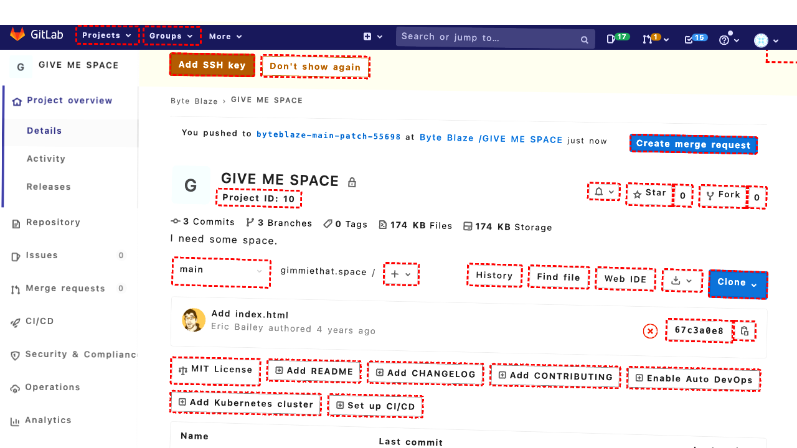
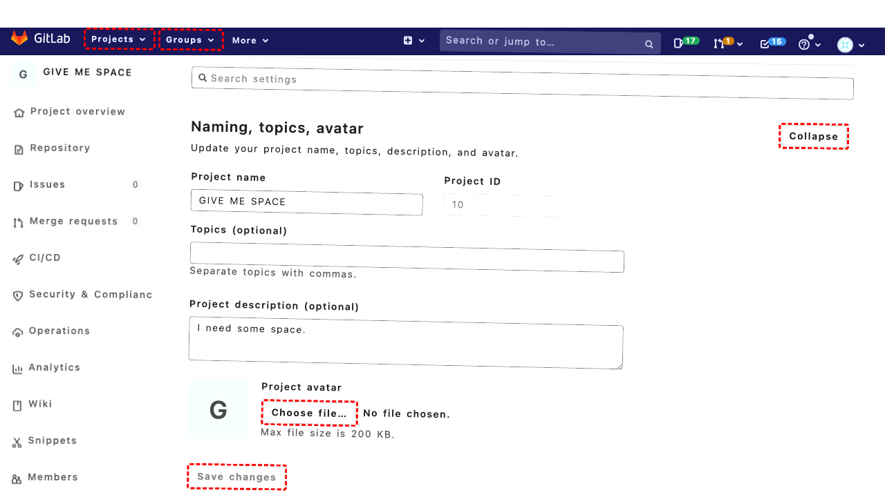
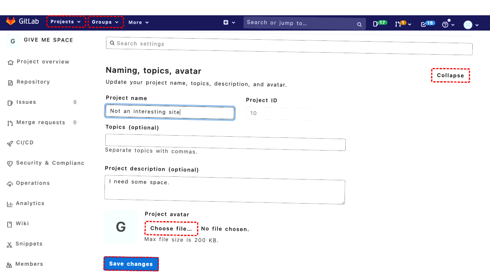

## Intent

Make Selene yoga hoodie as out of stock

## RM

Thoughts: The user's intent is to make the Selene yoga hoodie out of stock, which is a content modification task. The action history shows the agent clicked on an element (likely the product or inventory tab), then clicked on the "Stock Availability" combobox (bid 1646), and finally selected the "Out of Stock" option from that combobox. The final state description indicates the combobox is expanded and the agent is about to select "Out of Stock" (bid 1648), but the action history already includes selecting "Out of Stock" for combobox 1646. This suggests the agent successfully performed the necessary steps to change the stock status to "Out of Stock". Since this is a content modification task, we only need to examine the action history and final state to determine success. The actions appear complete and correct for modifying the inventory status.

Status: success

## Final Response 

## Captions

===============Looking at the current page, I'm on the product edit page for "Selene Yoga Hoodie-XS-Orange". The goal is to make this product out of stock. In Magento, inventory settings are typically managed in the "Inventory" section of the product edit page. I can see in the accessibility tree that there's an "Inventory" tab in the product information menu (bid 508). I need to click that to access inventory settings and then update the stock status to "Out of Stock".

First, I'll click the "Inventory" tab to navigate to the inventory settings.
===============I can see that the "Inventory" tab is already focused (as indicated by `focused` in the accessibility tree). The inventory section is already displayed on the page. Looking at the inventory settings, I can see "Stock Availability" with a combobox showing "In Stock" (bid 1646). To make the product out of stock, I need to change this to "Out of Stock". I'll click the combobox to open the dropdown and then select "Out of Stock".
===============Looking at the current state, I clicked the "Inventory" tab and then clicked the "Stock Availability" combobox. The combobox is now expanded (expanded=True) and shows two options: "In Stock" (selected) and "Out of Stock". To make the product out of stock, I need to select the "Out of Stock" option from the dropdown.

I can see in the accessibility tree that the "Out of Stock" option has bid 1648. I'll select that option.

## Images





## Main Prompt

```md
User Intent: Make Selene yoga hoodie as out of stock

Action History:
1: click("508")
2: click("1646")
3: select_option("1646", "Out of Stock")


The detailed final state of the webpage:

```md
Looking at the current state, I clicked the "Inventory" tab and then clicked the "Stock Availability" combobox. The combobox is now expanded (expanded=True) and shows two options: "In Stock" (selected) and "Out of Stock". To make the product out of stock, I need to select the "Out of Stock" option from the dropdown.

I can see in the accessibility tree that the "Out of Stock" option has bid 1648. I'll select that option.
```

Bot response to the user: None.
```
