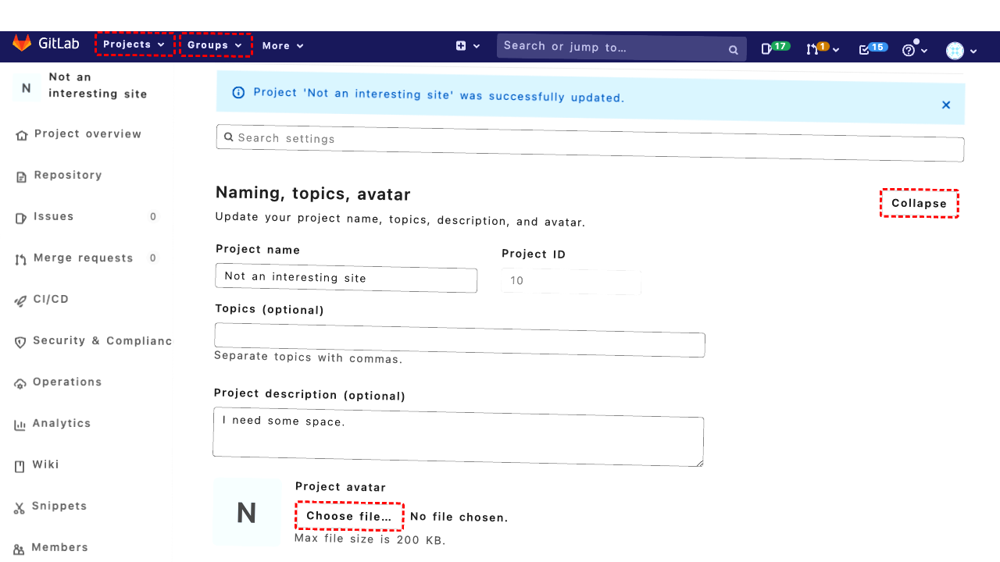

## Intent

Update the project site's title to "Hello"

## RM

Thoughts: This is a content modification task where the user wants to update the project site's title to "Hello". The action history shows the agent performed a click, filled the field with "Hello", and clicked again (likely to save/submit). The final state confirms the title was successfully updated to "Hello" with a success message and the field showing the correct value. Since the task is successfully completed based on the action history and final state, the bot's lack of response does not affect the outcome for this task type.

Status: success

## Final Response 

## Captions

===============Looking at the accessibility tree, I can see we're on a GitLab project page for "Title Wanted". To update the project title to "Hello", I need to navigate to the project settings where the title field can be edited. I can see there's a "Settings" link with bid '395' in the sidebar.

The `update_project_title` function is perfect for this task - it will click the Settings link, fill the title field, and save the changes. I just need to identify the correct element IDs for the title field and save button once I'm on the settings page.
===============Looking at the current page state, I can see we're already on the General Settings page for the project (as indicated by the URL ending with "/edit" and the "General Settings" heading). The title field is visible with bid '481' showing the current value "Title Wanted", and there's a "Save changes" button with bid '503' (though it's currently disabled, likely because no changes have been made yet).

Since we're already on the correct settings page, I can directly update the title field and save the changes.
===============Looking at the current state, I can see that the title field (bid '481') already contains "Hello" as its value, which means my previous fill action was successful. Now I need to save these changes by clicking the "Save changes" button. I can see there's a "Save changes" button with bid '503' available in the "Naming, topics, avatar" section.
===============Looking at the current state, I can see that the title field has been successfully updated to "Hello" and the save button (bid '503') is now enabled. The page also shows a success message "Project 'Hello' was successfully updated." at the top, confirming that the changes have been saved.

Since the goal has been accomplished (updating the project site's title to "Hello"), no further actions are needed. The task is complete.
===============Looking at the current state, I can see that the project title has already been successfully updated to "Hello" as confirmed by the success message "Project 'Hello' was successfully updated." at the top of the page. The goal has been accomplished, so no further actions are needed.
===============Looking at the current state, I can see that the project title has already been successfully updated to "Hello" as confirmed by the success message "Project 'Hello' was successfully updated." at the top of the page. The goal has been accomplished, so no further actions are needed.
===============Looking at the current state, I can see that the project title has already been successfully updated to "Hello" as confirmed by the success message "Project 'Hello' was successfully updated." at the top of the page. The goal has been accomplished, so no further actions are needed.
===============Looking at the current state, I can see that the project title has already been successfully updated to "Hello" as confirmed by the success message "Project 'Hello' was successfully updated." at the top of the page. The accessibility tree shows the title field (bid '484') contains "Hello" as its value, and the goal has been fully accomplished. No further actions are needed.
===============Looking at the current state, I can see that the project title has already been successfully updated to "Hello" as confirmed by:

1. The success message "Project 'Hello' was successfully updated." at the top of the page
2. The title field (bid '484') showing the value "Hello"
3. The page title in the browser tab showing "Hello" as part of the project name

The goal of updating the project site's title to "Hello" has been fully accomplished. No further actions are needed.
===============Looking at the current state, I can see that the project title has already been successfully updated to "Hello" as confirmed by:

1. The success message "Project 'Hello' was successfully updated." displayed at the top of the page
2. The title field (bid '484') showing the value "Hello"
3. The page URL and navigation breadcrumbs showing "Hello" as the project name

The goal of updating the project site's title to "Hello" has been fully accomplished. No further actions are needed.

## Images





## Main Prompt

```md
User Intent: Update the project site's title to "Hello"

Action History:
1: click("395")
2: fill("481", "Hello")
3: click("503")
4: noop()
5: noop()
6: noop()
7: noop()
8: noop()
9: noop()
10: noop()


The detailed final state of the webpage:

```md
Looking at the current state, I can see that the project title has already been successfully updated to "Hello" as confirmed by:

1. The success message "Project 'Hello' was successfully updated." displayed at the top of the page
2. The title field (bid '484') showing the value "Hello"
3. The page URL and navigation breadcrumbs showing "Hello" as the project name

The goal of updating the project site's title to "Hello" has been fully accomplished. No further actions are needed.
```

Bot response to the user: None.
```
