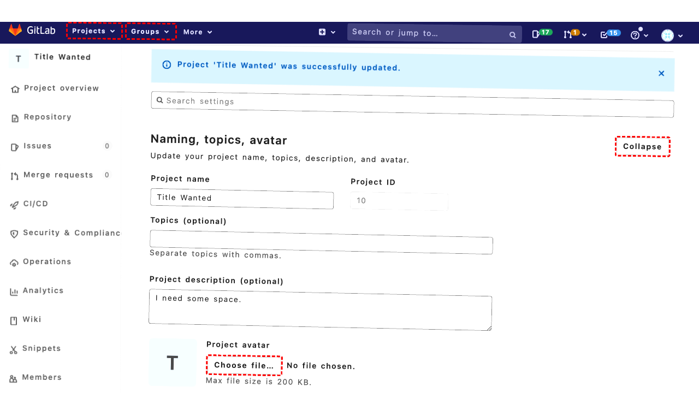

## Intent

Assign the issue regarding 404 in a11yproject to Roshanjossey.

## RM

Thoughts: The user's intent is to assign an issue to "Roshanjossey," which falls under the "Content modification" task type. The action history shows the agent attempted to fill a field (action 9) with "Roshanjossey" and clicked on the assignee section (action 10). However, the final state description indicates the agent is still on the issue page and has not successfully assigned the user—it mentions "previous attempts to interact with the assignee field have failed" and that the agent is still examining the accessibility tree to find a working approach. Since the final state does not confirm the assignment was completed and the agent's own analysis suggests failure, the task is unsuccessful.

Status: failure

## Final Response 

## Captions

===============Looking at the goal to assign an issue regarding 404 in a11yproject to Roshanjossey, I need to first navigate to the a11yproject repository, then find the specific 404 issue, and assign it to the user.

From the current page, I can see there's a project called "The A11Y Project / a11yproject.com" in the list. I should click on this project link to navigate to its repository page where I can access the issues.

The project link has the text "The A11Y Project / a11yproject.com" and appears to be at position [381] in the accessibility tree.
===============Looking at the current state, I can see I'm on the a11yproject.com repository page. I need to navigate to the issues section to find the 404-related issue. In the accessibility tree, I can see there's an "Issues" link with the text "Issues 41" at position [284], which indicates there are 41 issues in this repository.

I should click on this Issues link to view all the issues in the a11yproject repository, then I can search for the specific 404 issue and assign it to Roshanjossey.
===============Looking at the current page, I can see I'm on the issues page for the a11yproject.com repository. I need to find the specific issue about 404 errors. From the accessibility tree, I can see several issues listed, and one of them appears to be related to 404s:

- Issue #15: "[Bug] 404s, bad host, timeouts, bad urls for URLs linked from website"

This issue was created by "Roshan Jossy" and has labels including "bug", "content", "good first issue", and "help wanted". This matches the description of the issue I need to assign to Roshanjossey.

I should click on this specific issue to open it and then assign it to Roshanjossey.
===============Looking at the current state, I can see I'm on the a11yproject.com issues page. I need to find and open the specific issue about 404 errors. From the accessibility tree, I can see issue #15 titled "[Bug] 404s, bad host, timeouts, bad urls for URLs linked from website" which matches the description. I should click on this issue to open it so I can assign it to Roshanjossey.
===============Looking at the current state, I can see I'm still on the issues dashboard page showing issues assigned to Roshanjossey, not the a11yproject repository issues page. The issue I need to assign is actually in Tab 0, which shows the specific 404 issue in the a11yproject repository. Since my previous attempts to navigate to and click on the issue from the current page have failed, I should switch to Tab 0 where the issue is already open.
===============Looking at the current situation, I can see that I'm currently on Tab 0 which already has the specific 404 issue open - "[Bug] 404s, bad host, timeouts, bad urls for URLs linked from website (#15)" in the a11yproject repository. This is exactly the issue I need to assign to Roshanjossey.

From the accessibility tree, I can see there's a sidebar section with "Assignee" information showing "None - assign yourself". I need to click the "Edit" link next to Assignee to change the assignment. The Edit link for the assignee field appears to be at position [1397] in the accessibility tree.
===============Looking at the current state, I can see that I'm on the specific 404 issue page in the a11yproject repository. The issue is already open and I can see the sidebar with assignment information. I previously clicked the "Edit" link for the assignee field, and now I need to select Roshanjossey from the dropdown that appears.

From the accessibility tree, I can see there's a dropdown list of assignable users, and "Roshan Jossy @Roshanjossey" appears at position [1675]. I should click on this option to assign the issue to Roshanjossey.
===============Looking at the error message, I can see that the click action on element "1675" (Roshan Jossy @Roshanjossey) failed because another element (bid="1469" from the due_date block) is intercepting pointer events. This suggests there's an overlapping element preventing the click.

Since I'm trying to assign the issue to Roshanjossey and the dropdown is open but I can't click the user option due to an overlay, I should try a different approach. Let me first close any potential overlays by pressing Escape, then try to interact with the assignee field again.
===============Looking at the current situation, I can see that my previous attempt to assign the issue to Roshanjossey failed due to an overlay intercepting the click. After pressing Escape to clear any overlays, I should now try to interact with the assignee field again.

From the accessibility tree, I can see there's an assignee dropdown/search field that should now be accessible. I need to search for "Roshanjossey" in the assignee field and select the user. The assignee search/input field appears to be at position [1468] in the accessibility tree.
===============Looking at the current situation, I can see that I'm on the specific 404 issue page and need to assign it to Roshanjossey. My previous attempts to interact with the assignee field have failed due to element visibility issues.

Let me examine the accessibility tree more carefully. I can see there's an "Assignee" section in the sidebar with the text "None - assign yourself" at position [1397]. Since my direct click on the user option failed and I couldn't find the search field, I should try a different approach by first clicking the main "Assignee" area to open the dropdown, then searching for the user.

The "Assignee" section appears to be at position [1397] in the tree, which should open the assignee dropdown when clicked.

## Images





## Main Prompt

```md
User Intent: Assign the issue regarding 404 in a11yproject to Roshanjossey.

Action History:
1: click("381")
2: click("284")
3: click("1223")
4: click("1223")
5: tab_focus(0)
6: click("1397")
7: click("1675")
8: keyboard_press("Escape")
9: fill("1468", "Roshanjossey")
10: click("1397")


The detailed final state of the webpage:

```md
Looking at the current situation, I can see that I'm on the specific 404 issue page and need to assign it to Roshanjossey. My previous attempts to interact with the assignee field have failed due to element visibility issues.

Let me examine the accessibility tree more carefully. I can see there's an "Assignee" section in the sidebar with the text "None - assign yourself" at position [1397]. Since my direct click on the user option failed and I couldn't find the search field, I should try a different approach by first clicking the main "Assignee" area to open the dropdown, then searching for the user.

The "Assignee" section appears to be at position [1397] in the tree, which should open the assignee dropdown when clicked.
```

Bot response to the user: None.
```
