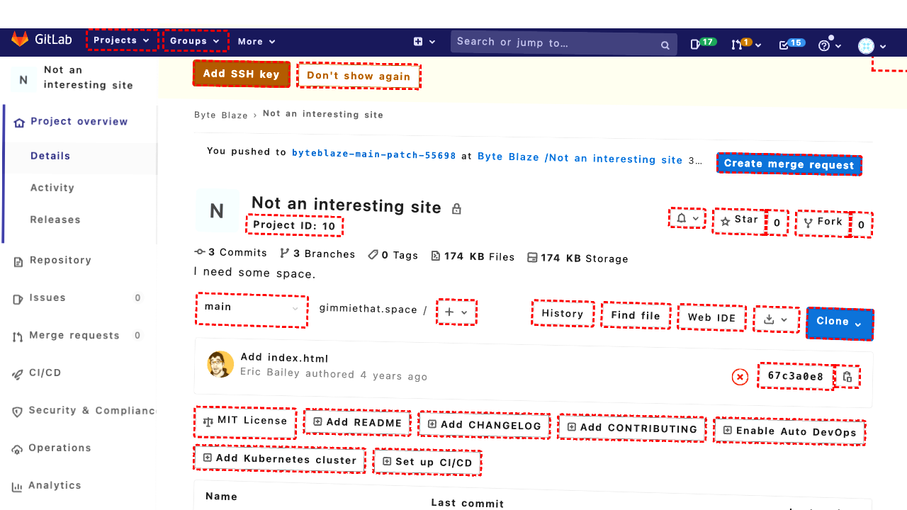
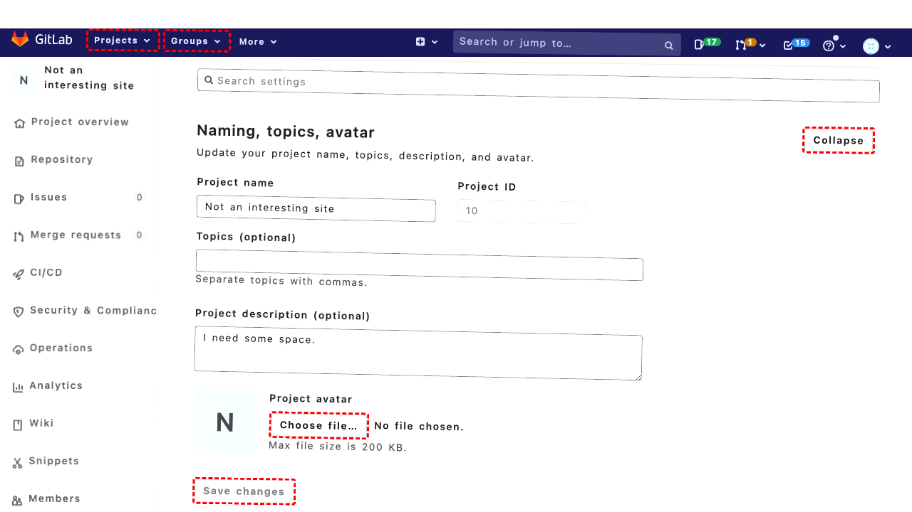
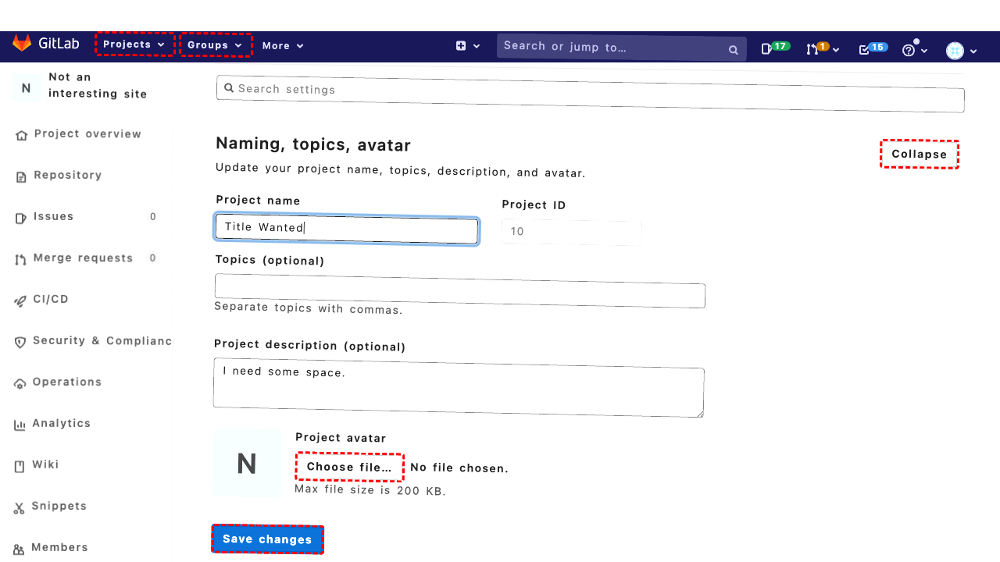

## Intent

Make Aeon capri as out of stock

## RM

Thoughts: The user's intent is to modify the content of a webpage (specifically, to set the Aeon capri product as out of stock). This is a content modification task. The action history shows the agent clicked on element "508" (likely the Inventory tab), clicked on element "1646" (the Stock Availability dropdown), and then selected the "Out of Stock" option from that dropdown. The final state description confirms the dropdown is expanded and the "Out of Stock" option is not selected initially, but the agent's action of selecting "Out of Stock" should have changed that. Since the task is content modification, we only need to examine the action history and final state. The action history indicates the agent performed the necessary steps to select "Out of Stock". The final state description is from before the selection, but the action history shows the selection was completed. Therefore, the task is successfully completed.

Status: success

## Final Response 

## Captions

===============Looking at the current page, I'm on the product edit page for "Aeon Capri-28-Black". The goal is to make this product out of stock. In Magento, inventory settings are typically managed in the "Inventory" section of the product edit page. I can see in the accessibility tree that there's an "Inventory" tab/link available (bid 508). I should click on that to access the inventory settings where I can change the stock status.
===============Looking at the current page, I can see that the "Inventory" tab is already focused (as indicated by "focused" in the accessibility tree for bid 508). The inventory section is already visible on the page, as shown by the "Inventory" heading (bid 1532) and the inventory settings table below it.

To make the product out of stock, I need to change the "Stock Availability" field from "In Stock" to "Out of Stock". I can see a combobox for "Stock Availability" with bid 1646, currently set to "In Stock". I should select the "Out of Stock" option from that dropdown.
===============Looking at the current state, I've clicked on the "Inventory" tab and then clicked on the "Stock Availability" dropdown (bid 1646). The dropdown is now expanded (expanded=True in the accessibility tree). I can see two options: "In Stock" (selected) and "Out of Stock" (not selected). To make the product out of stock, I need to select the "Out of Stock" option.

## Images





## Main Prompt

```md
User Intent: Make Aeon capri as out of stock

Action History:
1: click("508")
2: click("1646")
3: select_option("1646", "Out of Stock")


The detailed final state of the webpage:

```md
Looking at the current state, I've clicked on the "Inventory" tab and then clicked on the "Stock Availability" dropdown (bid 1646). The dropdown is now expanded (expanded=True in the accessibility tree). I can see two options: "In Stock" (selected) and "Out of Stock" (not selected). To make the product out of stock, I need to select the "Out of Stock" option.
```

Bot response to the user: None.
```
