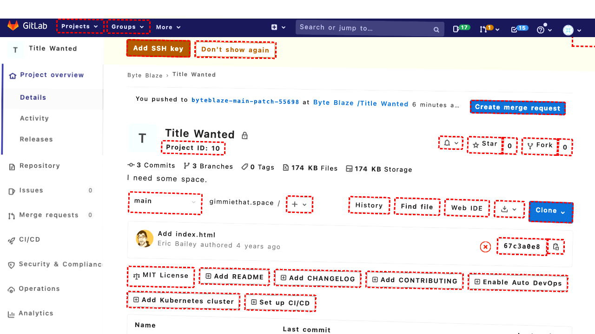
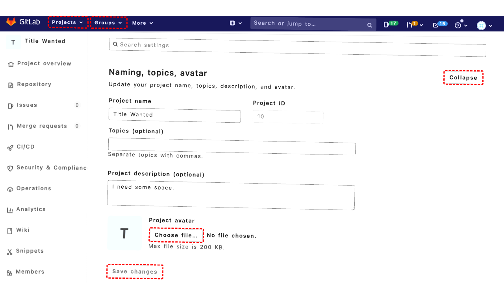
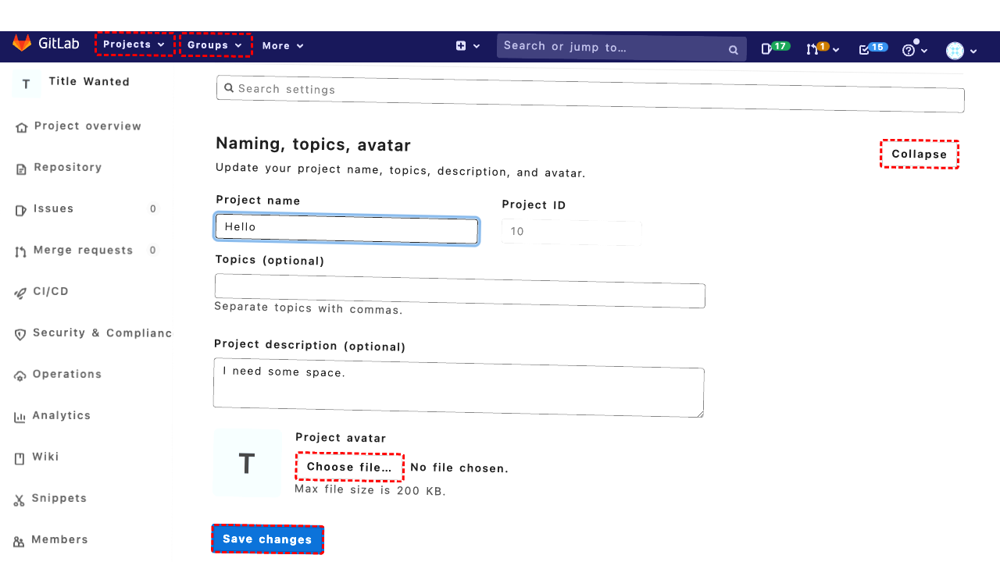

## Intent

Update the project site's title to "Hello"

## RM

Thoughts: The user's intent is to update the project site's title to "Hello", which is a content modification task. The action history shows the agent clicked an element (likely an edit button), filled a field with "Hello", and clicked another element (likely a save/submit button). The final state of the webpage confirms that the project was successfully updated with the new title "Hello", as indicated by the success message. The agent's actions directly led to the intended modification, so the task is successful.

Status: success

## Final Response "Successfully updated the project site's title to 'Hello'. The change has been saved and applied."

## Captions

===============Looking at the current page, I can see this is a GitLab repository page for a project called "Title Wanted". The goal is to update the project site's title to "Hello".

From the accessibility tree, I can see the project title appears in multiple places:
- In the main heading: "Title Wanted Private - Project access must be granted..."
- In the breadcrumbs: "Title Wanted"
- In the sidebar navigation: "Title Wanted"

To change the project title, I need to access the project settings. I can see there's a "Settings" link in the sidebar navigation at position [509]. This should lead to where I can modify the project title.

Let me click on the Settings link to navigate to the project settings page.<｜end▁of▁thinking｜>I need to navigate to the project settings to change the project title. I can see a "Settings" link in the sidebar navigation at position [509]. Let me click on that to access the project settings where I can modify the title.
===============Looking at the current page state, I can see I'm already on the General Settings page for the project "Title Wanted". The accessibility tree shows I'm in the "General · Settings · Byte Blaze / Title Wanted · GitLab" page, and I can see the project name field with the current value "Title Wanted" at position [595].

Since I'm already on the correct settings page, I can directly modify the project name field to change it to "Hello". The project name field is a textbox with bid [595] that currently has the value "Title Wanted".

I'll use the fill action to update this field with the new title "Hello".
===============Looking at the current state, I can see that I successfully filled the project name field with "Hello" at position [595]. Now I need to save this change. I can see there's a "Save changes" button at position [618] in the same "Naming, topics, avatar" section.

I should click this button to apply the title change from "Title Wanted" to "Hello".
===============Looking at the current state, I can see from the accessibility tree that the project was successfully updated - there's a success message at position [577] that says "Project 'Hello' was successfully updated." This confirms that my previous actions were successful and the project title has been changed from "Title Wanted" to "Hello".

The goal has been accomplished - the project site's title has been updated to "Hello". There's no further action needed. I'll send a confirmation message to the user to let them know the task is complete.

## Images






## Main Prompt

```md
User Intent: Update the project site's title to "Hello"

Action History:
1: click("509")
2: fill("595", "Hello")
3: click("618")
4: send_msg_to_user("Successfully updated the project site's title to 'Hello'. The change has been saved and applied.")


The detailed final state of the webpage:

```md
Looking at the current state, I can see from the accessibility tree that the project was successfully updated - there's a success message at position [577] that says "Project 'Hello' was successfully updated." This confirms that my previous actions were successful and the project title has been changed from "Title Wanted" to "Hello".

The goal has been accomplished - the project site's title has been updated to "Hello". There's no further action needed. I'll send a confirmation message to the user to let them know the task is complete.
```

Bot response to the user: "Successfully updated the project site's title to 'Hello'. The change has been saved and applied.".
```
