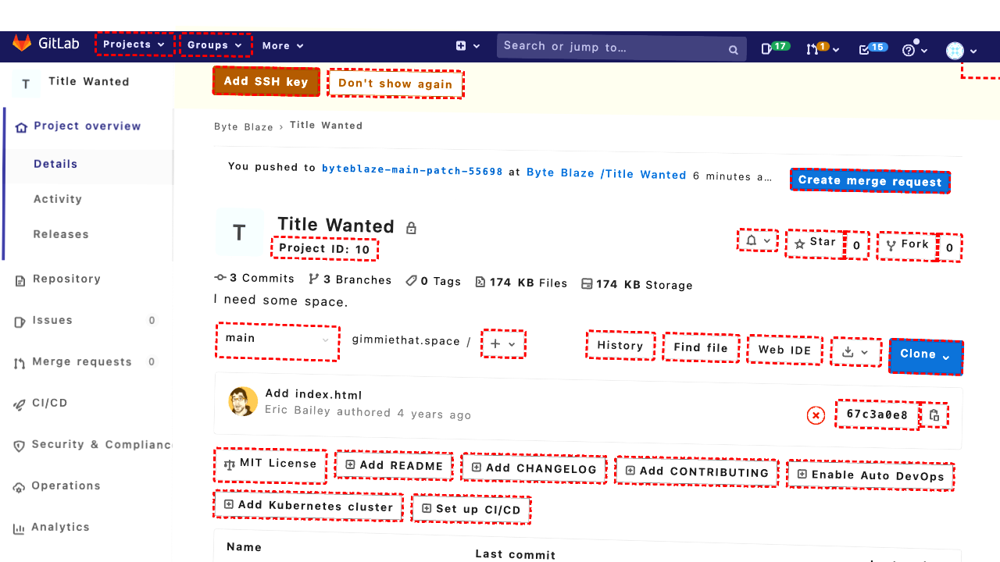
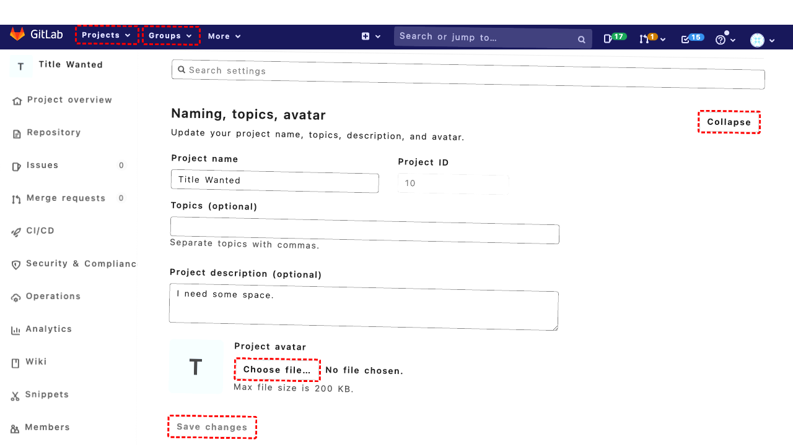
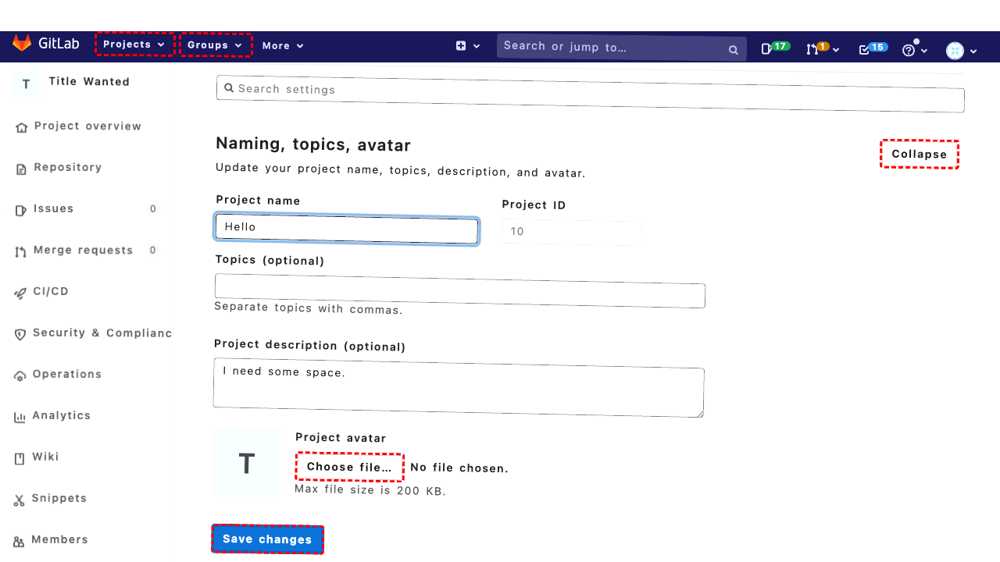
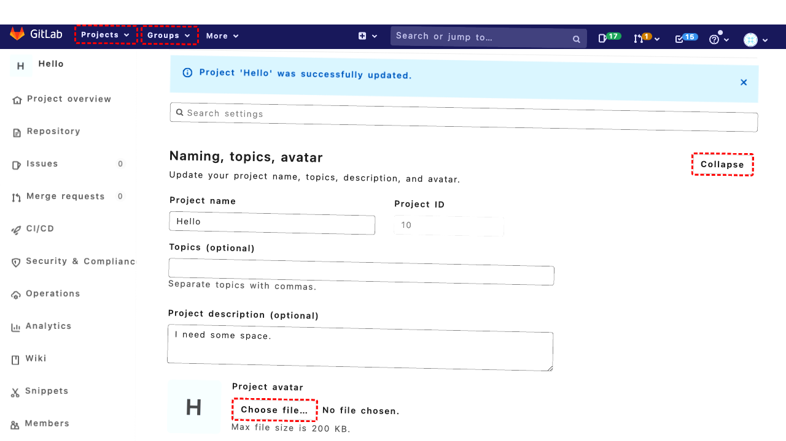

## Intent

Modify the address of order #299 to 456 Oak Avenue, Apartment 5B, New York, NY, 10001

## RM

Thoughts: The user's intent is to modify the address of order #299 to a specific address. This is a content modification task. The action history shows the agent navigating to the orders page, clicking on order #299 (likely via IDs 678 and 593), filling in the address details (street, city, state, zip), and clicking to save (ID 451). The final state of the webpage confirms a success message and that the shipping address section now displays exactly the requested address: "456 Oak Avenue, Apartment 5B, New York, New York, 10001" (which matches "New York, NY, 10001" as NY is the abbreviation for New York). The bot's response also confirms the modification. Therefore, the task is successfully completed.

Status: success

## Final Response "Successfully modified the shipping address of order #299 to 456 Oak Avenue, Apartment 5B, New York, NY, 10001. The address has been updated and saved."

## Captions

===============I need to modify the address of order #299. Currently, I'm on the Dashboard page. To edit an order, I first need to navigate to the Orders page. Looking at the accessibility tree, I can see a navigation menu with "Sales" and under it "Orders". The "Sales" link has bid 66 and "Orders" link has bid 70. I should click on "Sales" to expand the menu, then click "Orders". Alternatively, I could directly click "Orders" if it's already visible, but from the tree structure, it appears "Sales" is a parent item that might need to be expanded first.

Let me navigate to the Orders page.
===============Looking at the current state, I can see I'm on the Orders page (the title is "Orders / Sales / Magento Admin"). I need to find order #299. Scanning the table, I can see order numbers in the second column. I notice the first row shows order "000000299" - that's exactly what I need. The "View" link for that order has bid 678. I should click on that to view the order details, where I can then modify the address.
===============Looking at the current page, I can see I'm on the Order View page for order #000000299. The goal is to modify the shipping address to "456 Oak Avenue, Apartment 5B, New York, NY, 10001".

In the accessibility tree, I can see a "Shipping Address" section with an "Edit" link (bid 593). That's exactly what I need to click to edit the shipping address. The billing address also has an "Edit" link (bid 581), but the goal specifically mentions modifying the address of the order, and typically shipping address is what matters for delivery. However, since the goal doesn't specify billing vs shipping, I should probably edit both to be consistent, but let me start with the shipping address as that's likely the primary target.

I'll click the "Edit" link for the shipping address.
===============Looking at the current page, I can see I'm on the "Edit Order 000000299 Shipping Address" page (heading at bid 441). The goal is to modify the address to "456 Oak Avenue, Apartment 5B, New York, NY, 10001".

From the accessibility tree, I can see the form fields:
- Street Address field (bid 508) currently has value "321 Maple Avenue"
- City field (bid 516) currently has value "Oakland"
- State/Province dropdown (bid 776) currently has value "California"
- Zip/Postal Code field (bid 849) currently has value "94602"

I need to update these fields to match the new address:
- Street Address: "456 Oak Avenue, Apartment 5B" (this appears to be a single line address, though it has an apartment number)
- City: "New York"
- State: "New York" (NY)
- Zip: "10001"

I should fill in these fields. Let me start with the Street Address field.
===============Looking at the current state, I can see the Street Address field has been updated to "456 Oak Avenue, Apartment 5B". Now I need to update the City field from "Oakland" to "New York". The City field has bid 516.
===============Looking at the current state, I can see the City field has been updated to "New York". Now I need to update the State/Province from "California" to "New York". The State/Province dropdown has bid 776 and currently shows "California". I need to select "New York" from the dropdown.
===============Looking at the current state, I can see the State/Province dropdown has been updated to "New York". Now I need to update the Zip/Postal Code from "94602" to "10001". The Zip/Postal Code field has bid 849.
===============Looking at the current state, I can see all the address fields have been updated correctly: Street Address is "456 Oak Avenue, Apartment 5B", City is "New York", State is "New York", and Zip is "10001". The goal was to modify the address of order #299 to "456 Oak Avenue, Apartment 5B, New York, NY, 10001". All the necessary changes have been made.

Now I need to save these changes. I can see a "Save Order Address" button with bid 451. I should click this button to save the updated shipping address.
===============Looking at the current state, I can see I'm back on the Order View page for order #000000299. The page shows a success message at bid 497: "The order address has been updated." This confirms that the shipping address was successfully modified.

Now I should verify that the shipping address now shows the updated information. Looking at the Shipping Address section (starting at bid 596), I can see it displays: "456 Oak Avenue, Apartment 5B, New York, New York, 10001". This matches exactly what was requested: "456 Oak Avenue, Apartment 5B, New York, NY, 10001". The state is shown as "New York" which corresponds to NY.

The goal has been successfully accomplished. I should inform the user that the address has been modified.

## Images







## Main Prompt

```md
User Intent: Modify the address of order #299 to 456 Oak Avenue, Apartment 5B, New York, NY, 10001

Action History:
1: navigate_to_orders_page('70', '66')
2: click("678")
3: click("593")
4: fill("508", "456 Oak Avenue, Apartment 5B")
5: fill("516", "New York")
6: select_option("776", "New York")
7: fill("849", "10001")
8: click("451")
9: send_msg_to_user("Successfully modified the shipping address of order #299 to 456 Oak Avenue, Apartment 5B, New York, NY, 10001. The address has been updated and saved.")


The detailed final state of the webpage:

```md
Looking at the current state, I can see I'm back on the Order View page for order #000000299. The page shows a success message at bid 497: "The order address has been updated." This confirms that the shipping address was successfully modified.

Now I should verify that the shipping address now shows the updated information. Looking at the Shipping Address section (starting at bid 596), I can see it displays: "456 Oak Avenue, Apartment 5B, New York, New York, 10001". This matches exactly what was requested: "456 Oak Avenue, Apartment 5B, New York, NY, 10001". The state is shown as "New York" which corresponds to NY.

The goal has been successfully accomplished. I should inform the user that the address has been modified.
```

Bot response to the user: "Successfully modified the shipping address of order #299 to 456 Oak Avenue, Apartment 5B, New York, NY, 10001. The address has been updated and saved.".
```
