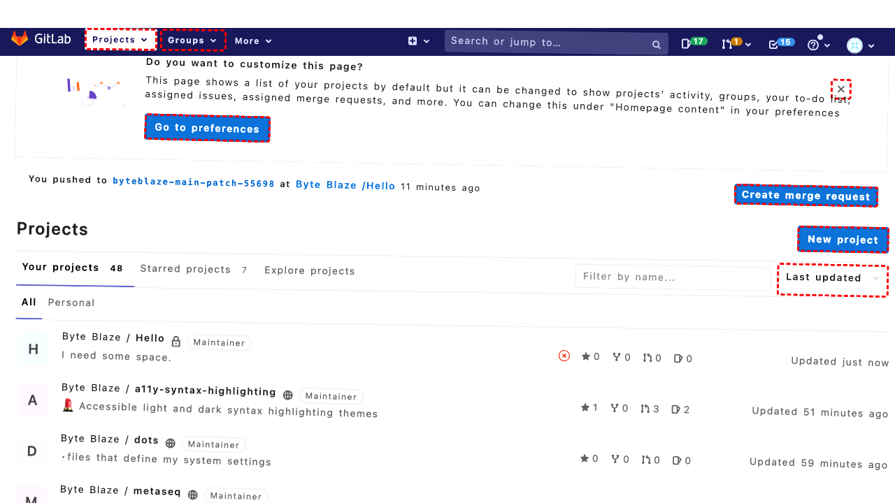
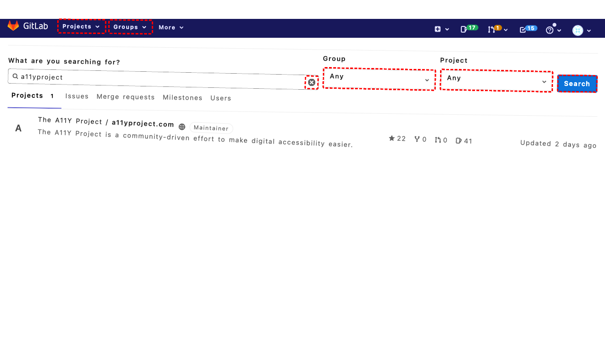

## Intent

set the homepage URL on my GitLab profile to https://egg.tart.com

## RM

Thoughts: The user's intent is to set the homepage URL on their GitLab profile to "https://egg.tart.com", which is a content modification task. The action history shows the agent clicked to navigate to the profile settings, filled the URL field with the desired value, and clicked to save. The final state confirms the profile was successfully updated and the "Website url" field now contains "https://egg.tart.com". Therefore, the task is successfully completed.

Status: success

## Final Response "Successfully updated the homepage URL in your GitLab profile to https://egg.tart.com"

## Captions

===============Looking at the current page, I'm on the GitLab dashboard. To set my homepage URL in my GitLab profile, I need to navigate to my user profile settings. I can see there's a user profile link in the top navigation bar (element with ID 187 that shows my avatar).

Let me click on my profile link to access the dropdown menu where I can find the settings option.
===============I can see that clicking on the profile link (ID 187) has expanded the dropdown menu. Now I need to click on the "Settings" link to access my profile settings where I can update my homepage URL.

Looking at the accessibility tree, I can see the "Settings" link has ID 203 in the dropdown menu.
===============Looking at the current page, I can see I'm already on the User Settings page (URL: http://172.26.116.102:8080/profile). The accessibility tree shows I'm in the "Edit Profile" section where I can update my profile information.

To set the homepage URL, I need to find the "Website url" field. I can see it in the accessibility tree with ID 482, and it currently has the value "byteblaze.github.io". I should fill this field with the new homepage URL "https://egg.tart.com".
===============Looking at the current state, I can see that the "Website url" field (ID 482) has already been filled with "https://egg.tart.com" based on the accessibility tree which shows `value='https://egg.tart.com', focused`. This means my previous fill action was successful.

Now I need to save these changes by clicking the "Update profile settings" button, which has ID 513 according to the accessibility tree.
===============Looking at the current state, I can see that the profile was successfully updated (the message "Profile was successfully updated" appears in the accessibility tree). The "Website url" field now shows the value "https://egg.tart.com", which means my goal of setting the homepage URL to https://egg.tart.com has been accomplished.

Since the task is complete, I should notify the user that the homepage URL has been successfully updated.

## Images





## Main Prompt

```md
User Intent: set the homepage URL on my GitLab profile to https://egg.tart.com

Action History:
1: click("187")
2: click("203")
3: fill("482", "https://egg.tart.com")
4: click("513")
5: send_msg_to_user("Successfully updated the homepage URL in your GitLab profile to https://egg.tart.com")


The detailed final state of the webpage:

```md
Looking at the current state, I can see that the profile was successfully updated (the message "Profile was successfully updated" appears in the accessibility tree). The "Website url" field now shows the value "https://egg.tart.com", which means my goal of setting the homepage URL to https://egg.tart.com has been accomplished.

Since the task is complete, I should notify the user that the homepage URL has been successfully updated.
```

Bot response to the user: "Successfully updated the homepage URL in your GitLab profile to https://egg.tart.com".
```
