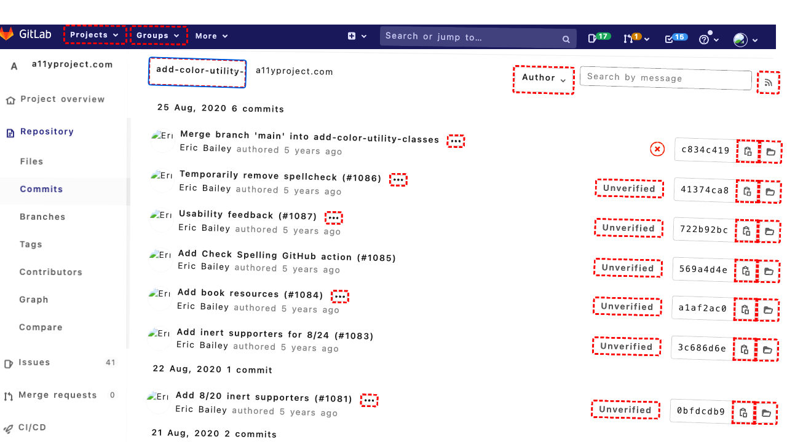
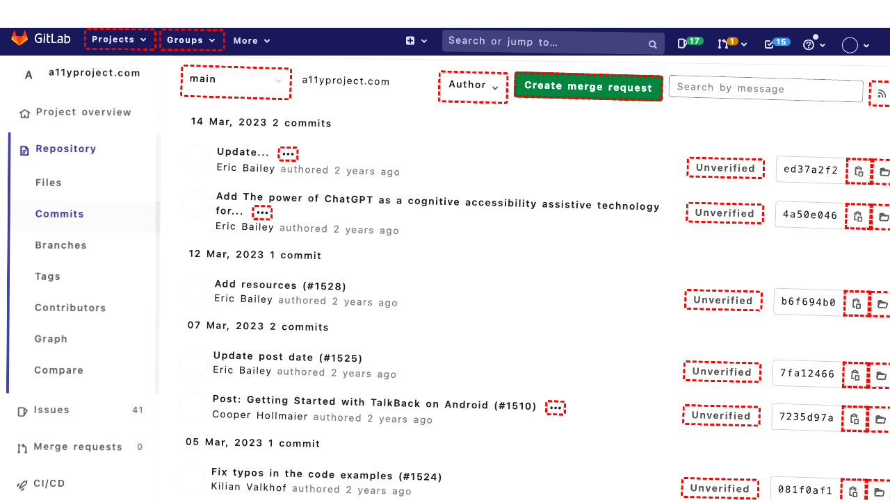

## Intent

How many commits did kilian make to a11yproject on 3/5/2023?

## RM

Thoughts: This is an information seeking task where the user wants to know how many commits Kilian made to a11yproject on 3/5/2023. The agent's action history shows it navigated through the site, filled in a search field with "kilian", and clicked various elements. The final state of the webpage confirms there is exactly 1 commit by Kilian Valkhof on March 5, 2023, and the bot's response accurately provides this information. The actions taken were sufficient to locate and verify the specific information requested.

Status: "success"

## Final Response "Kilian made 1 commit to a11yproject on 3/5/2023."

## Captions

===============Looking at the current page, I can see the GitLab dashboard with a list of projects. I need to find the "a11yproject" repository and then navigate to its commit history to check how many commits "kilian" made on 3/5/2023.

From the accessibility tree, I can see there's a project called "The A11Y Project / a11yproject.com" with a link at ID 284. This appears to be the project I need to examine. I should click on this link to navigate to the project page first.
===============Looking at the current page, I can see I'm on the a11yproject.com repository page. I need to find commit information for a specific user (kilian) on a specific date (3/5/2023).

From the accessibility tree, I can see there's a link to "Activity" at ID 249 in the project navigation. This is likely where I can find commit history and activity data. I should click on this Activity link to access the commit history where I can then filter by user and date.
===============Looking at the current state, I can see I'm already on the Activity page for the a11yproject.com repository (based on the URL and page title). The activity feed shows various events like users leaving the project, merge requests being opened, and comments on issues, but I don't see any commit information displayed yet.

The activity page appears to be showing all activity types by default. I need to filter this to show only push events (which would include commits). Looking at the accessibility tree, I can see there are filter options at IDs 475-491, including "Push events" at ID 479. I should click on "Push events" to filter the activity to show only commits.
===============Looking at the current state, I can see I'm on the Activity page with "Push events" filtered, but the displayed activities are still showing events from "1 week ago" rather than the specific date I need (3/5/2023). The current view doesn't seem to provide a way to filter by specific date or user.

I need to find a different approach to access commit history with date filtering. Looking back at the accessibility tree, I notice there's a "Repository" link at ID 255 in the project navigation. This might lead to a more detailed commit history interface where I can filter by date and author. Let me navigate to the repository section first.
===============Looking at the current situation, I realize I've been navigating through the Activity section but haven't found the specific commit filtering capabilities I need. The goal is to find commits by "kilian" on 3/5/2023, which requires access to the detailed commit history with date and author filtering.

From the accessibility tree, I can see there's a "Commits" link at ID 270 under the Repository section. This is likely the dedicated commit history page where I can view all commits and potentially filter by author and date. This should provide the functionality I need to answer the user's question.
===============Looking at the current page, I can see I'm now on the Commits page for the "add-color-utility-classes" branch of the a11yproject.com repository. The page shows commit history grouped by date, but all the commits displayed are from 2020 (5 years ago), which is much earlier than the target date of 3/5/2023.

I need to find a way to filter commits by date and author. Looking at the accessibility tree, I can see there's a search box at ID 500 labeled "Filter by commit message". While this filters by commit message, I need to find a way to filter by date and author specifically.

Let me first try using the search functionality to see if I can filter for "kilian" to find commits by that author, which might help narrow down the results before filtering by date.
===============Looking at the current state, I can see I'm on the commits page for the "add-color-utility-classes" branch with the search box already filled with "kilian" (as shown in the accessibility tree: `searchbox 'Filter by commit message' value='kilian', focused`). The search appears to have been executed since the value is already set.

However, I notice the commits displayed are from 2020, which is much earlier than the target date of 3/5/2023. This suggests that either:
1. There are no commits by "kilian" on 3/5/2023 in this branch, or
2. I need to check a different branch or the main repository

The current URL shows I'm viewing commits for the "add-color-utility-classes" branch specifically. To get a complete view of all commits by "kilian" on 3/5/2023, I should check the main/default branch instead. Looking at the accessibility tree, I can see a branch selector button at ID 477 labeled "add-color-utility-classes" with a dropdown indicator. I should click this to switch to a different branch, likely the main branch.
===============Looking at the current state, I can see I'm on the commits page for the "add-color-utility-classes" branch, but the commits shown are from 2020, which is much earlier than the target date of 3/5/2023. The search for "kilian" has already been applied but shows no results from 2023.

I need to check if there are commits by "kilian" on 3/5/2023 in the main branch instead. The branch dropdown is open (expanded=True), and I can see various branch options including "main" at ID 1466. I should select the "main" branch to view commits there, which might include more recent activity.
===============Looking at the current state, I can see I'm now on the main branch commits page. The accessibility tree shows commit history grouped by date, and I can see there's a section for "05 Mar, 2023" at ID 637-641 with "1 commit" listed. Within this section, I can see a commit by "Kilian Valkhof" at ID 642-661 with the message "Fix typos in the code examples (#1524)". This matches exactly what I'm looking for - a commit by kilian on 3/5/2023.

The accessibility tree clearly shows there is 1 commit by Kilian Valkhof on March 5, 2023. I can now provide this answer to the user.

## Images




## Main Prompt

```md
User Intent: How many commits did kilian make to a11yproject on 3/5/2023?

Action History:
1: click("284")
2: click("249")
3: click("479")
4: click("255")
5: click("270")
6: fill("500", "kilian")
7: click("477")
8: click("1466")
9: send_msg_to_user("Kilian made 1 commit to a11yproject on 3/5/2023.")


The detailed final state of the webpage:

```md
Looking at the current state, I can see I'm now on the main branch commits page. The accessibility tree shows commit history grouped by date, and I can see there's a section for "05 Mar, 2023" at ID 637-641 with "1 commit" listed. Within this section, I can see a commit by "Kilian Valkhof" at ID 642-661 with the message "Fix typos in the code examples (#1524)". This matches exactly what I'm looking for - a commit by kilian on 3/5/2023.

The accessibility tree clearly shows there is 1 commit by Kilian Valkhof on March 5, 2023. I can now provide this answer to the user.
```

Bot response to the user: "Kilian made 1 commit to a11yproject on 3/5/2023.".
```
