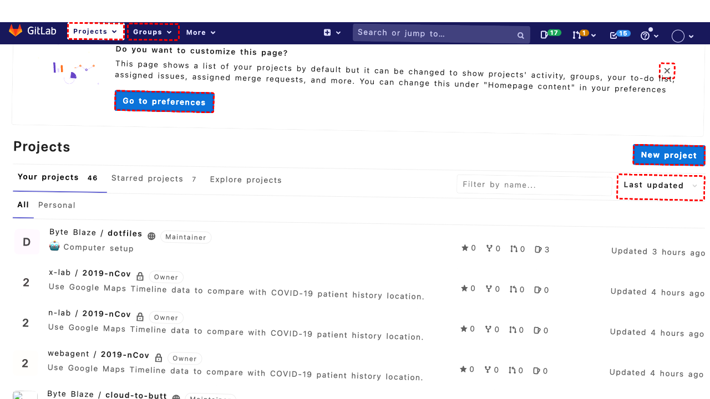
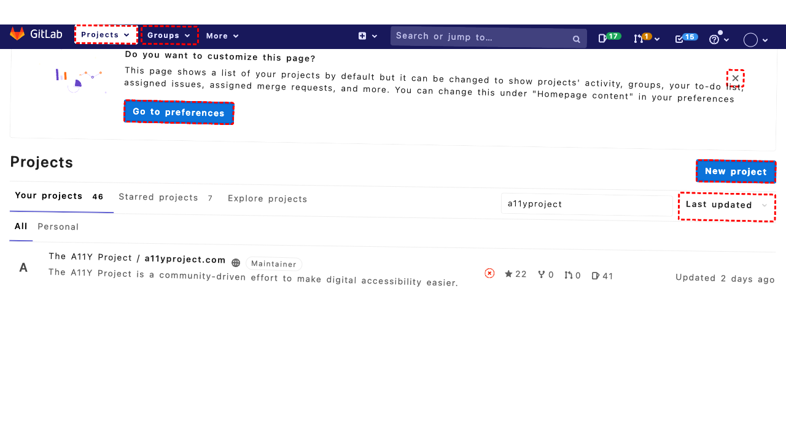
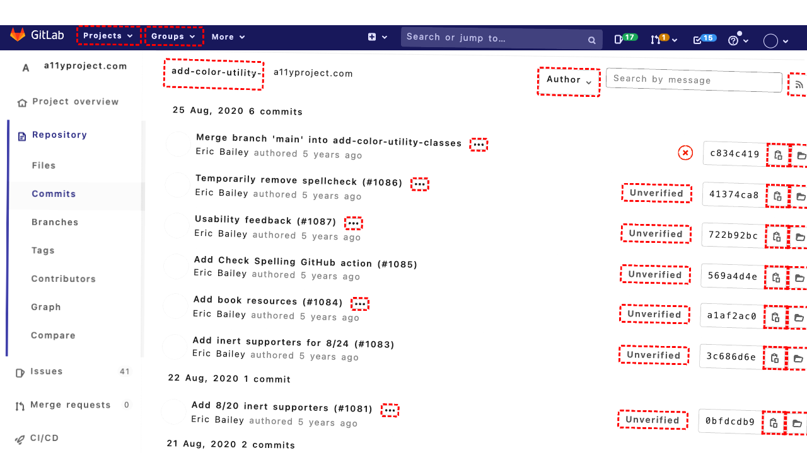
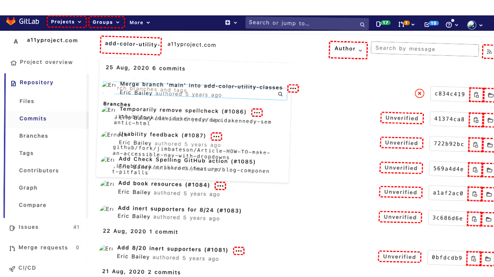
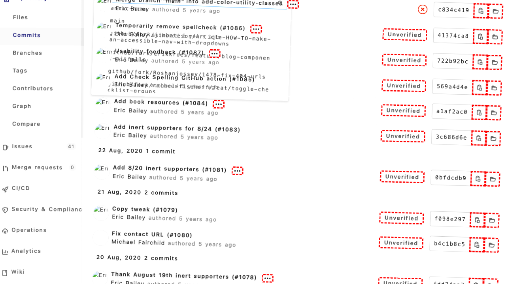
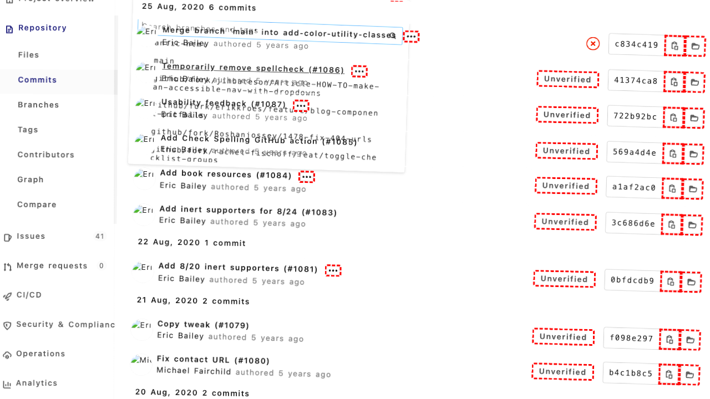

## Intent

Tell me the the number of reviews that our store received by far that mention term "best"

## RM

Thoughts: The user's intent is to obtain the number of reviews that mention the term "best". This is an information-seeking task. The agent's action history shows it navigated to the reviews section, applied a filter for "best", and then extracted the result. The final state indicates the filter was applied and the page displays "Total 0 records found". The agent's response correctly reports this count as 0. The actions appear sufficient: the agent performed necessary navigation, filtering, and reading of the result. There is no indication of missing steps or errors.

Status: success

## Final Response "The store has received 0 reviews that mention the term 'best'."

## Captions

===============I need to navigate to the "All Reviews" page to filter reviews by the term "best" and get the count. Currently, I'm on the Dashboard page. According to the action trajectory, I should first click the "Catalog" menu (bid 113), then "Reviews and Ratings" (bid 139), then "Customer Reviews" (bid 143), then "All Reviews" (bid 150). However, looking at the accessibility tree, I see that "Customer Reviews" (bid 143) is already a link that expands a submenu, and "All Reviews" (bid 150) is directly under it. So I can follow the trajectory.

Let me start by clicking "Catalog" to expand the menu.
===============I'll continue by clicking "Reviews and Ratings" to expand that section.
===============I can see that after clicking "Catalog" and "Reviews and Ratings", the menu has expanded. Now I need to click "Customer Reviews" to expand its submenu, then click "All Reviews" to navigate to the reviews listing page.

Looking at the accessibility tree, I can see that "Customer Reviews" has bid 143 and "All Reviews" has bid 150. Let me click "Customer Reviews" first.
===============Now that "Customer Reviews" is expanded, I can click "All Reviews" to navigate to the reviews listing page.
===============Looking at the current state, I can see I'm already on the "All Reviews" page (the URL ends with `/admin/catalog_product_review/` and the page title is "All Reviews / Customer Reviews / Reviews and Ratings / Catalog / Magento Admin"). This matches the goal of being on the reviews listing page.

Now I need to filter reviews by the term "best" and then get the count. According to the action trajectory, I should:
1. Fill the Review textbox (bid 621) with the term "best"
2. Click the Search button (bid 474) to apply the filter
3. Extract the count from the filtered results

I can see in the accessibility tree that there's a textbox with bid 621 under the "Review" column header. This is the filter field for review content. I'll fill it with "best".
===============Looking at the current state, I can see that the textbox with bid 621 already has the value "best" (as shown in the accessibility tree: `StaticText 'best'`). This suggests that the filter may already be applied, or at least the field is pre-filled. However, I need to ensure the filter is actually applied by clicking the Search button to refresh the results.

The action trajectory indicates I should click the Search button (bid 474) after filling the field. Even though the field already contains "best", I should still click Search to trigger the filter and update the review count.

After that, I can extract the count from the page. I can see in the accessibility tree there's a text that says "Total 128 records found" (in the LayoutTableCell with bid 453). This appears to be the total count of all reviews, not filtered. After applying the filter, this count should update to show only reviews containing "best".

Let me click the Search button now.
===============Looking at the current state, I can see that after clicking the Search button, the page has refreshed. The URL now contains a filter parameter (`/filter/Y3JlYXRlZF9hdCU1QmxvY2FsZSU1RD1lbl9VUyZkZXRhaWw9YmVzdA==/`) which indicates the filter for "best" has been applied.

In the accessibility tree, I can see in the LayoutTableCell with bid 453, there's text that says "Total 0 records found". This suggests that after filtering for reviews containing "best", there are 0 matching reviews. However, I need to verify this is the correct count.

The goal is to "tell me the number of reviews that our store received by far that mention term 'best'". The count appears to be 0 based on the current display. I should extract this count and report it to the user.

I can use the `extract_count()` function from the action trajectory example, but looking at the available actions, I don't see `extract_count()` listed. Instead, I should read the count from the page and send it to the user.

From the accessibility tree, I can see the text "Total 0 records found" in the LayoutTableCell (bid 453). This is the count I need to report. I'll extract this information and send it to the user.

## Images









## Main Prompt

```md
User Intent: Tell me the the number of reviews that our store received by far that mention term "best"

Action History:
1: click("113")
2: click("139")
3: click("143")
4: click("150")
5: fill("621", "best")
6: click("474")
7: send_msg_to_user("The store has received 0 reviews that mention the term 'best'.")


The detailed final state of the webpage:

```md
Looking at the current state, I can see that after clicking the Search button, the page has refreshed. The URL now contains a filter parameter (`/filter/Y3JlYXRlZF9hdCU1QmxvY2FsZSU1RD1lbl9VUyZkZXRhaWw9YmVzdA==/`) which indicates the filter for "best" has been applied.

In the accessibility tree, I can see in the LayoutTableCell with bid 453, there's text that says "Total 0 records found". This suggests that after filtering for reviews containing "best", there are 0 matching reviews. However, I need to verify this is the correct count.

The goal is to "tell me the number of reviews that our store received by far that mention term 'best'". The count appears to be 0 based on the current display. I should extract this count and report it to the user.

I can use the `extract_count()` function from the action trajectory example, but looking at the available actions, I don't see `extract_count()` listed. Instead, I should read the count from the page and send it to the user.

From the accessibility tree, I can see the text "Total 0 records found" in the LayoutTableCell (bid 453). This is the count I need to report. I'll extract this information and send it to the user.
```

Bot response to the user: "The store has received 0 reviews that mention the term 'best'.".
```
