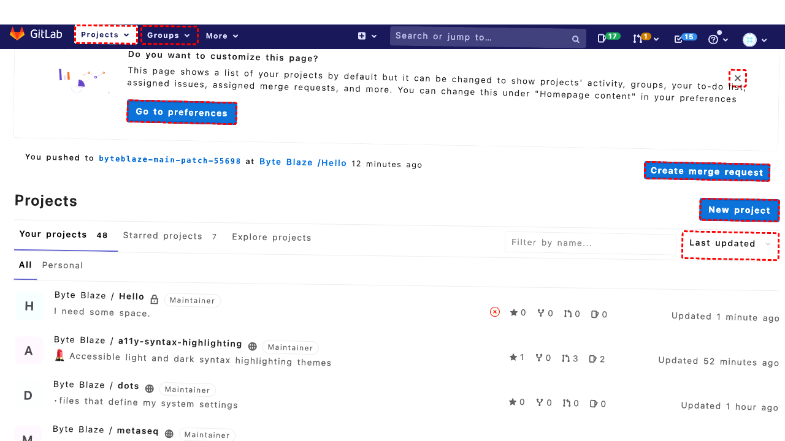
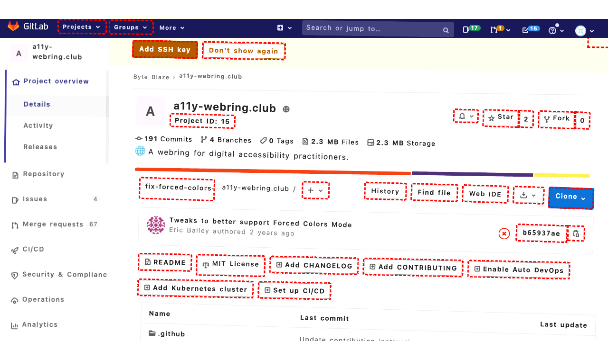
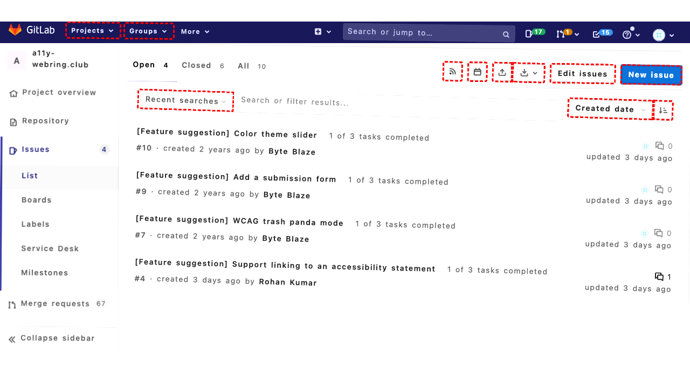
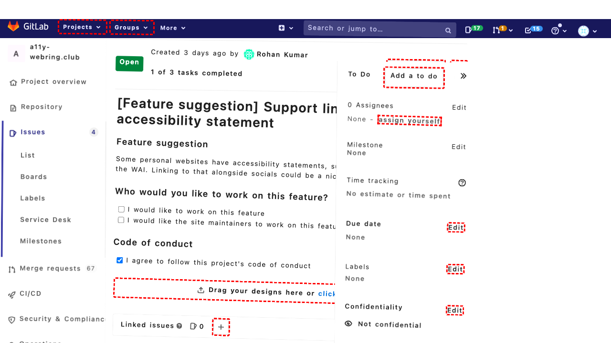
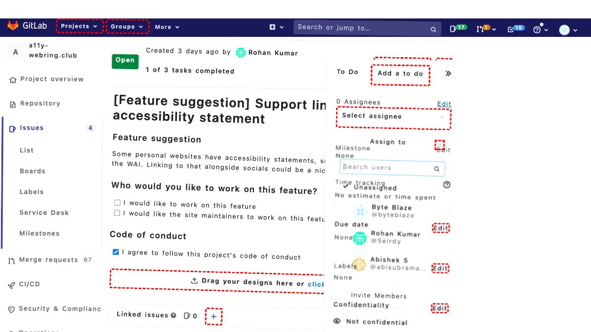
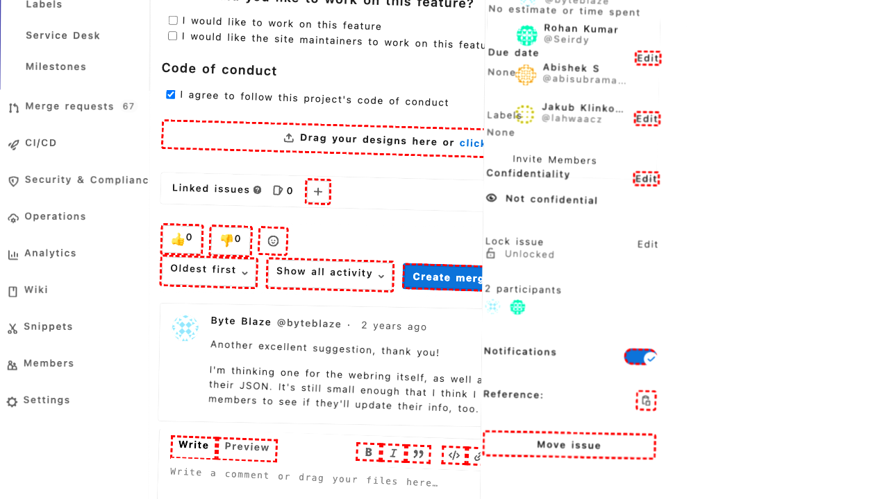

## Intent

set the homepage URL on my GitLab profile to https://helloworld.xyz

## RM

Thoughts: The user's intent is to modify the content of their GitLab profile by setting the homepage URL, which falls under the "Content modification" task type. The action history shows the agent filled the URL field with "https://helloworld.xyz" and clicked to update the profile. The final state of the webpage confirms a success message ("Profile was successfully updated"), indicating the modification was applied. Since the task is content modification, the bot's response is not needed for evaluation, and the action history and final state confirm success.

Status: success

## Final Response "Successfully set the homepage URL on your GitLab profile to https://helloworld.xyz"

## Captions

===============Looking at the current page, I'm on the GitLab dashboard showing projects. To set my homepage URL in my GitLab profile, I need to navigate to my user profile settings. I can see there's a user profile link in the top navigation with my avatar.

The user profile link appears to be at element [187] with the URL `http://172.26.116.102:8080/byteblaze`. This should take me to my profile page where I can access settings to update my homepage URL.
===============Looking at the current state, I just clicked on my user profile link. Now I need to navigate to the settings page where I can update my profile information including the homepage URL. From the accessibility tree, I can see there's a "Settings" link available in the user dropdown menu at element [203].
===============Looking at the current page, I can see I'm on the User Settings page with a sidebar navigation. I need to find where to set the homepage URL. From the accessibility tree, I can see there's a "Profile" section in the sidebar that's currently active, and within the form there are various fields including "Website url" at element [482] with the current value "https://egg.tart.com". This is exactly where I need to update the homepage URL.
===============Looking at the current state, I can see that I successfully filled the "Website url" field with "https://helloworld.xyz" in my previous action. Now I need to save these changes by clicking the "Update profile settings" button, which is visible at element [513] in the accessibility tree.
===============Looking at the current state, I can see from the accessibility tree that there's a success message displayed: "Profile was successfully updated" (visible at element with StaticText containing this message). This indicates that my previous action of clicking the "Update profile settings" button was successful and the homepage URL has been updated to "https://helloworld.xyz".

Since the goal has been accomplished and the profile was successfully updated, I should notify the user that the task is complete.

## Images







## Main Prompt

```md
User Intent: set the homepage URL on my GitLab profile to https://helloworld.xyz

Action History:
1: click("187")
2: click("203")
3: fill("482", "https://helloworld.xyz")
4: click("513")
5: send_msg_to_user("Successfully set the homepage URL on your GitLab profile to https://helloworld.xyz")


The detailed final state of the webpage:

```md
Looking at the current state, I can see from the accessibility tree that there's a success message displayed: "Profile was successfully updated" (visible at element with StaticText containing this message). This indicates that my previous action of clicking the "Update profile settings" button was successful and the homepage URL has been updated to "https://helloworld.xyz".

Since the goal has been accomplished and the profile was successfully updated, I should notify the user that the task is complete.
```

Bot response to the user: "Successfully set the homepage URL on your GitLab profile to https://helloworld.xyz".
```
