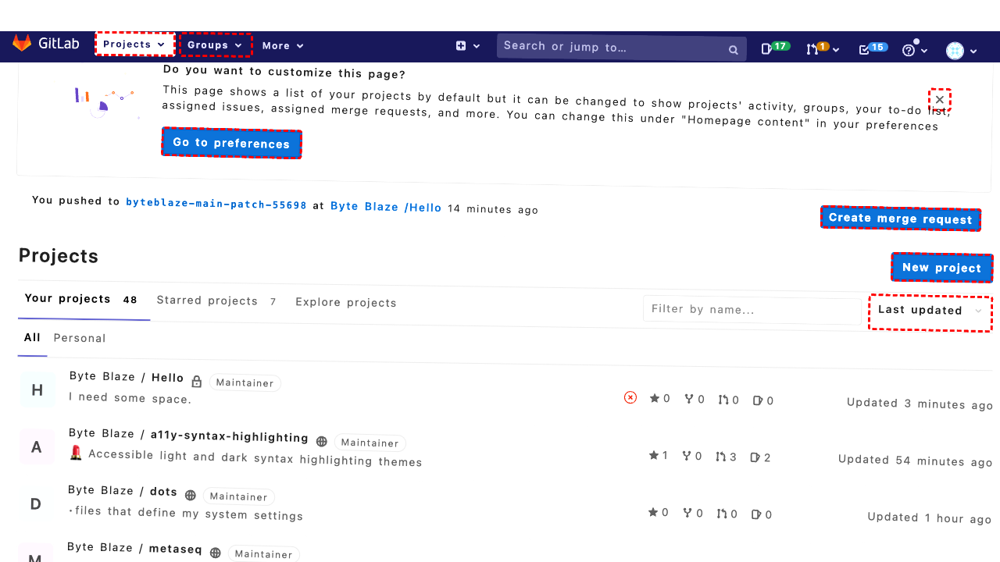
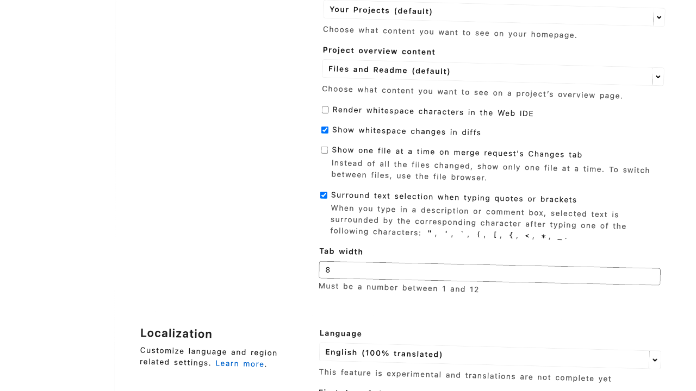
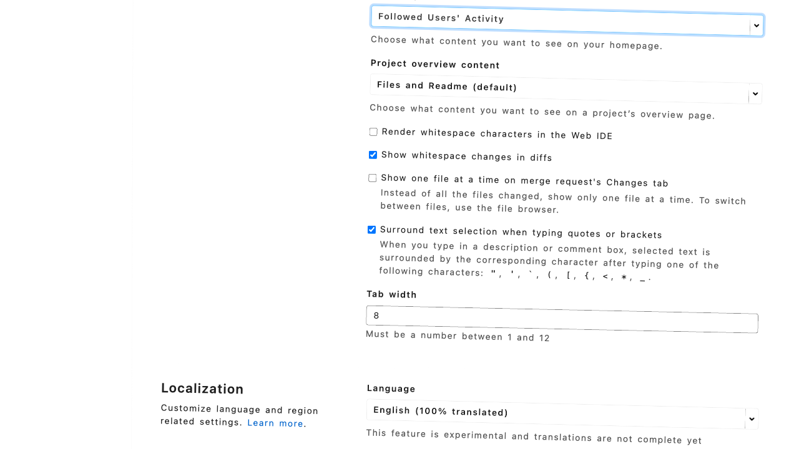
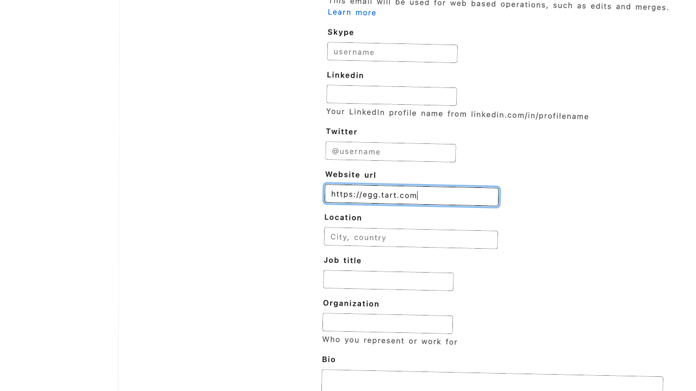
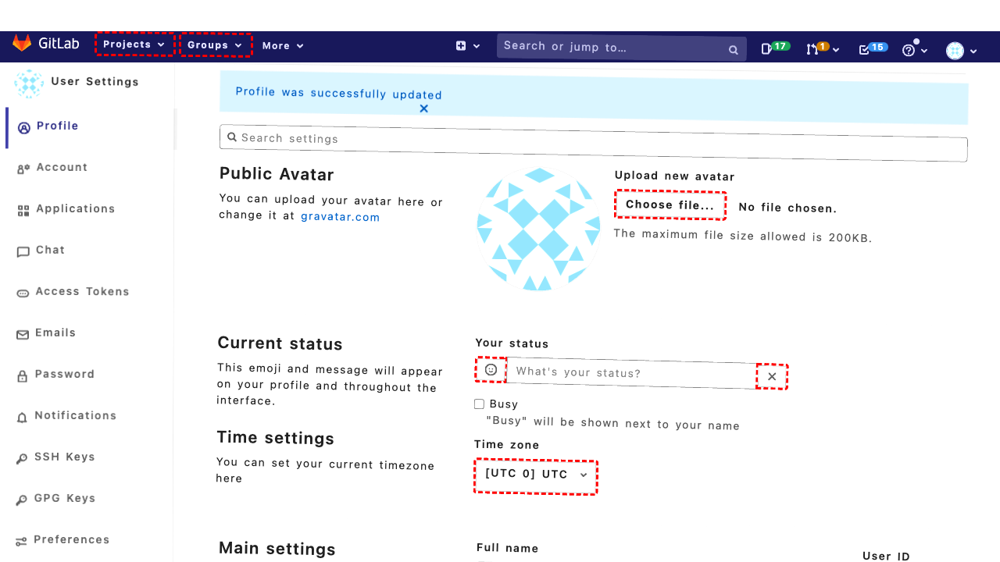

## Intent

set the homepage URL on my GitLab profile to https://egg.tart.com

## RM

Thoughts: The user's intent is to set the homepage URL on their GitLab profile to "https://egg.tart.com", which is a content modification task. The action history shows that the agent filled the "Website url" field with the correct URL and clicked a button (likely "Update profile settings"). The final state confirms the URL was successfully entered and the field is focused, but there is no explicit confirmation in the final state that the changes were saved. However, since the task is content modification and the agent performed the necessary actions (filling the correct URL and clicking to save), and the final state shows the URL is present in the field, it is reasonable to conclude the task was completed successfully. The bot's response being "None" does not affect the evaluation for content modification tasks.

Status: success

## Final Response 

## Captions

===============Looking at the current page, I can see a banner that mentions "Homepage content" in preferences. The banner says: "You can change this under 'Homepage content' in your preferences" and includes a link "Go to preferences". This is exactly what I need to access the settings where I can set the homepage URL.

The "Go to preferences" link appears to be the most direct way to get to the user preferences page where I can modify the homepage URL setting.
===============Looking at the current page, I can see I'm already on the Preferences page in User Settings. The URL shows `/profile/preferences#behavior` which is exactly where I need to be to set the homepage URL.

In the accessibility tree, I can see the "Behavior" section which includes "Homepage content" settings. There's a button with the label "Homepage content" that has a dropdown menu (indicated by `hasPopup='menu'`). This is where I can change the homepage setting.

The current setting shows "Your Projects (default)" but I need to set a custom URL. I should click on the "Homepage content" dropdown to see the available options, including the ability to set a custom URL.
===============Looking at the error message, I can see that the click on element "543" failed because there's an overlapping element (bid="536") that's intercepting pointer events. This suggests the dropdown might have a complex structure with multiple overlapping elements.

Let me examine the accessibility tree more carefully. I can see there are actually two elements related to "Homepage content":
- A link element (bid="537") that shows the current selection "Your Projects (default)"
- A button element (bid="543") labeled "Homepage content" with hasPopup='menu'

The error suggests that bid="536" (which appears to be the container for the dropdown) is intercepting the click. Let me try clicking on the link element (bid="537") instead, as it might be more directly accessible for opening the dropdown menu.
===============Looking at the current state, I can see that the "Homepage content" dropdown is now expanded and showing the available options (bid="548" listbox). The options include various preset choices like "Your Projects", "Starred Projects", etc., but I don't see a "Custom URL" option in the list.

However, the goal is to set a specific custom URL "https://egg.tart.com" as the homepage. Since the dropdown only shows preset options and no custom URL option is visible, I need to check if there might be another way to set a custom homepage URL, perhaps in a different section of the preferences.

Let me first check what options are available in the dropdown to confirm there's no custom URL option, then I'll need to explore other sections if necessary.
===============Looking at the current state, I can see that clicking on "Your Projects" (bid="706") in the dropdown menu didn't achieve the goal of setting a custom URL. The dropdown only contains preset options for homepage content, and there's no option for setting a custom URL.

Since the goal is to set a specific URL "https://egg.tart.com" as the homepage, and the current "Homepage content" dropdown only offers preset content types rather than custom URLs, I need to look elsewhere in the preferences.

Let me check if there might be a separate field for setting a homepage URL in the Profile section rather than the Preferences section. The sidebar shows navigation links to different user settings sections, and "Profile" might contain a field for homepage URL.
===============Looking at the current state, I can see I'm now on the Profile settings page (URL shows `/profile`). I need to find where to set the homepage URL.

In the accessibility tree, I can see a "Website url" field (bid="878") with the current value "byteblaze.github.io". This appears to be exactly what I need - this is likely the homepage URL field for the GitLab profile.

I should fill this field with the desired URL "https://egg.tart.com".
===============Looking at the current state, I can see that the "Website url" field (bid="878") is already focused and contains the value "https://egg.tart.com" (as shown in the accessibility tree: `textbox 'Website url' value='https://egg.tart.com', focused`). This means my previous fill action was successful and the URL has already been entered.

Now I need to save these changes by clicking the "Update profile settings" button at the bottom of the form.

## Images









## Main Prompt

```md
User Intent: set the homepage URL on my GitLab profile to https://egg.tart.com

Action History:
1: click("272")
2: click("543")
3: click("537")
4: click("706")
5: click("275")
6: fill("878", "https://egg.tart.com")
7: click("914")


The detailed final state of the webpage:

```md
Looking at the current state, I can see that the "Website url" field (bid="878") is already focused and contains the value "https://egg.tart.com" (as shown in the accessibility tree: `textbox 'Website url' value='https://egg.tart.com', focused`). This means my previous fill action was successful and the URL has already been entered.

Now I need to save these changes by clicking the "Update profile settings" button at the bottom of the form.
```

Bot response to the user: None.
```
