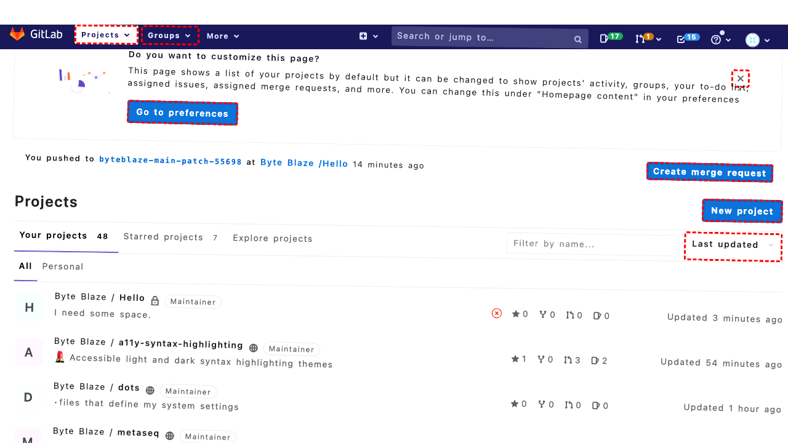
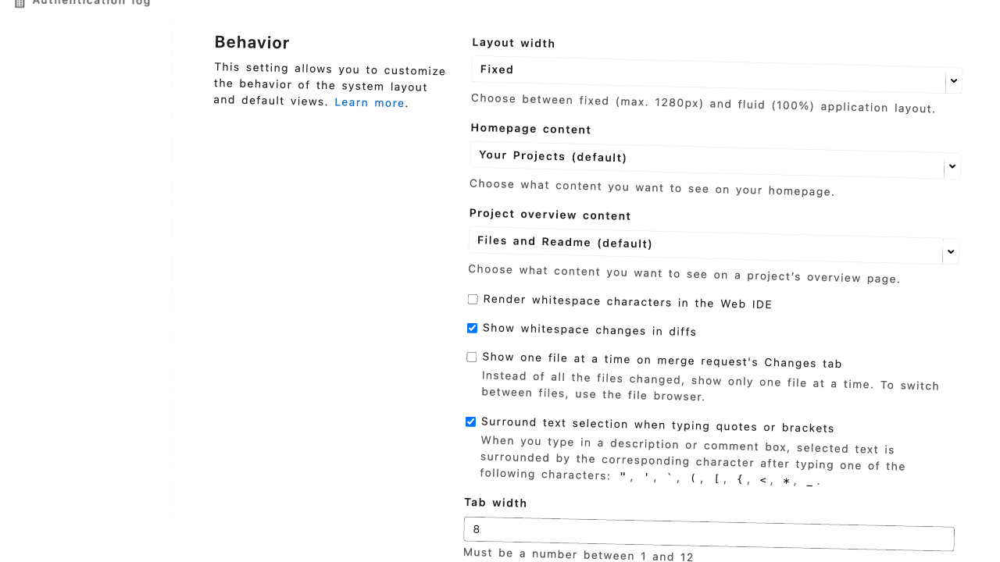
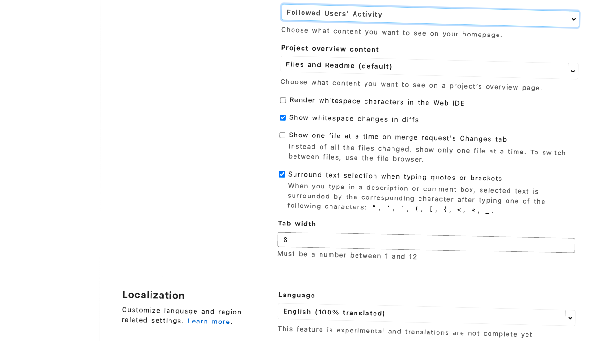
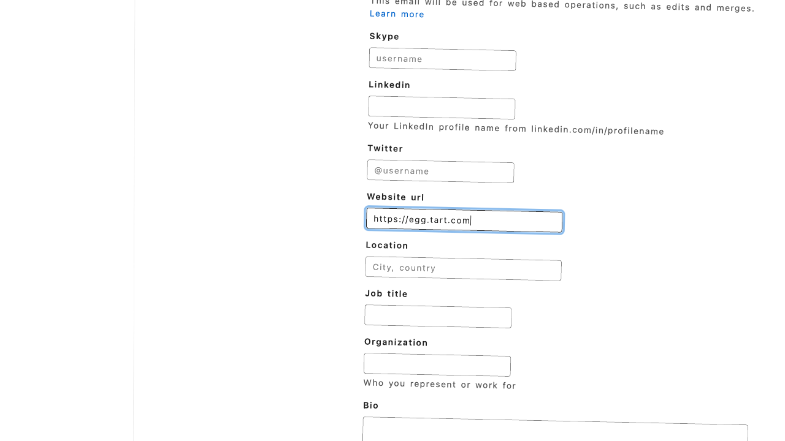

## Intent

Modify the address of order #125 to 654 Elm Drive, Apartment 12, Miami, FL, 33101

## RM

Thoughts: The user's intent is to modify the address of order #125 to a specific address. This is a content modification task. The action history shows the agent navigated to the orders page, clicked on order #125 (likely via IDs 710 and 593), filled in the address details (street, city, state, zip), and clicked to save (ID 451). The final state confirms a success message and that the shipping address section displays the updated address exactly as intended. The bot's response also confirms the update. All evidence indicates the modification was successfully executed.

Status: success

## Final Response "Successfully updated the shipping address for order #125 to 654 Elm Drive, Apartment 12, Miami, FL, 33101."

## Captions

===============I need to modify the address of order #125. Currently, I'm on the Dashboard page. To access order #125, I need to navigate to the Orders page first. Looking at the accessibility tree, I can see a navigation menu with "Sales" and under it "Orders". I should click on "Sales" to expand the menu, then click on "Orders". Alternatively, I can directly click the "Orders" link if it's visible. The tree shows a link with text "Orders" under the Sales listitem. I'll use the navigate_to_orders_page function, which can optionally expand the Sales menu first. I'll provide the IDs for the Sales link and Orders link.

From the tree:
- Sales link: [66] link 'Sales' (bid likely 66)
- Orders link: [70] link 'Orders' (bid likely 70)

I'll use navigate_to_orders_page with both IDs to ensure the menu is expanded.
===============Looking at the current state, I can see I'm on the Orders page (the title is "Orders / Sales / Magento Admin"). I can see a table of orders with order numbers like "000000299", "000000065", and "000000125". I need to find order #125, which appears to be order number "000000125" in the third row of the table. I need to click the "View" link for that order to access its details and modify the address.

From the accessibility tree, I can see the row for order #125 has a "View" link with bid 710. I should click on that link to view the order details.
===============Looking at the current page, I can see I'm on the Order View page for order #000000125. The goal is to modify the shipping address to "654 Elm Drive, Apartment 12, Miami, FL, 33101". I can see in the accessibility tree that there's a "Shipping Address" section with an "Edit" link (bid 593). I should click that edit link to access the address editing form.
===============Looking at the current page, I can see I'm on the "Edit Order 000000125 Shipping Address" page (heading at [441]). The form is already loaded with the current address values. I need to update the address fields to the new address: "654 Elm Drive, Apartment 12, Miami, FL, 33101".

From the accessibility tree, I can identify the relevant form fields:

1. Street Address: Currently "123 Peachtree St" (bid 508)
2. City: Currently "Atlanta" (bid 516)
3. State/Province: Currently "Georgia" (bid 776 - combobox)
4. Zip/Postal Code: Currently "30308" (bid 849)
5. Country: Already "United States" (bid 522) - should remain the same

The new address is "654 Elm Drive, Apartment 12, Miami, FL, 33101". I need to:
- Update Street Address to "654 Elm Drive, Apartment 12"
- Update City to "Miami"
- Update State/Province to "Florida" (FL)
- Update Zip/Postal Code to "33101"

I'll fill each field in sequence, then save the changes.
===============Looking at the current state, I've successfully updated the street address. Now I need to update the city field from "Atlanta" to "Miami". The city field has bid 516 and currently shows "Atlanta". I'll fill it with the new city.
===============Looking at the current state, I've updated the street address and city. Next, I need to update the state/province from "Georgia" to "Florida". The state field is a combobox with bid 776. I need to select the "Florida" option.
===============Looking at the current state, I've updated the street address, city, and state. Next, I need to update the zip/postal code from "30308" to "33101". The zip code field has bid 849 and currently shows "30308". I'll fill it with the new zip code.
===============Looking at the current state, I've successfully updated all the address fields to the new values. Now I need to save the changes. I can see there's a "Save Order Address" button with bid 451. I should click this button to save the modified address.
===============Looking at the current state, I can see I'm back on the Order View page for order #000000125. The accessibility tree shows a success message at [497]: "The order address has been updated." This confirms that the address modification was successful.

I should verify that the shipping address now shows the updated information. In the Shipping Address section at [599], I can see it displays "654 Elm Drive, Apartment 12" and "Miami, Florida, 33101", which matches the goal address. The task is complete.

I'll send a confirmation message to the user.

## Images










## Main Prompt

```md
User Intent: Modify the address of order #125 to 654 Elm Drive, Apartment 12, Miami, FL, 33101

Action History:
1: navigate_to_orders_page('70', '66')
2: click("710")
3: click("593")
4: fill("508", "654 Elm Drive, Apartment 12")
5: fill("516", "Miami")
6: select_option("776", "Florida")
7: fill("849", "33101")
8: click("451")
9: send_msg_to_user("Successfully updated the shipping address for order #125 to 654 Elm Drive, Apartment 12, Miami, FL, 33101.")


The detailed final state of the webpage:

```md
Looking at the current state, I can see I'm back on the Order View page for order #000000125. The accessibility tree shows a success message at [497]: "The order address has been updated." This confirms that the address modification was successful.

I should verify that the shipping address now shows the updated information. In the Shipping Address section at [599], I can see it displays "654 Elm Drive, Apartment 12" and "Miami, Florida, 33101", which matches the goal address. The task is complete.

I'll send a confirmation message to the user.
```

Bot response to the user: "Successfully updated the shipping address for order #125 to 654 Elm Drive, Apartment 12, Miami, FL, 33101.".
```
