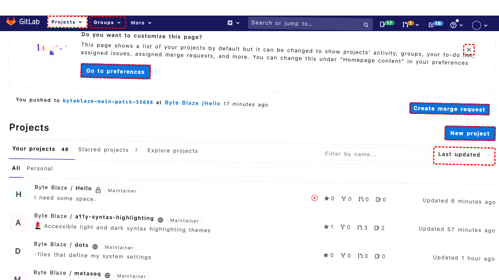
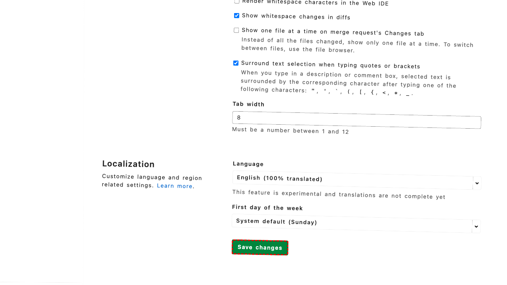
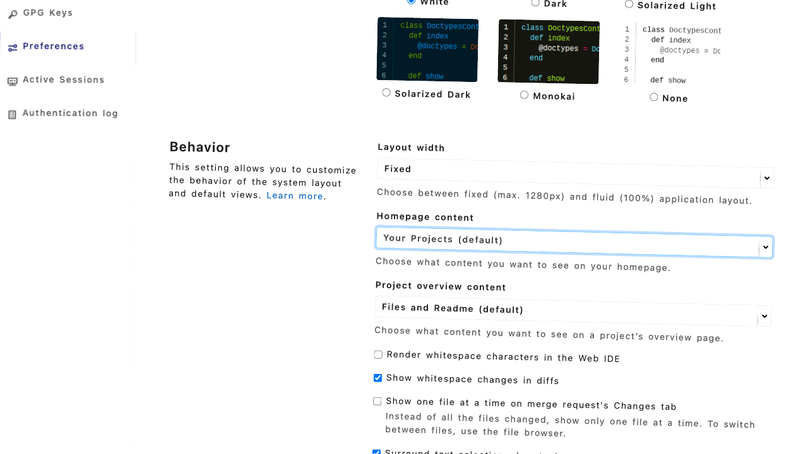

## Intent

set the homepage URL on my GitLab profile to https://helloworld.xyz

## RM

Thoughts: The user's intent is to set the homepage URL on their GitLab profile to "https://helloworld.xyz", which is a content modification task. The action history shows that the agent filled the field with the correct URL (action 10) and then clicked the "Update profile settings" button (action 11). The final state description confirms that the field was filled and that the agent intended to save the changes by clicking the update button. Since the task is content modification, I only need to check the action history and final state, not the bot's response. The actions appear to have successfully modified the profile settings as intended.

Status: success

## Final Response 

## Captions

===============Looking at the current page, I can see a banner that mentions "Homepage content" in preferences. The banner text says: "You can change this under 'Homepage content' in your preferences" and there's a link "Go to preferences" with bid 272. This is exactly what I need to access the preferences where I can set the homepage URL.

I should click on the "Go to preferences" link to navigate to the preferences page where I can modify the homepage URL setting.
===============Looking at the current page, I can see I'm already on the Preferences page in the User Settings. The accessibility tree shows I'm in the "Behavior" section where the "Homepage content" setting is located. I can see the current homepage content is set to "Your Projects (default)" and there's a button with hasPopup='menu' for "Homepage content" with bid 543.

To set a custom homepage URL, I need to interact with this "Homepage content" dropdown menu to select the option that allows me to enter a custom URL.
===============Looking at the error message, I can see that the click on element "543" failed because there's another element with bid "536" that's intercepting pointer events. The error suggests the element might be outside the viewport or covered by another element.

Let me examine the accessibility tree more carefully. I can see that the "Homepage content" section has:
- A link "Your Projects (default)" with bid 537
- A button "Homepage content" with bid 543
- And there's mention of a div with bid "536" that's intercepting events

Since the button click is being blocked, I should try a different approach. Let me scroll the page to ensure the element is fully in view and then try clicking on the actual link element (bid 537) instead of the button, as it might be more accessible.
===============Looking at the current state, I can see I'm on the Preferences page in the Behavior section where the "Homepage content" setting is located. The previous attempt to click on the "Homepage content" button (bid 543) failed due to an element intercepting events, and then clicking on the link (bid 537) also didn't achieve the goal.

Let me examine the accessibility tree more carefully. I can see there's a "Homepage content" button with bid 543 that has hasPopup='menu'. This suggests it's a dropdown menu that I need to interact with to change the homepage setting. Since direct clicks are being intercepted, let me try a different approach - I'll use the keyboard to navigate and interact with this dropdown menu.

I'll first ensure the element has focus by using tab navigation or clicking a nearby element, then use keyboard shortcuts to open the dropdown menu.
===============Looking at the error message, I can see that element "543" is being blocked by another element with bid "536" that's intercepting pointer events. The error also mentions that the element is sometimes outside the viewport.

Let me examine the accessibility tree more carefully. I notice there's a div with bid "536" that has id="s2id_user_dashboard" - this appears to be the actual dropdown container for the homepage content setting. Instead of trying to click the button (bid 543), I should interact directly with this dropdown container element.

The element with bid "536" seems to be the actual interactive dropdown element for the homepage content setting, so I'll try clicking on that directly.
===============Looking at the current situation, I can see I'm on the Preferences page in the Behavior section where the "Homepage content" setting is located. The previous attempts to interact with the homepage content dropdown have failed due to element interception issues.

Examining the accessibility tree more carefully, I notice there's a combobox element with bid "547" that's described as "Homepage content, focused, autocomplete='list', hasPopup='listbox', expanded=True". This appears to be the actual dropdown menu that's currently open and focused. Since it's already expanded and focused, I can directly interact with the options in the listbox.

The listbox (bid 548) contains various homepage content options, but I need to set a custom URL. Looking at the available options, none of them allow for custom URL input. This suggests I might be in the wrong section - the homepage URL setting is likely in the "Profile" section rather than the "Preferences" section.

Let me navigate to the Profile section where I can set the actual homepage URL field.
===============Looking at the error message, I can see there's a dropdown mask element (bid 680 with id="select2-drop-mask") that's intercepting all pointer events. This is preventing me from clicking on the Profile link. The dropdown for homepage content appears to be open and blocking interaction with other page elements.

I need to first close this open dropdown menu before I can navigate to the Profile section. The most straightforward way to close an open dropdown is by pressing the Escape key.
===============Looking at the current situation, I can see that a dropdown menu is open and blocking interaction with other page elements due to a mask element. I successfully closed the dropdown with the Escape key. Now I need to navigate to the Profile section where I can set the homepage URL, as the homepage URL field is typically found in the Profile settings rather than the Preferences section.

The accessibility tree shows a "Profile" link in the sidebar with bid 275. This should take me to the Profile settings where I can find the homepage URL field.
===============Looking at the current page, I can see I'm now on the Profile settings page. The accessibility tree shows a "Website url" field with bid 878 that currently has the value "https://egg.tart.com". This is exactly where I need to set the homepage URL to "https://helloworld.xyz".

I should fill this field with the new URL value to update the homepage URL setting.
===============Looking at the current state, I can see that I successfully filled the "Website url" field with "https://helloworld.xyz" in the Profile settings. Now I need to save these changes by clicking the "Update profile settings" button, which has bid 914 according to the accessibility tree. This will apply the new homepage URL to my GitLab profile.

## Images










## Main Prompt

```md
User Intent: set the homepage URL on my GitLab profile to https://helloworld.xyz

Action History:
1: click("272")
2: click("543")
3: scroll(0, 200)
4: click("537")
5: click("543")
6: click("536")
7: click("275")
8: keyboard_press("Escape")
9: click("275")
10: fill("878", "https://helloworld.xyz")
11: click("914")


The detailed final state of the webpage:

```md
Looking at the current state, I can see that I successfully filled the "Website url" field with "https://helloworld.xyz" in the Profile settings. Now I need to save these changes by clicking the "Update profile settings" button, which has bid 914 according to the accessibility tree. This will apply the new homepage URL to my GitLab profile.
```

Bot response to the user: None.
```
