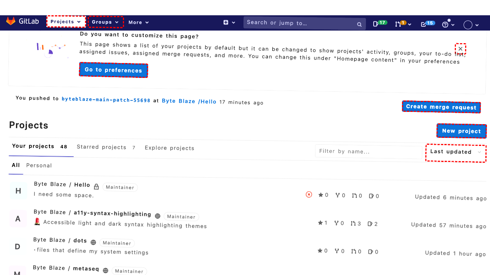
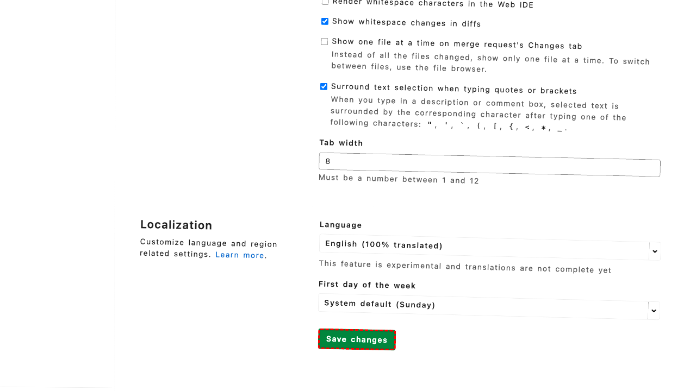
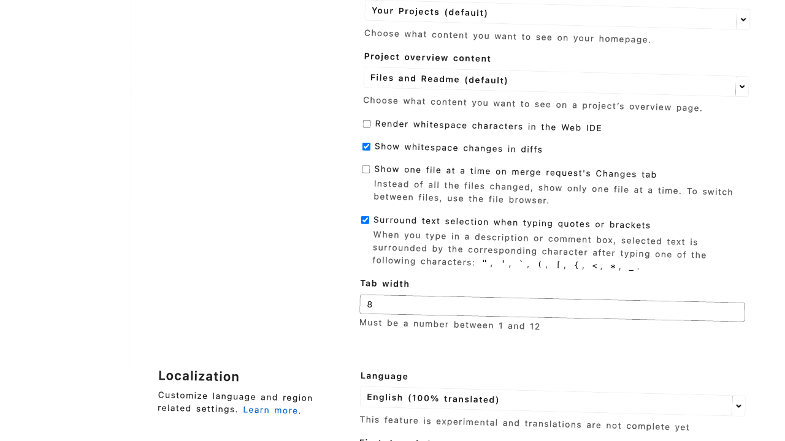
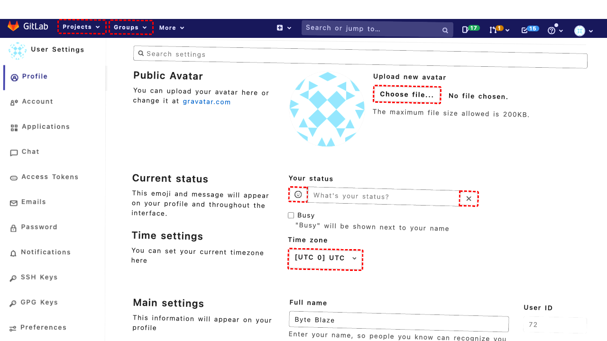
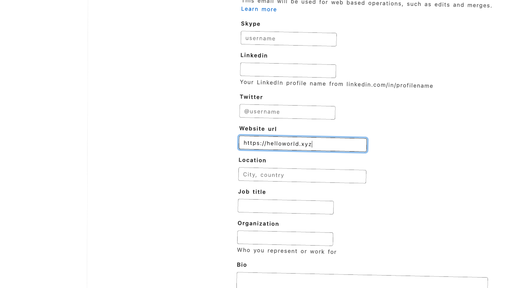

## Intent

Modify the address of order #300 to 987 Cedar Court, Los Angeles, CA, 90012

## RM

Thoughts: The user's intent is to modify the address of order #300 to a specific address. This is a content modification task. The action history shows the agent attempted to search for order #300 (actions 2 and 4) and clicked various buttons, but the final state of the webpage indicates the agent is on the "Edit Order 000000020 Shipping Address" page, which is for order #20, not order #300. The agent itself recognizes this error in the final state description and plans to go back. Since the agent did not successfully navigate to the correct order's edit page and did not fill in the new address, the task has not been completed. The bot response is "None," which also indicates no confirmation of success. Therefore, the execution is a failure.

Status: failure

## Final Response 

## Captions

===============I need to modify the address of order #300. Currently, I'm on the Dashboard page. To access order #300, I need to navigate to the Orders page first. Looking at the accessibility tree, I can see the navigation menu: under "Sales" there is an "Orders" link. I should click on "Sales" to expand the menu, then click "Orders". However, note that the "Sales" link is currently a top-level menu item that might need to be clicked to expand. In the tree, "Sales" is at [66] link 'Sales'. Then "Orders" is at [70] link 'Orders'. I'll use the navigate_to_orders_page function, which can optionally expand the sales menu first.

But I need to check if the sales menu is already expanded. The tree shows the "Sales" listitem [65] and its nested list [68] with "Orders" inside. This suggests the menu might be collapsed by default. I should click the "Sales" link to expand it, then click "Orders". I'll use the navigate_to_orders_page function with both parameters.

First, I'll identify the IDs: The "Sales" link has bid '66' (from [66] link 'Sales'). The "Orders" link has bid '70' (from [70] link 'Orders'). I'll call navigate_to_orders_page with sales_link_id='66' and orders_link_id='70'.
===============Looking at the current page, I can see I'm on the Orders page (the title is "Orders / Sales / Magento Admin"). The page shows a list of orders with order numbers like 000000299, 000000065, etc. I need to find order #300. The order numbers displayed appear to be 9-digit numbers starting with zeros, but order #300 might be displayed as 000000300 or similar.

I need to locate order #300 in the list. Since there are 354 records and 20 per page, I might need to search or filter. I can use the search/filter functionality on the page. There's a textbox in the "Order #" column header at [596] textbox '' (bid likely '596'). I can fill that with "300" or "000000300" to filter.

Let me first try filtering by order number. I'll fill the Order # filter field with "000000300" (since other orders show 9-digit numbers) and click the Search button (bid '486').
===============Looking at the current state, I've filtered the orders by order number "000000300" and clicked Search. Now I need to see if order #300 appears in the results. The accessibility tree shows the filtered results, but I don't see order #300 in the visible rows. The tree shows rows for orders 299, 065, 125, etc., but not 300. This could mean:

1. Order #300 is not on the current page (maybe on another page)
2. The filter didn't work as expected
3. Order #300 might have a different format

Looking at the filter field [596], it currently has value '000000300' (focused). The search was executed. I should check if there are any results. The page shows "Total 354 records found" but after filtering, this number might change. I need to see if any rows appear.

Let me examine the table rows more carefully. The tree shows rows from 663 to 982, which are orders 299, 065, 125, etc. No row for 300. This suggests either:
- Order #300 doesn't exist
- The filter needs to be exact match or different format

I should try a simpler filter: just "300" without leading zeros. Let me clear the filter and try "300".

First, I'll clear the filter field and enter "300", then search again.
===============Looking at the current state, I've filtered by "300" but still don't see order #300 in the results. The tree shows the same rows as before. This suggests order #300 might not be in the current dataset or might have a different numbering format. However, the goal is to modify the address of order #300, so I need to find it.

Let me check if there's a pagination control. I see "Page Go to Previous page 1 Go to Next page of 18 pages" - there are 18 pages. Order #300 might be on a different page. I could navigate through pages, but it would be more efficient to use the filter properly.

Looking at the order numbers displayed: they are 9-digit numbers like "000000299", "000000065", etc. The pattern suggests the order numbers are padded with zeros to 9 digits. So order #300 should be "000000300". My filter with "000000300" should have worked if it exists.

Maybe the filter requires a partial match? Let me try filtering with just "300" but also check if there's a status filter or other filters that might be hiding it. Alternatively, I could click on the "Order #" column header to sort ascending/descending to find order #300.

But first, let me reset all filters to see all orders again, then maybe sort by order number descending to bring higher numbers to the top. I'll click the "Reset Filter" button (bid '482').
===============Looking at the current state after resetting filters, I'm back to viewing all orders. I need to find order #300. Since there are 354 records and 18 pages, order #300 should exist (it's less than 354). I should navigate to the page where order #300 appears. The order numbers shown are 000000299, 000000065, 000000125, etc. These seem to be in descending order (299, 065, 125 are not sequential). The order numbers might not be sequential in the list due to sorting.

I should sort by order number ascending to bring lower numbers (like 300) to the top. I can click the "Order #" column header link to sort. Looking at the tree, the "Order #" column header has a link at [594] link 'Order #' (bid '594'). Clicking it should toggle sorting.
===============Looking at the accessibility tree, I need to find the correct bid for the "Order #" column header link. I see at [1194] link 'Order #' with bid likely '1194'. Let me click that to sort by order number.
===============Looking at the current state after clicking the "Order #" header, I need to find order #300. The tree shows rows with order numbers like 000000001, 000000002, etc. (starting from 1). This suggests sorting is now ascending. I should scroll or navigate through pages to find order #300. Since there are 20 orders per page, order #300 would be on page 15 (300/20 = 15). I can use the pagination controls to go to page 15.

I see the pagination control at the top: "Page Go to Previous page 1 Go to Next page of 18 pages". There's a textbox with value '1' (bid likely '1626') where I can enter a page number. I'll fill it with '15' and press Enter to go to page 15.
===============Looking at the current state, I've navigated to page 15. I need to find order #300 on this page. The tree shows rows with order numbers like 000000281, 000000282, etc. I need to scan for order #300 (which would be 000000300). Looking at the rows:

- Row with order 000000281
- Row with order 000000282
- Row with order 000000283
- Row with order 000000284
- Row with order 000000285
- Row with order 000000286
- Row with order 000000287
- Row with order 000000288
- Row with order 000000289
- Row with order 000000290
- Row with order 000000291
- Row with order 000000292
- Row with order 000000293
- Row with order 000000294
- Row with order 000000295
- Row with order 000000296
- Row with order 000000297
- Row with order 000000298
- Row with order 000000299
- Row with order 000000300

Perfect! I can see order #300 (000000300) in the last row. I need to click the "View" link for this order to access its details and modify the address. Looking at the row for order 000000300, I can see the "View" link at [2149] link 'View' with bid '2149'.
===============Looking at the current page, I can see I'm now on the Order View page for order #000000300. The title shows "Order # 000000300 | Dec 11, 2022 11:37:11 AM". I need to modify the shipping address to "987 Cedar Court, Los Angeles, CA, 90012".

On this page, I can see the "Shipping Address" section with an "Edit" link next to it. The accessibility tree shows at [593] link 'Edit' with bid '593' for the shipping address. I should click this "Edit" link to access the address editing form.
===============Looking at the current page, I can see I'm on the "Edit Order 000000020 Shipping Address" page. Wait, the title says "Edit Order 000000020 Shipping Address" not order #300. This suggests I might have clicked the wrong "Edit" link or there's been a navigation issue. Let me check the URL: it shows `/admin/sales_order/address/address_id/959/`. This appears to be a different order (000000020) rather than order #300 (000000300).

I need to go back and ensure I'm editing the correct order. I should navigate back to the order view for order #300 and then click the "Edit" link for the shipping address. Let me use the "Back" button on the current page (bid '443').

## Images











## Main Prompt

```md
User Intent: Modify the address of order #300 to 987 Cedar Court, Los Angeles, CA, 90012

Action History:
1: navigate_to_orders_page('70', '66')
2: fill('596', '000000300')
3: click('486')
4: fill('596', '300')
5: click('486')
6: click('482')
7: click('594')
8: click('1194')
9: fill('1626', '15')
10: keyboard_press('Enter')
11: click('2149')
12: click('593')
13: click('443')


The detailed final state of the webpage:

```md
Looking at the current page, I can see I'm on the "Edit Order 000000020 Shipping Address" page. Wait, the title says "Edit Order 000000020 Shipping Address" not order #300. This suggests I might have clicked the wrong "Edit" link or there's been a navigation issue. Let me check the URL: it shows `/admin/sales_order/address/address_id/959/`. This appears to be a different order (000000020) rather than order #300 (000000300).

I need to go back and ensure I'm editing the correct order. I should navigate back to the order view for order #300 and then click the "Edit" link for the shipping address. Let me use the "Back" button on the current page (bid '443').
```

Bot response to the user: None.
```
