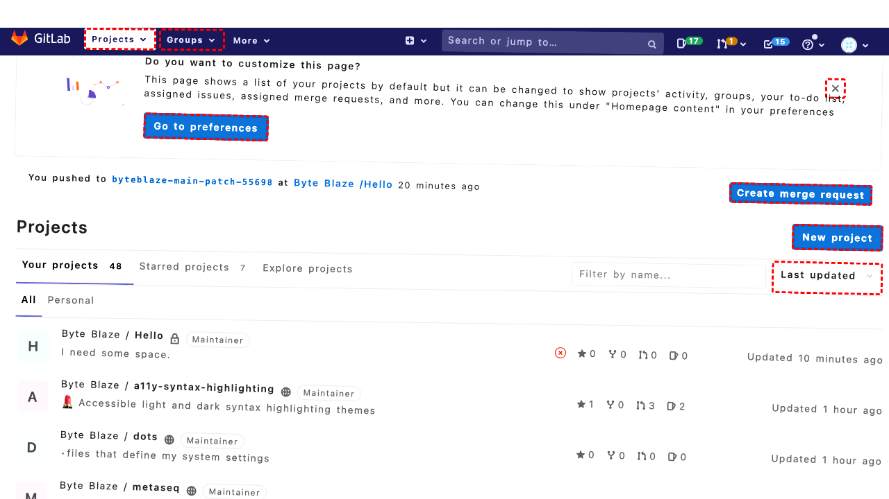
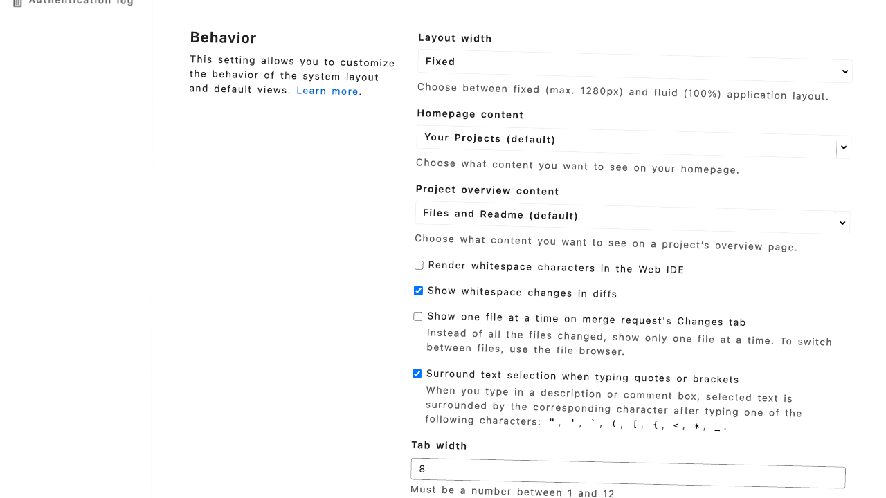
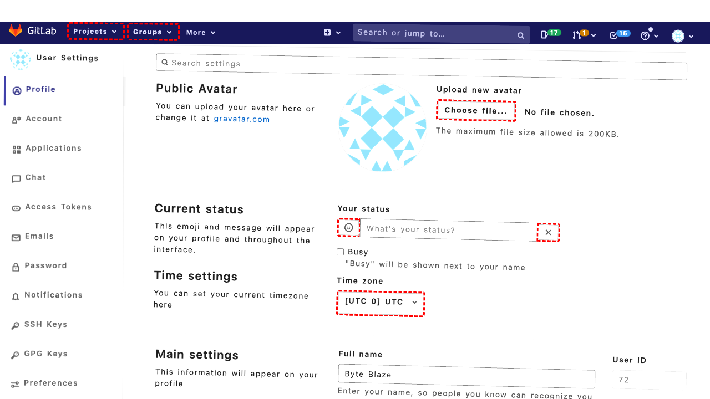
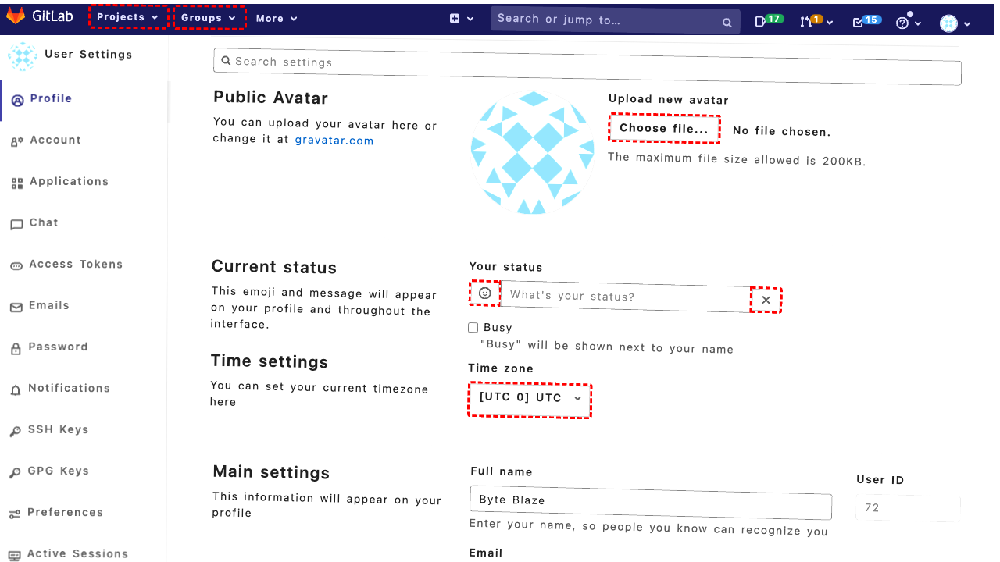
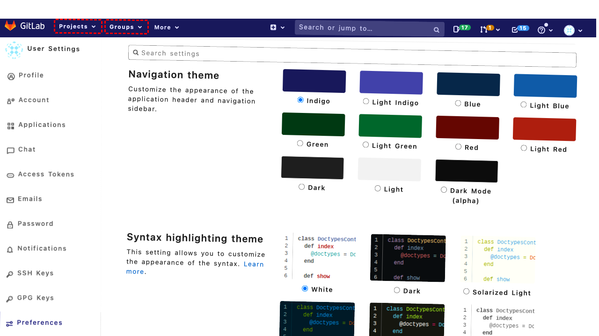

## Intent

set the homepage URL on my GitLab profile to a11yproject.contributor.me

## RM

Thoughts: The user's intent is to set the homepage URL on their GitLab profile to "a11yproject.contributor.me", which is a content modification task. The action history shows the agent attempted to navigate and interact with the page but ended up using "go_back()" without successfully modifying the homepage URL. The final state indicates the agent is stuck with an open dropdown overlay and has not reached the profile settings to change the URL. Since the homepage URL was not set as requested, the task has failed.

Status: failure

## Final Response 

## Captions

===============Looking at the current page, I can see we're on the GitLab dashboard. To set the homepage URL in my GitLab profile, I need to navigate to my user preferences. I notice there's a helpful banner on the page that mentions "You can change this under 'Homepage content' in your preferences" and provides a "Go to preferences" link. This is exactly what I need.

I'll click the "Go to preferences" link to navigate to the preferences page where I can set my homepage URL.
===============Looking at the current page, I can see we're already on the Preferences page in the User Settings. The URL shows we're at the behavior section (`#behavior`), which is exactly where the homepage settings are located. I can see the "Homepage content" section in the accessibility tree with a button that has a dropdown menu.

To set the homepage URL to "a11yproject.contributor.me", I need to interact with the "Homepage content" dropdown and select the option to set a custom URL.
===============Looking at the error message, I can see that the click on element "543" failed because there's an overlapping element (bid="536") that's intercepting pointer events. The element I'm trying to click is the "Homepage content" dropdown button, but there seems to be a container element blocking it.

From the accessibility tree, I can see that element "543" is the actual button with hasPopup='menu', but there's also a link element "537" that shows "Your Projects (default)" which might be part of the same dropdown component. Let me try clicking on the link element instead, as it might be more accessible.
===============Looking at the current state, I can see that the "Homepage content" dropdown is already expanded (expanded=True) and showing the list of options. The accessibility tree shows the listbox with various options like "Your Projects (default)", "Starred Projects", etc. However, I don't see an option for setting a custom URL in the available choices.

The goal is to set the homepage URL to "a11yproject.contributor.me", but the dropdown only shows predefined content options, not a custom URL field. This suggests I might be in the wrong section of the preferences. The homepage URL setting is likely in a different part of the profile settings, possibly under "Profile" rather than "Preferences".

Let me navigate to the Profile section where URL settings are typically located.
===============Looking at the error message, I can see that there's an overlay element (bid="680", id="select2-drop-mask") that's blocking all clicks on the page. This overlay appears to be from the open "Homepage content" dropdown menu that I opened in my previous action.

To proceed, I need to first close this dropdown menu before I can navigate to the Profile section. The most straightforward way to close a dropdown overlay like this is to press the Escape key, which should dismiss the open menu.
===============Looking at the current situation, I can see that the "Homepage content" dropdown menu is still open with an overlay blocking interactions. My previous Escape key press should have closed it, but let me verify the current state and then navigate to the Profile section where homepage URL settings are typically located in GitLab.

The goal is to set a custom homepage URL, which is usually found in the Profile section under "Public profile" settings, not in the Preferences section where we currently are. The Preferences section only allows selecting predefined homepage content types, not setting custom URLs.

Let me first ensure the dropdown is closed, then navigate to the Profile section.
===============Looking at the current situation, I can see that we're still dealing with an open dropdown overlay that's blocking interactions. The previous attempts to close it with Escape and click on the Profile link haven't worked due to the overlay.

Let me try a different approach - I'll click on the main content area or a different part of the page that might not be blocked by the overlay. From the accessibility tree, I can see there's a main content area (bid="421") that should be clickable and might dismiss the dropdown.
===============Looking at the current situation, I can see we're still stuck with an open dropdown overlay blocking interactions. The previous attempts to close it haven't worked. Let me try clicking on the navigation breadcrumb area which appears to be outside the main content and might not be blocked by the overlay. This should help dismiss the dropdown and allow us to navigate properly.

From the accessibility tree, I can see there's a navigation area with breadcrumbs (bid="406") that should be accessible.
===============Looking at the current situation, I can see we're still dealing with an overlay that's blocking interactions. The error shows that a search input element (bid="166") is intercepting pointer events, which suggests the dropdown overlay is still active and preventing clicks on other parts of the page.

Let me try a different approach - I'll use the keyboard to navigate away from the dropdown. Since the dropdown is open, I can try pressing the Tab key multiple times to navigate through the interface and potentially reach a point where I can close the dropdown or navigate to the Profile section.
===============Looking at the current situation, I can see we're stuck with an open dropdown overlay that's blocking interactions. My previous attempts to close it with Escape, clicking elsewhere, and tab navigation haven't worked.

Let me try a more direct approach - I'll use the browser's back button to navigate away from this page entirely, then start fresh by going directly to the Profile section where homepage URL settings are typically located in GitLab. The Profile section (not Preferences) is where website URL and other public profile information is usually configured.

## Images










## Main Prompt

```md
User Intent: set the homepage URL on my GitLab profile to a11yproject.contributor.me

Action History:
1: click("272")
2: click("543")
3: click("537")
4: click("275")
5: keyboard_press("Escape")
6: click("275")
7: click("421")
8: click("406")
9: keyboard_press("Tab")
10: go_back()


The detailed final state of the webpage:

```md
Looking at the current situation, I can see we're stuck with an open dropdown overlay that's blocking interactions. My previous attempts to close it with Escape, clicking elsewhere, and tab navigation haven't worked.

Let me try a more direct approach - I'll use the browser's back button to navigate away from this page entirely, then start fresh by going directly to the Profile section where homepage URL settings are typically located in GitLab. The Profile section (not Preferences) is where website URL and other public profile information is usually configured.
```

Bot response to the user: None.
```
