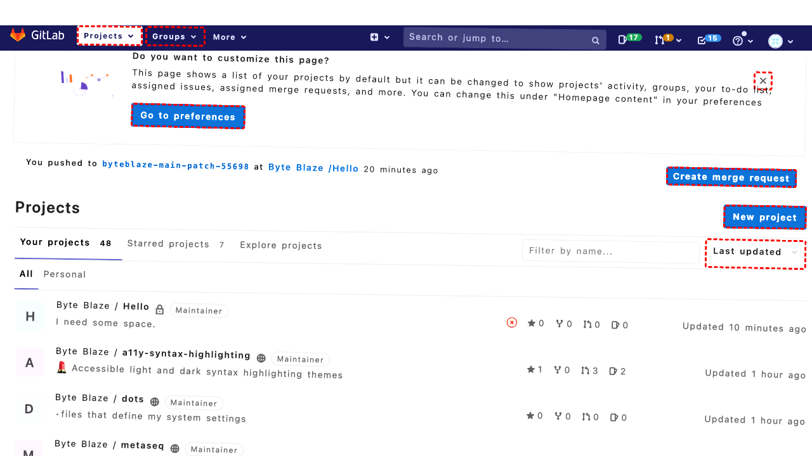
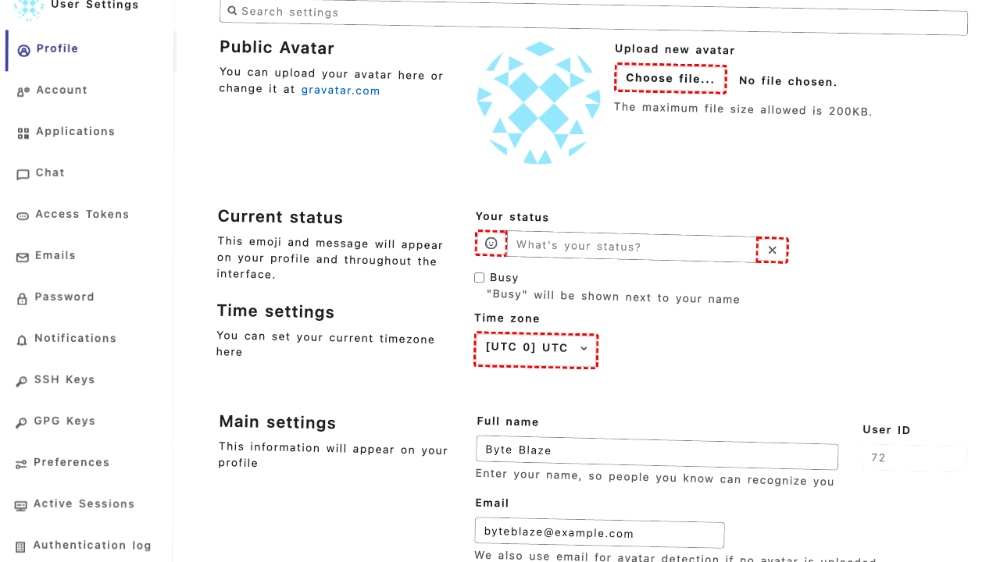
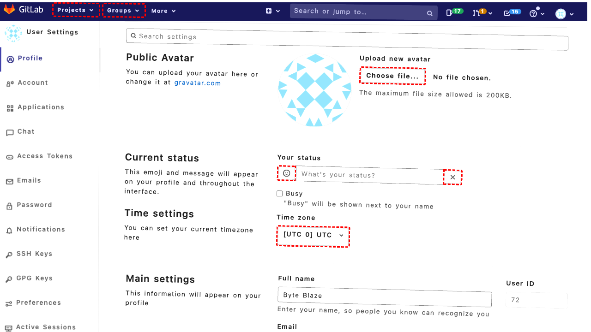
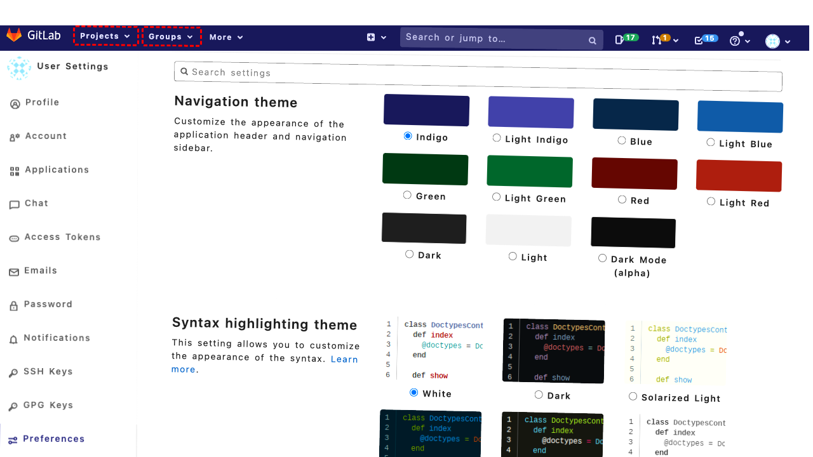

## Intent

Add a new color option brown to the size S of Phoebe Zipper Sweatshirt

## RM

Thoughts: The user's intent is to add a new color option (brown) to size S of the Phoebe Zipper Sweatshirt, which is a content modification task. The agent's action history shows it performed a series of clicks, a select_option to "Configurable Product", and fill actions, but it ended with scrolling. The final state indicates the agent is still on the editing page for the simple product variant "Phoebe Zipper Sweatshirt-S-White" and is considering how to proceed, but there is no evidence that the brown color option was actually added to size S. The agent did not complete the modification, such as by creating a new variant or updating attributes. Therefore, the task is not successfully completed.

Status: failure

## Final Response 

## Captions

===============I need to add a new color option "brown" to size S of the Phoebe Zipper Sweatshirt. First, I need to navigate to the product management page for that specific product. Currently, I'm on the Dashboard. I should go to Catalog > Manage Products, then find and edit the Phoebe Zipper Sweatshirt product.

Looking at the accessibility tree, I can see the navigation menu. There's a "Catalog" menu item with ID 113. Under it, there's "Manage Products" with ID 117. I'll click those.

First, I'll click the Catalog menu to expand it, then click Manage Products.
===============I need to wait for the Catalog menu to expand after clicking it, then click the Manage Products link. Let me add a short wait and then click.
===============I can see the Catalog menu was clicked and likely expanded. Now I need to click "Manage Products" (ID 117) to navigate to the product grid. Let me do that.
===============Looking at the current page, I can see I'm already on the "Manage Products" page (the title confirms this). The product grid is visible with many products. I need to find the "Phoebe Zipper Sweatshirt" product. I can see in the product list there's a row for "Phoebe Zipper Sweatshirt-S-White" with ID 2797. That appears to be one variant (size S, color white). However, I need to edit the configurable product itself (the parent) to add a new color option for size S, not edit a simple product variant.

In Magento, configurable products have multiple simple product variants. To add a new color option for size S, I likely need to:
1. Find the configurable product "Phoebe Zipper Sweatshirt" (not the simple variant)
2. Edit it and go to the "Associated Products" section
3. Create a new simple product for size S in brown color

But first, I need to locate the configurable product. Looking at the product grid, I see many simple products but not the configurable parent. I should filter the grid to find it. I can use the "Type" filter to show only "Configurable Product" type.

I see a "Type" column header with a combobox filter (ID 617). I'll select "Configurable Product" from that filter, then click the Search button.
===============Looking at the current state, I've filtered the product grid to show only "Configurable Product" type. Now I need to find the "Phoebe Zipper Sweatshirt" configurable product in the results. Let me check if it appears in the filtered list.

From the accessibility tree, I can see the product rows after filtering. I need to look for a row containing "Phoebe Zipper Sweatshirt" (not "Phoebe Zipper Sweatshirt-S-White" which is a simple product). Let me scan the visible rows in the tree.

I can see rows starting from ID 681, but those are simple products (like "Phoebe Zipper Sweatshirt-S-White", "Erika Running Short-32-Red", etc.). After filtering to configurable products, I should see different products. However, the tree still shows the same simple products, which suggests the filter hasn't been applied yet or the page hasn't updated.

I should wait for the page to refresh after applying the filter, then look for the configurable product. Let me add a wait and then check if the product list has changed.
===============Looking at the current state, I've applied the filter for "Configurable Product" type, but the product list still shows simple products. This suggests the filter might not have been applied correctly or the page needs to refresh. Let me check if there's a "Search" button to apply the filter. I see ID 488 is a "Search" button. I already clicked it, but maybe I need to wait longer or the filter isn't working as expected.

Let me re-examine the filter section. I see the "Type" filter combobox (ID 617) is currently expanded (expanded=True). I should collapse it first, then ensure the filter is applied. Actually, I already selected "Configurable Product" and clicked Search. Let me wait a bit more and scroll to see if there are any configurable products.

Alternatively, I can search for "Phoebe Zipper Sweatshirt" by name using the "Name" filter. I see a textbox under the "Name" column header (ID 615). I'll fill that with "Phoebe Zipper" and click Search again.
===============Looking at the current state, I've searched for "Phoebe Zipper" in the name filter. The results show one product: "Phoebe Zipper Sweatshirt-S-White" (ID 2797), which is a simple product. This confirms that the configurable parent product might not be showing up in the list, or perhaps the Phoebe Zipper Sweatshirt is actually a simple product with configurable attributes managed differently.

In Magento, sometimes products are set up as simple products with custom options rather than configurable products with associated simples. However, the goal is to add a new color option "brown" to size S. This suggests there might be existing color options (like white) for size S, and I need to add brown as another option.

Looking at the product name "Phoebe Zipper Sweatshirt-S-White", it appears to be a simple product variant with size S and color white. To add a brown color option for size S, I likely need to:
1. Edit this simple product to duplicate it with brown color, OR
2. Find the parent configurable product and add a new associated product.

Since I can't find a configurable parent, let me check if there are other Phoebe Zipper Sweatshirt variants. I'll clear the name filter and search for all products with "Phoebe" in the name.

First, clear the name filter and search again:
===============Looking at the error, it seems there was a division by zero error in the backend when trying to execute the action. This is likely a server-side issue with the Magento application. Let me try a different approach: I'll navigate directly to the edit page for the Phoebe Zipper Sweatshirt-S-White product (ID 2797) since that's the variant I can see, and from there I might be able to understand the product structure better.

From the product grid, I can see the "Edit" link for the Phoebe Zipper Sweatshirt-S-White product has ID 695. Let me click it to edit this product.
===============Looking at the current page, I'm now on the edit page for "Phoebe Zipper Sweatshirt-S-White" (as shown in the title). This is a simple product variant. To add a new color option "brown" for size S, I need to either:

1. Create a new simple product variant for brown color (size S), or
2. Check if this is part of a configurable product and add an associated product.

Since I'm on the edit page for the white variant, I can see the product information. I notice the product has attributes like color and size. Looking at the accessibility tree, I can see various fields but not the color attribute specifically.

I should check if there's a "Configurable Product" section or if this product is linked to a parent configurable product. However, from the current view, I need to understand the product structure better. Let me scroll down to see more of the product edit form.

First, let me scroll down to see if there are any sections related to configurations or associated products.
===============Looking at the current page, I'm editing the simple product variant "Phoebe Zipper Sweatshirt-S-White". To add a brown color option for size S, I need to either create a new simple product variant with brown color, or check if there's a configurable parent product.

First, I should check the product attributes to see what color is currently set. I can see in the accessibility tree there's a "General" section with various fields, but I don't see a specific "color" attribute field. In Magento, color is likely a custom attribute that might be displayed elsewhere.

Let me look for the "Attributes" section or check if there's a way to see the product's color value. I can also check the product name - it includes "White" which suggests color is part of the name but might be stored as an attribute.

Better approach: Since I need to add a new color option, I should check if there's a "Configurable Product" section or look for "Associated Products". Let me scroll further down the page to see more sections.

## Images








## Main Prompt

```md
User Intent: Add a new color option brown to the size S of Phoebe Zipper Sweatshirt

Action History:
1: click("113")
2: noop(500)
3: click("117")
4: click("117")
5: click("617")
6: select_option("617", "Configurable Product")
7: click("488")
8: noop(2000)
9: fill("615", "Phoebe Zipper")
10: click("488")
11: noop(2000)
12: fill("615", "")
13: click("488")
14: noop(2000)
15: click("695")
16: scroll(0, 500)
17: scroll(0, 800)


The detailed final state of the webpage:

```md
Looking at the current page, I'm editing the simple product variant "Phoebe Zipper Sweatshirt-S-White". To add a brown color option for size S, I need to either create a new simple product variant with brown color, or check if there's a configurable parent product.

First, I should check the product attributes to see what color is currently set. I can see in the accessibility tree there's a "General" section with various fields, but I don't see a specific "color" attribute field. In Magento, color is likely a custom attribute that might be displayed elsewhere.

Let me look for the "Attributes" section or check if there's a way to see the product's color value. I can also check the product name - it includes "White" which suggests color is part of the name but might be stored as an attribute.

Better approach: Since I need to add a new color option, I should check if there's a "Configurable Product" section or look for "Associated Products". Let me scroll further down the page to see more sections.
```

Bot response to the user: None.
```
