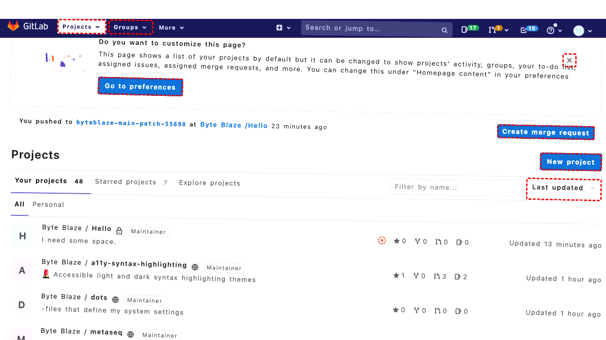
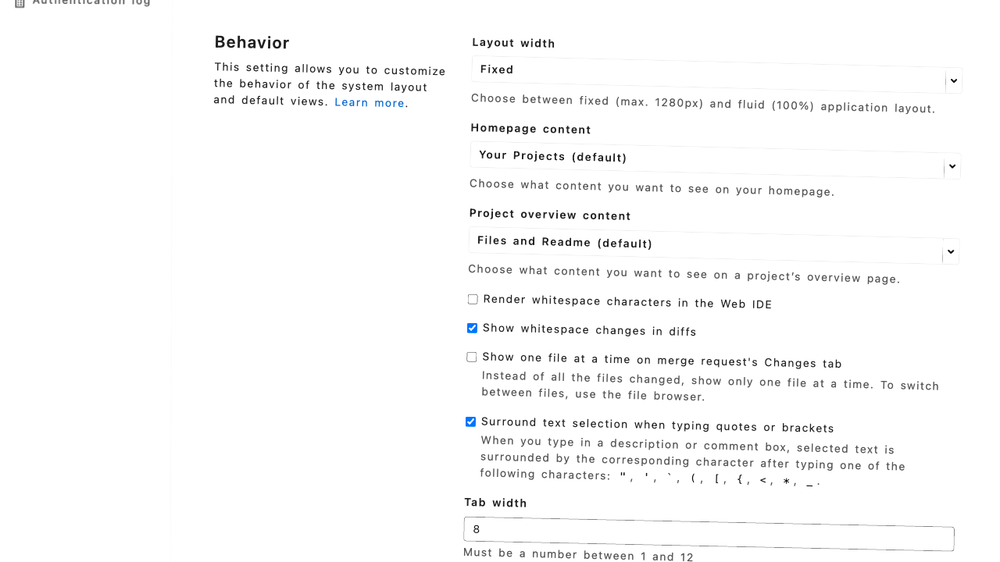
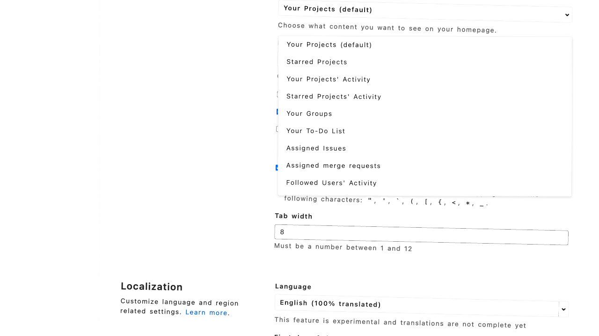
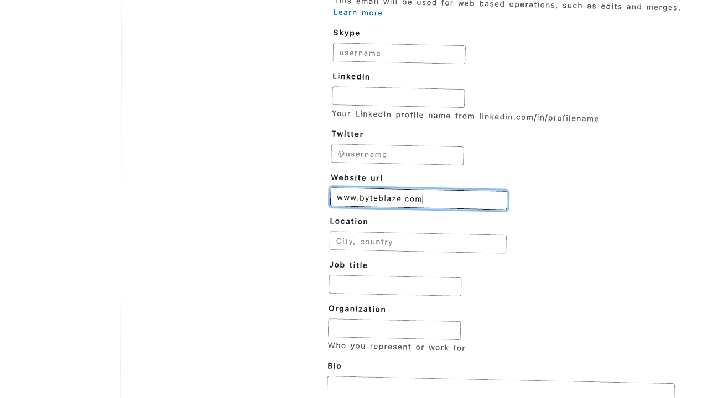
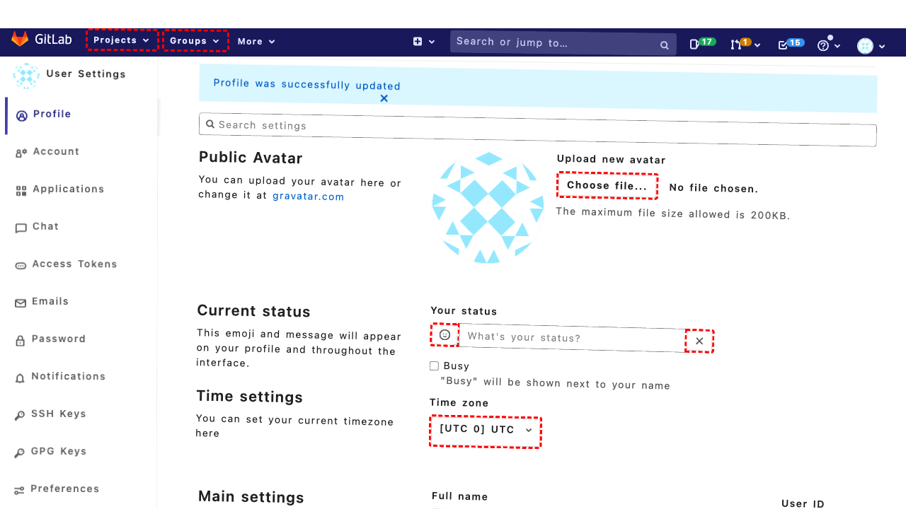

## Intent

Add a new color blue to size S and M of Frankie Sweatshirt

## RM

Thoughts: The user's intent is to add a new color blue to size S and M of Frankie Sweatshirt, which is a content modification task. The agent's action history shows attempts to search for "Frankie Sweatshirt" and "Sweatshirt" using filters, but it does not show any actions related to actually modifying the product (e.g., selecting the product, navigating to its configuration page, or adding colors to sizes). The final state of the webpage indicates the agent is still stuck in a search/filter interface, encountering errors with element IDs, and has not reached the product editing page. Since the agent failed to navigate to the correct page and perform the required modifications, the task is unsuccessful.

Status: failure

## Final Response 

## Captions

===============I need to add a new color blue to size S and M of Frankie Sweatshirt. This is a product configuration task. I should navigate to the product management page, find the Frankie Sweatshirt product, and edit its configurations to add the color blue to sizes S and M.

First, I need to go to the Catalog > Manage Products page. Looking at the accessibility tree, I can see the Catalog menu item with bid 113. I'll click that to expand it, then click "Manage Products" (bid 117).
===============I can see that the Catalog menu is now expanded because the link is focused (as indicated in the accessibility tree). Now I need to click on "Manage Products" to navigate to the product listing page.
===============Looking at the current page, I can see I'm already on the "Manage Products" page (the heading says "Manage Products"). The Catalog menu was already expanded from my previous action, and I'm now on the product listing page. I need to find the "Frankie Sweatshirt" product in the list.

Scanning the visible rows in the product table, I can see products like "Phoebe Zipper Sweatshirt-S-White", "Erika Running Short" variants, "Ina Compression Short" variants, but I don't see "Frankie Sweatshirt" in the first 20 rows displayed. I need to search for it.

I can use the search functionality on this page. There's a "Name" filter field (bid 615) where I can enter "Frankie Sweatshirt" to filter the products. Let me fill that field and then click the Search button (bid 488).
===============Looking at the current state, I've filled the "Name" filter with "Frankie Sweatshirt". Now I need to click the Search button to apply this filter and find the Frankie Sweatshirt product.
===============Looking at the current page, I can see the search results after filtering for "Frankie Sweatshirt". The accessibility tree shows a row with product information including "Frankie Sweatshirt" (bid 1240 in the filter row). However, I need to see the actual product row in the results table to click on it for editing.

From the tree, I can see there's a table with rows. I need to locate the row for "Frankie Sweatshirt" and click on it to edit the product. The product row should be clickable. Let me examine the table structure: there's a rowgroup (bid 1305) with a row (bid 1306) that says "No records found." This suggests my search didn't find the product, which is odd because I entered "Frankie Sweatshirt" in the name filter.

Wait, I see in the filter row (bid 1238) there's a textbox with value "Frankie Sweatshirt" (bid 1240). But the results show "No records found." This might mean the product doesn't exist with that exact name, or there's a typo. Let me check if I need to clear the filter and try a broader search, or perhaps the product is listed under a different name.

Actually, looking back at the initial accessibility tree before my actions, I saw "Frankie Sweatshirt" mentioned in the filter row (bid 1238) as a placeholder. That was the default filter value already present. So when I filled "615" with "Frankie Sweatshirt", I was just setting it to the same value. The "No records found" suggests there are no products matching that name in the system.

But the user wants to add a color to sizes S and M of Frankie Sweatshirt, so the product must exist. Perhaps I need to search differently or look at all products. Let me reset the filter and view all products to see if it's there.

I can click the "Reset Filter" button (bid 1109) to clear all filters and show all products.
===============Looking at the current state, I've reset the filter and should now see all products. The goal is to find "Frankie Sweatshirt" to edit its configurations. Since the product wasn't found with the exact name filter, perhaps it's listed under a different name or as part of a configurable product. I should scan the visible rows in the product table.

From the accessibility tree, I can see many product rows (starting from bid 1525). Looking at the names: "Phoebe Zipper Sweatshirt-S-White", "Erika Running Short" variants, "Ina Compression Short" variants, etc. I don't see "Frankie Sweatshirt" in the first 20 rows displayed. I need to search more broadly or navigate through pages.

Alternatively, I could search for "Sweatshirt" to find all sweatshirt products, then look for Frankie among them. Let me use the Name filter again with "Sweatshirt".
===============Looking at the error, I tried to fill an element with bid "615" but it doesn't exist in the current accessibility tree. I need to find the correct bid for the Name filter field. Looking at the current tree, I can see the filter row in the table. The Name column header has a textbox (bid 1459) under it. That's likely the Name filter field.

Let me check: In the table, row with bid 1442 contains filter fields. The column for "Name" (bid 1457) has a textbox (bid 1459). That should be where I enter the filter text. I'll fill that with "Sweatshirt" to search for sweatshirt products.
===============Looking at the current state, I've filled the Name filter with "Sweatshirt". Now I need to click the Search button to apply this filter. I can see the Search button in the top right area of the table with bid 1332.
===============Looking at the current state, I've searched for "Sweatshirt" and should now see sweatshirt products. I need to find "Frankie Sweatshirt" among the results. Scanning the accessibility tree, I can see product rows like "Ariel Roll Sleeve Sweatshirt", "Cassia Funnel Sweatshirt", but I don't see "Frankie Sweatshirt". Perhaps the product name is different or it's a configurable product that needs to be managed differently.

Let me check if there's a "Frankie Sweatshirt" in the results by looking more carefully. The tree shows many rows but "Frankie" doesn't appear. Maybe the product doesn't exist yet and I need to create it? But the user says "Add a new color blue to size S and M of Frankie Sweatshirt" - this implies the product already exists with some colors and sizes, and I need to add blue to sizes S and M.

Perhaps "Frankie Sweatshirt" is a configurable product that has associated simple products for each color/size combination. In Magento, configurable products don't appear in the main product grid by default unless I change the filter. Let me check the "Type" filter - it's currently set to "Any". I should filter for "Configurable Product" type to see if Frankie Sweatshirt is a configurable product.

Looking at the filter row, there's a combobox for Type (bid 1448). I'll select "Configurable Product" from the dropdown.
===============Looking at the current accessibility tree, I need to find the correct bid for the Type filter. I can see in the table header row (bid 1442) there are multiple columns. The Type column header (bid 1446) has a combobox (bid 1448) - but that bid "1448" wasn't found. Let me check the tree more carefully.

Actually, looking at the tree structure: I see row with bid 1442 (filter row). Within it, there's a columnheader for Type (bid 1446) which contains a combobox (bid 1448). But the error says it couldn't find element with bid "1448". This might be because the element ID changed after the page update. Let me look for the Type filter again.

From the tree: I can see "columnheader ''" (bid 1444) which is empty, then "columnheader 'ID'" (bid 1445), then "columnheader 'Name'" (bid 1457), then "columnheader 'Type'" (bid 1446). Under bid 1446, there's a combobox (bid 1448). But the error suggests this bid doesn't exist. Perhaps I need to use a different approach.

Let me first click the Search button to apply my current "Sweatshirt" filter and see what products appear, then I can look for "Frankie" in the results. The Search button is at bid 1332.

## Images











## Main Prompt

```md
User Intent: Add a new color blue to size S and M of Frankie Sweatshirt

Action History:
1: click("113")
2: click("117")
3: fill("615", "Frankie Sweatshirt")
4: click("488")
5: click("1109")
6: fill("615", "Sweatshirt")
7: fill("1459", "Sweatshirt")
8: click("1332")
9: select_option("1448", "Configurable Product")
10: click("1332")


The detailed final state of the webpage:

```md
Looking at the current accessibility tree, I need to find the correct bid for the Type filter. I can see in the table header row (bid 1442) there are multiple columns. The Type column header (bid 1446) has a combobox (bid 1448) - but that bid "1448" wasn't found. Let me check the tree more carefully.

Actually, looking at the tree structure: I see row with bid 1442 (filter row). Within it, there's a columnheader for Type (bid 1446) which contains a combobox (bid 1448). But the error says it couldn't find element with bid "1448". This might be because the element ID changed after the page update. Let me look for the Type filter again.

From the tree: I can see "columnheader ''" (bid 1444) which is empty, then "columnheader 'ID'" (bid 1445), then "columnheader 'Name'" (bid 1457), then "columnheader 'Type'" (bid 1446). Under bid 1446, there's a combobox (bid 1448). But the error suggests this bid doesn't exist. Perhaps I need to use a different approach.

Let me first click the Search button to apply my current "Sweatshirt" filter and see what products appear, then I can look for "Frankie" in the results. The Search button is at bid 1332.
```

Bot response to the user: None.
```
