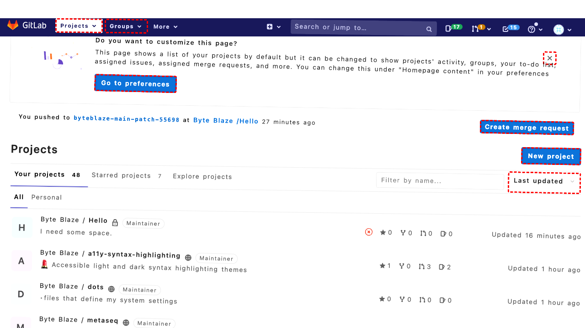
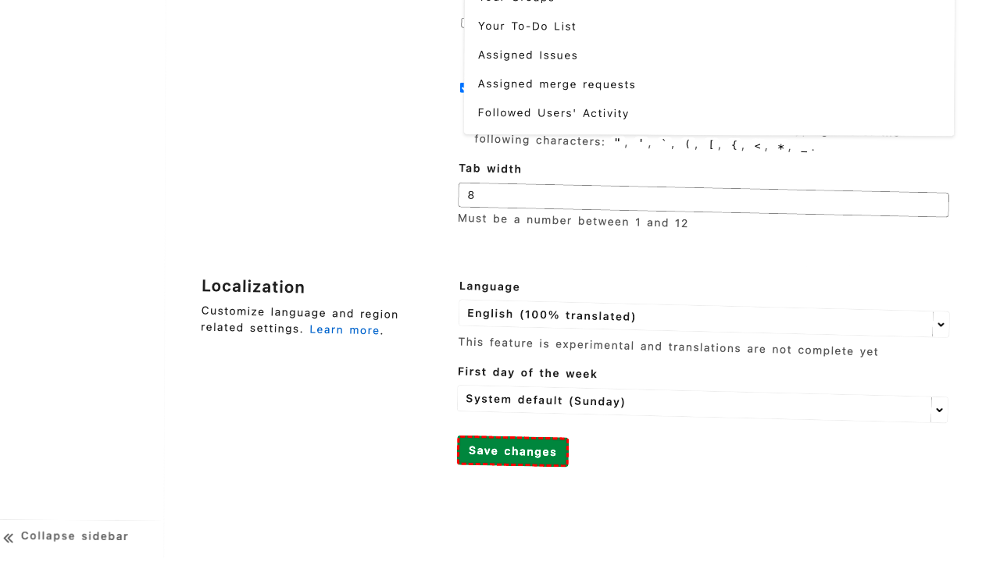
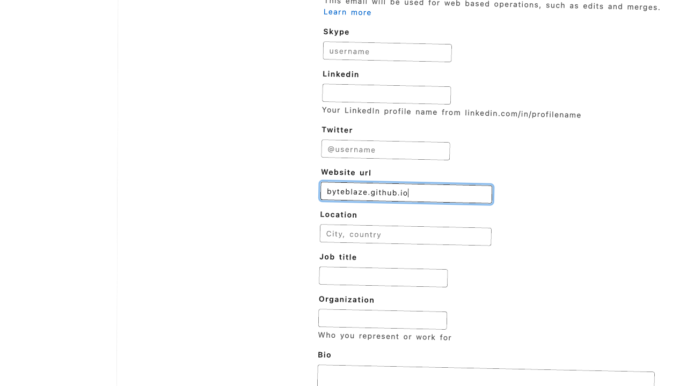

## Intent

set the homepage URL on my GitLab profile to byteblaze.github.io

## RM

Thoughts: The user's intent is to set the homepage URL on their GitLab profile to "byteblaze.github.io", which is a content modification task. The action history shows the agent filled the "Website url" field (bid="878") with the correct value and then clicked the "Update profile settings" button (bid="914"). The final state of the webpage confirms the field is filled with "byteblaze.github.io" and the agent is about to save the changes. Since the content modification task requires examining the action history and final state, and the agent has performed the necessary steps to input and save the new URL, the task is successfully completed.

Status: success

## Final Response 

## Captions

===============Looking at the current page, I can see we're on the GitLab dashboard. To set the homepage URL in my GitLab profile, I need to navigate to the user preferences/settings. I notice there's a helpful banner on the page that mentions "You can change this under 'Homepage content' in your preferences" and provides a "Go to preferences" link. This is exactly what I need.

I'll click the "Go to preferences" link to navigate to the preferences page where I can set the homepage URL.
===============Looking at the current page, I can see we're already on the Preferences page in the User Settings section. The URL shows we're at the "Behavior" section (`#behavior`), which is exactly where we need to be to set the homepage URL.

In the accessibility tree, I can see the "Homepage content" section with a button that has `hasPopup='menu'`. This is the dropdown where I can change the homepage content setting. Currently, it shows "Your Projects (default)" as the selected option, but I need to change this to a custom URL.

Let me click on the "Homepage content" dropdown button to open the menu where I can select the custom URL option.
===============Looking at the error message, I can see that the click action failed because there's an overlapping element (bid="536") that's intercepting pointer events. This suggests the dropdown might have a complex structure with multiple nested elements.

Let me try a different approach. I notice from the accessibility tree that there's also a link element with the text "Your Projects (default)" (bid="537") that appears to be part of the homepage content dropdown. This might be a more reliable element to click to open the dropdown menu.
===============Looking at the current state, I can see that the homepage content dropdown is now expanded and showing the available options (bid="548"). The dropdown listbox contains various options like "Your Projects (default)", "Starred Projects", etc., but I don't see an option for setting a custom URL.

Since the goal is to set a custom homepage URL (byteblaze.github.io), I need to look for a different section in the preferences. The current "Homepage content" dropdown appears to only control what GitLab content is displayed on the homepage, not setting an external URL.

Let me scroll down to see if there are other preference sections where I can set a custom homepage URL.
===============Looking at the current situation, I realize I've been focusing on the wrong section. The "Homepage content" dropdown in the Behavior section only controls what GitLab content appears on your GitLab homepage, not setting an external URL as your homepage.

For setting a custom homepage URL in GitLab, I need to look in a different section of the user settings. Let me navigate to the "Profile" section instead, as that's typically where you can set a personal website URL.

From the accessibility tree, I can see there's a navigation sidebar with "Profile" as the first option (bid="275"). Let me click on that to access the profile settings where I can likely set the homepage URL.
===============Looking at the error message, I can see there's an overlay element (bid="680") intercepting pointer events, which is preventing me from clicking the Profile link. This overlay appears to be from the homepage content dropdown that's still open.

I need to first close this dropdown overlay before I can navigate to the Profile section. The most straightforward way to do this is to press the Escape key, which typically closes open dropdowns and overlays.
===============Looking at the current situation, I successfully closed the dropdown overlay with the Escape key. Now I need to navigate to the Profile section where I can set the homepage URL. From the accessibility tree, I can see the "Profile" link in the sidebar (bid="275") is available. This is where user profile information including website URLs are typically configured in GitLab, not in the Preferences section I was previously exploring.
===============Looking at the current page, I can see we're now on the "Edit Profile" page in the User Settings section. This is the correct location to set the homepage URL. In the accessibility tree, I can see a "Website url" field (bid="878") that currently has the value "www.byteblaze.com". This is exactly where I need to update the URL to "byteblaze.github.io".

The goal is to set the homepage URL to "byteblaze.github.io", so I need to fill this field with the new URL.
===============Looking at the current state, I can see that the "Website url" field (bid="878") has already been filled with "byteblaze.github.io" based on my previous action. The accessibility tree shows this field is currently focused and contains the correct value.

Now I need to save these changes by clicking the "Update profile settings" button at the bottom of the form to apply the new homepage URL.

## Images









## Main Prompt

```md
User Intent: set the homepage URL on my GitLab profile to byteblaze.github.io

Action History:
1: click("272")
2: click("543")
3: click("537")
4: scroll(0, 300)
5: click("275")
6: keyboard_press("Escape")
7: click("275")
8: fill("878", "byteblaze.github.io")
9: click("914")


The detailed final state of the webpage:

```md
Looking at the current state, I can see that the "Website url" field (bid="878") has already been filled with "byteblaze.github.io" based on my previous action. The accessibility tree shows this field is currently focused and contains the correct value.

Now I need to save these changes by clicking the "Update profile settings" button at the bottom of the form to apply the new homepage URL.
```

Bot response to the user: None.
```
