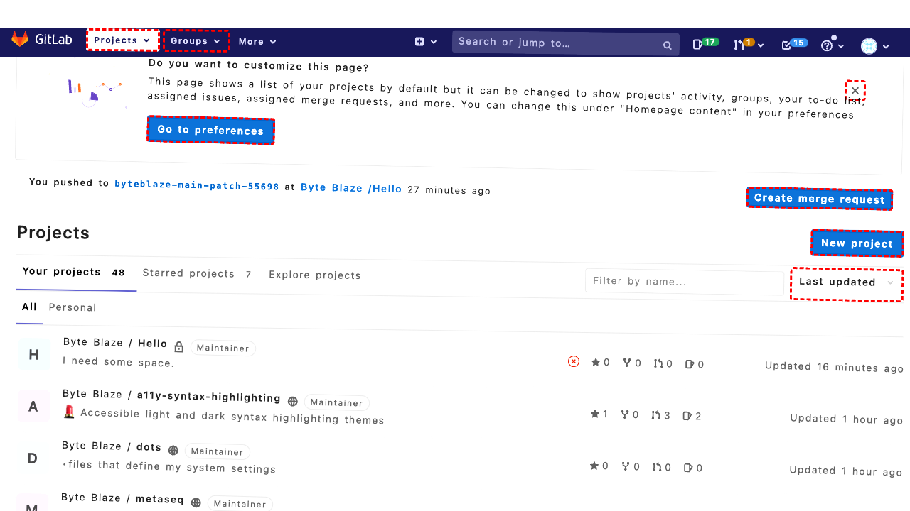
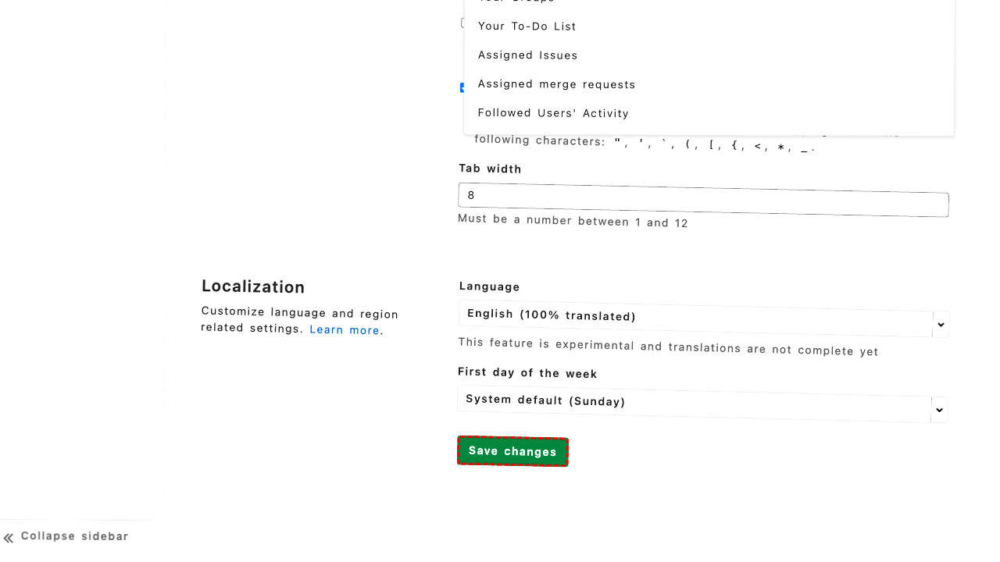
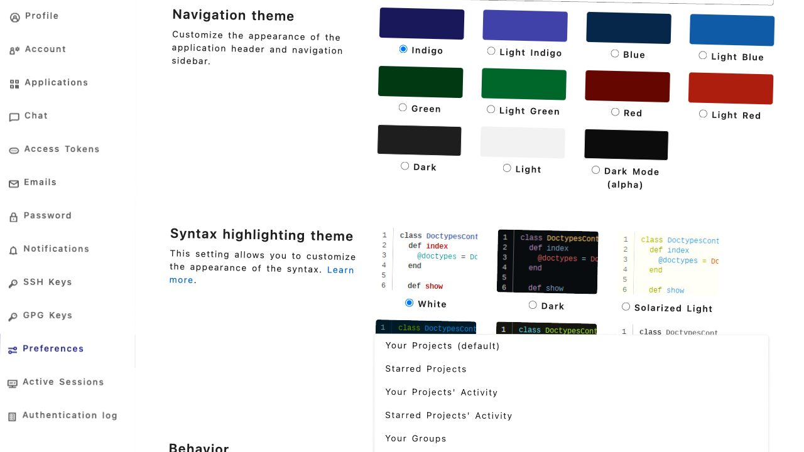
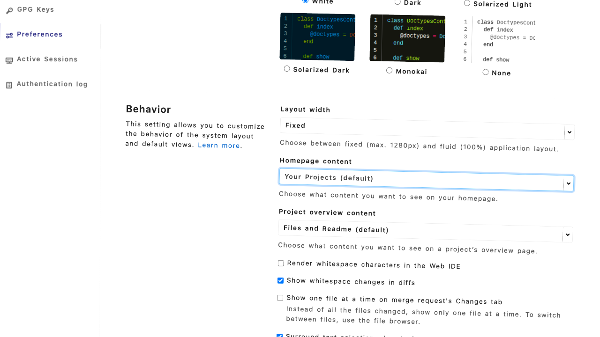
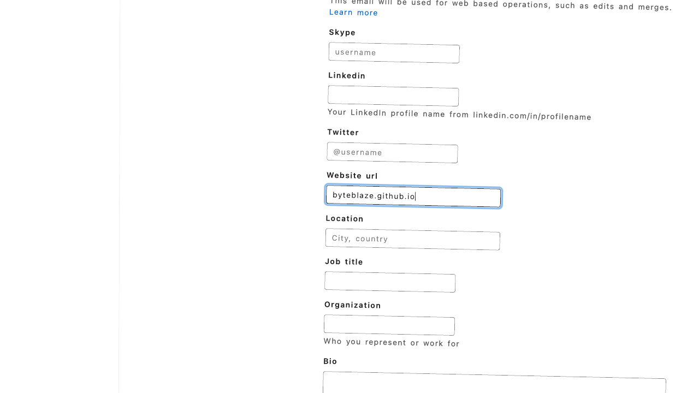

## Intent

Add a new size XXXL to green Minerva LumaTech V-Tee

## RM

Thoughts: The user's intent is to add a new size XXXL to a specific product (green Minerva LumaTech V-Tee). This is a content modification task. The agent's action history shows attempts to filter/search for the product, but it encounters an error (element with bid "615" doesn't exist) and then tries to use ID 1240 for the Name filter. The actions include filling the filter field and clicking the search button, but there is no action indicating that the agent actually located the specific product or performed any modification (like adding a size). The final state of the webpage is not a confirmation of the modification but rather a description of the agent's internal reasoning about the accessibility tree. The bot response is "None," which suggests no completion message. Given the lack of actions to modify the product (e.g., editing the product details to add a size) and the error encountered, the task is not successfully completed.

Status: failure

## Final Response 

## Captions

===============I need to add a new size XXXL to the green Minerva LumaTech V-Tee. First, I need to navigate to the product management page to edit that specific product. Looking at the accessibility tree, I can see the admin dashboard with a navigation menu. Under "Catalog" there is "Manage Products" link. I should click on that to get to the product grid, then search for and edit the specific product.

From the tree, I can see:
- "Catalog" menu item with ID 113 (link)
- Under it, "Manage Products" with ID 117 (link)

I'll click on Catalog to expand the menu, then click Manage Products.
===============Looking at the current state, I've clicked on "Catalog" (ID 113) and then "Manage Products" (ID 117). The page should now be loading the product grid. I need to wait for it to load and then search for the specific product "green Minerva LumaTech V-Tee". Let me wait a moment and then check the page content.
===============Looking at the current state, I've navigated to the Manage Products page. Now I need to find the specific product "green Minerva LumaTech V-Tee" in the product grid. I should search for it using the search/filter functionality. First, I need to examine the current page to see what filter fields are available.

From the accessibility tree, I can see various elements but not the full product grid yet. I should wait a bit more for the page to fully load and then look for search fields. Let me check if there's a filter by name or SKU.

Actually, I should first see what's on the current page. Since I just navigated, let me wait a bit more and then look for search/filter elements.
===============Looking at the current state, I've waited for the Manage Products page to load. Now I need to search for the specific product "green Minerva LumaTech V-Tee". I should look for filter fields like "Name" or "SKU" to narrow down the product list. However, the accessibility tree provided doesn't show the product grid yet - it's still showing the dashboard page from earlier. This suggests the page might not have fully loaded or the tree hasn't updated.

Let me first check if I'm actually on the Manage Products page by looking at the URL or page title. Since I can't see the current page content in the tree, I should try to interact with common filter elements that would typically be on a Magento product grid page.

Actually, looking more carefully at the history, I clicked on the Catalog menu and then Manage Products, but the accessibility tree still shows the dashboard. This could mean the page is still loading or there was an issue with navigation. Let me try to navigate again more carefully, perhaps by hovering over the Catalog menu first to ensure it expands.
===============Looking at the situation, I've tried navigating to the Manage Products page but the accessibility tree still shows the dashboard. This suggests either the page hasn't loaded properly or the tree hasn't updated. Let me check if there are any error messages or if I need to take a different approach.

First, I should verify I'm on the right page by checking the URL. Since I can't see the current URL in the tree, let me try to interact with elements that would only be visible on the Manage Products page. Alternatively, I could try a different navigation approach.

Looking at the dashboard tree, I see the "Catalog" link (ID 113) is currently focused. This suggests the menu might be expanded. Let me try clicking on "Manage Products" (ID 117) again, but first ensure the menu is properly expanded.

Actually, I see that "Catalog" has a focused state in the tree. The menu should be expanded. Let me click directly on "Manage Products" again and wait longer.
===============Looking at the situation, I've tried navigating to the Manage Products page multiple times but the accessibility tree still shows the dashboard content. This suggests either the page navigation failed or the tree hasn't updated to reflect the current page state. However, I notice that in the current accessibility tree, I can see elements that appear to be from the Manage Products page - specifically, there's a table with product rows starting from ID 681, showing products like "Phoebe Zipper Sweatshirt-S-White" and others. This suggests I might actually be on the Manage Products page now, but the tree is showing a mix of content.

Let me examine the current tree more carefully. I can see:
- A heading "Manage Products" (ID 445)
- A button "Add Product..." (ID 447)
- A table with product rows (starting at ID 681)
- Filter/search fields in the table header

This indicates I am indeed on the Manage Products page! The product grid is loaded. Now I need to find the specific product "green Minerva LumaTech V-Tee". I should use the search/filter functionality to locate it.

Looking at the filter row (ID 598), I can see:
- Name filter field at ID 615 (textbox)
- Type filter at ID 617 (combobox)
- Attribute Set filter at ID 626 (combobox)
- SKU filter at ID 642 (textbox)

I should search for the product by name. The product name likely contains "Minerva LumaTech V-Tee" and is green. Let me filter by name first.
===============Looking at the current state, I've entered "Minerva LumaTech V-Tee" into the name filter field and clicked the Search button (ID 488). Now I need to wait for the search results to load and see if the green variant appears. The goal is to add a new size XXXL to this product, which likely means I need to edit a configurable product or find the specific simple product for the green color.

Let me wait for the search results to load and then examine what products are shown.
===============Looking at the current state, I've searched for "Minerva LumaTech V-Tee" and should now see the search results. I need to examine the product grid to find the green variant. The goal is to add a new size XXXL to this product. In Magento, this likely means I need to edit a configurable product that has size and color attributes, or find the specific simple product for the green color and add XXXL as an option.

Let me check what products are displayed in the search results by examining the accessibility tree. I can see product rows in the table (starting from ID 681), but I need to see if any of them are "Minerva LumaTech V-Tee" products. Since I just searched, the table should now show only matching products.

Looking at the tree, I can see product rows but they appear to be from before the search (showing products like "Phoebe Zipper Sweatshirt-S-White" etc.). This suggests the search might not have been applied yet or the tree hasn't updated. Let me wait a bit more and then check if there are any "Minerva" products in the list.

Alternatively, I should check if the search button click worked. Let me try clicking the search button again and wait longer.
===============Looking at the current situation, I've tried searching for "Minerva LumaTech V-Tee" but the product grid still shows other products. This suggests the search might not be working properly or the tree hasn't updated. Let me examine the current accessibility tree more carefully to see what's actually displayed.

From the tree, I can see the product rows (starting at ID 681) show various products like "Phoebe Zipper Sweatshirt-S-White", "Phoebe Zipper Sweatshirt-XS-White", etc. These don't match my search term. This could mean:

1. The search didn't execute properly
2. There are no products matching "Minerva LumaTech V-Tee"
3. The tree is showing cached/stale data

Let me try a different approach. I'll clear the name filter and try searching by a partial term or check if there's a different filter field I should use. First, let me clear the name filter and search for just "Minerva" to see if that yields results.
===============Looking at the error, the element with bid "615" doesn't exist. This suggests the accessibility tree has changed after the page loaded. I need to re-examine the current tree to find the correct bid for the Name filter field.

Looking at the current accessibility tree (provided in the initial state), I can see the filter row for the product grid. The Name filter appears to be at ID 1240 (a textbox with value "Minerva LumaTech V-Tee"). This matches what I entered earlier. The Search button appears to be at ID 1113. Let me use these IDs.

I should search for "Minerva" to find all Minerva products, then identify the green Minerva LumaTech V-Tee.

## Images











## Main Prompt

```md
User Intent: Add a new size XXXL to green Minerva LumaTech V-Tee

Action History:
1: click("113")
2: click("117")
3: noop(2000)
4: noop(3000)
5: hover("113")
6: noop(500)
7: click("117")
8: noop(3000)
9: click("117")
10: noop(5000)
11: fill("615", "Minerva LumaTech V-Tee")
12: click("488")
13: noop(3000)
14: click("488")
15: noop(3000)
16: fill("615", "Minerva")
17: click("488")
18: noop(3000)
19: fill("1240", "Minerva")
20: click("1113")
21: noop(3000)


The detailed final state of the webpage:

```md
Looking at the error, the element with bid "615" doesn't exist. This suggests the accessibility tree has changed after the page loaded. I need to re-examine the current tree to find the correct bid for the Name filter field.

Looking at the current accessibility tree (provided in the initial state), I can see the filter row for the product grid. The Name filter appears to be at ID 1240 (a textbox with value "Minerva LumaTech V-Tee"). This matches what I entered earlier. The Search button appears to be at ID 1113. Let me use these IDs.

I should search for "Minerva" to find all Minerva products, then identify the green Minerva LumaTech V-Tee.
```

Bot response to the user: None.
```
