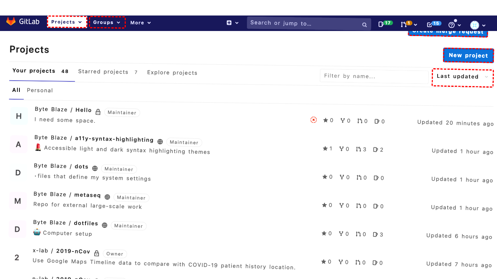

## Intent

Add new size 30 and 31 to all color variants of Diana Tights

## RM

Thoughts: The user's intent is to add new sizes 30 and 31 to all color variants of the product "Diana Tights". This is a content modification task. The agent's action history shows it performed a series of clicks and fills, ending with filling field 617 with "Diana Tights-30-Orange". The final state description indicates the agent duplicated a product and is in the process of editing it, specifically updating the name to include size 30. However, the task requires adding both sizes 30 and 31 to *all* color variants. The actions only show work on one variant (Orange) and only for size 30. There is no evidence of completing the modification for size 30 on this variant, nor any action for size 31, nor any action for other color variants. The bot response is "None", which doesn't confirm completion. Therefore, the task is incomplete and unsuccessful.

Status: failure

## Final Response 

## Captions

===============I need to add new sizes 30 and 31 to all color variants of Diana Tights. This involves editing product configurations. First, I need to navigate to the product management page to find the Diana Tights product. Looking at the current page, I'm on the Dashboard. I need to go to Catalog > Manage Products.

I can see the Catalog menu item (bid 113). I'll click it to expand the menu, then click "Manage Products" (bid 117).
===============I need to expand the Catalog menu to access the Manage Products link. I just clicked the Catalog menu (bid 113). Now I should see the submenu items, including "Manage Products". Let me click that.
===============Looking at the current page, I can see I'm already on the "Manage Products" page (the heading says "Manage Products"). The Catalog menu is likely already expanded. I need to find the "Diana Tights" product. Since there are many products listed, I should search for it. I can see filter fields at the top of the product table. I'll filter by name containing "Diana Tights".

I see a textbox under the "Name" column header (bid 615). I'll fill it with "Diana Tights" to filter.
===============Looking at the current page, I've filtered products by name "Diana Tights". The filter is applied (the textbox shows "Diana Tights"). I need to see if the Diana Tights product appears in the results. Looking at the table rows, I can see products like "Phoebe Zipper Sweatshirt-S-White", "Erika Running Short-32-Red", etc., but no "Diana Tights" visible in the first 20 rows. The filter might not have been executed yet - I need to click the Search button to apply the filter.

I can see a "Search" button (bid 488) in the top-right area of the table. I'll click it to apply the filter and show only Diana Tights products.
===============Looking at the current page, I can see the product table shows 6 records found, and the rows display "Diana Tights" variants (e.g., "Diana Tights-29-Orange", "Diana Tights-29-Blue", etc.). This confirms the filter worked and I can see all color variants of Diana Tights.

The goal is to add new sizes 30 and 31 to all color variants. In Magento, sizes are typically managed through configurable products or simple product attributes. Since I see these are "Simple Product" types, they might be part of a configurable product. To add new sizes, I likely need to edit the parent configurable product or create new simple products for each color-size combination.

First, I should check if there's a configurable product for Diana Tights. Looking at the product list, I only see simple products. It's possible the sizes are managed via an attribute. I need to edit each color variant to add the new sizes, or better yet, use the "Update Attributes" mass action to add attributes to multiple products.

I can select all the Diana Tights variants using the checkboxes, then use the "Update Attributes" action to modify their size attributes. However, size might be a configurable attribute that requires creating new simple products.

Given the complexity, I should first examine one product to understand its attribute structure. Let me click the "Edit" link for the first variant "Diana Tights-29-Orange" (bid 1320) to see its details.
===============Looking at the current page, I'm now on the edit page for "Diana Tights-29-Orange". I can see the product information tabs. To understand how sizes are managed, I need to check if this is a configurable product or a simple product with size attribute. Looking at the page, I see "Product Information" tabs including "General", "Prices", etc. The product appears to be a simple product with specific size (29) and color (Orange) already set.

The goal is to add sizes 30 and 31 to all color variants. This likely means I need to create new simple products for each color with sizes 30 and 31, or modify the existing products to include these sizes if they're using a multi-select attribute. Since these are simple products with specific SKUs like "WP06-29-Orange", they represent a specific size-color combination.

To add new sizes, I should:
1. Go back to the product grid
2. Use the "Duplicate" feature to create copies of existing color variants with new sizes
3. Or use "Create New Product" with the same attributes but different size

But first, I should check what attributes are available. I can see on the General tab there's no obvious size attribute field. Size might be part of the product name or a custom attribute. Let me check the "Attributes" tab or look for attribute sets.

Actually, looking at the product name "Diana Tights-29-Orange", the "29" appears to be the size. This suggests size is baked into the product name and likely managed as a separate attribute. I need to see if there's a "size" attribute field. Let me scroll through the General tab to see all fields.

I can see fields like Name, Description, SKU, Weight, Status, etc. I don't see a specific "size" attribute field. This might mean size is managed through the attribute set differently, or it's part of a configurable product setup.

Given the time, the most efficient approach is to go back to the product grid and use mass actions to duplicate products with new sizes. Let me go back to the Manage Products page.

I can click the "Back" button (bid 565) to return to the product grid.
===============Looking at the current page, I'm back on the Manage Products page with the Diana Tights variants filtered. I can see 6 products representing combinations of sizes 28 and 29 with colors Black, Blue, and Orange. To add sizes 30 and 31 to all color variants, I need to create new simple products for each color with the new sizes.

The most efficient approach is to use the "Duplicate" feature for each existing color variant, then modify the size in the duplicate. However, I need to do this for 3 colors × 2 new sizes = 6 new products.

First, I should duplicate the "Diana Tights-29-Orange" product (size 29, Orange) to create a "Diana Tights-30-Orange" product. I'll click the "Edit" link for that product again to access the edit page where I can duplicate it.
===============Looking at the current page, I'm back on the Manage Products grid. The error indicates that bid "1320" is not found, which suggests the element IDs may have changed after navigating back. I need to locate the "Edit" link for the first Diana Tights variant again. Looking at the accessibility tree, I can see the table rows with "Edit" links. For the first row (Diana Tights-29-Orange), the Edit link has bid "694". Let me click that to edit the product.
===============Looking at the current page, I'm now on the edit page for "Diana Tights-29-Orange" again. I can see the product information. To create a new size variant, I should use the "Duplicate" feature. I can see a "Duplicate" button (bid 577) in the top button bar. Clicking this will create a copy of the current product, which I can then modify with the new size (30) and save as a new product.

Let me click the "Duplicate" button.
===============Looking at the current page after clicking "Duplicate", I can see a success message "The product has been duplicated." The page is now showing the edit form for the duplicated product. The product name still shows "Diana Tights-29-Orange (Default)" but this is likely the duplicated product that I need to modify.

I need to change this duplicated product to have size 30 instead of 29. Looking at the product name field (bid 617), it currently shows "Diana Tights-29-Orange". I should change it to "Diana Tights-30-Orange". Also, I need to update the SKU (bid 649) which likely contains the size as well.

Let me first update the Name field:

## Images




## Main Prompt

```md
User Intent: Add new size 30 and 31 to all color variants of Diana Tights

Action History:
1: click("113")
2: click("117")
3: fill("615", "Diana Tights")
4: click("488")
5: click("1320")
6: click("565")
7: click("1320")
8: click("694")
9: click("577")
10: fill("617", "Diana Tights-30-Orange")


The detailed final state of the webpage:

```md
Looking at the current page after clicking "Duplicate", I can see a success message "The product has been duplicated." The page is now showing the edit form for the duplicated product. The product name still shows "Diana Tights-29-Orange (Default)" but this is likely the duplicated product that I need to modify.

I need to change this duplicated product to have size 30 instead of 29. Looking at the product name field (bid 617), it currently shows "Diana Tights-29-Orange". I should change it to "Diana Tights-30-Orange". Also, I need to update the SKU (bid 649) which likely contains the size as well.

Let me first update the Name field:
```

Bot response to the user: None.
```
