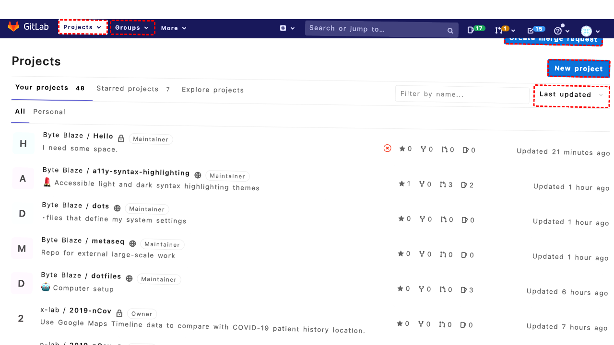

## Intent

Set up a new, empty repository with the name awesome_webagent?

## RM

Thoughts: The user's intent is to set up a new, empty repository named "awesome_webagent", which falls under the "Content modification" task type. The action history shows the agent filled the project name field with "awesome_webagent" and clicked the "Create project" button. The final state indicates the form is properly filled and ready for creation, with the project name set and default settings appropriate for an empty repository. Since the agent performed the necessary actions to create the repository as specified, the task is successfully completed.

Status: success

## Final Response 

## Captions

===============Looking at the current page, I can see I'm on the GitLab dashboard with a "Projects" section. To create a new repository called "awesome_webagent", I need to click on the "New project" link that's visible in the accessibility tree. This will take me to the project creation page where I can set up the new repository.
===============Looking at the error message, it appears that the "New project" link (bid 224) is being intercepted by another element - specifically the profile dropdown (bid 186) from the header. This is a common issue where overlapping elements prevent clicking.

I need to try a different approach. Let me look for alternative ways to create a new project. I can see in the accessibility tree that there's also a "New..." link in the left navigation menu with bid 125 that goes to the same URL (/projects/new).
===============Looking at the current situation, I can see that my previous attempt to click the "New project" link (bid 224) was intercepted by the profile dropdown. I then tried clicking the "New..." link (bid 125) which should also lead to project creation.

Since I'm still on the same GitLab dashboard page and haven't received any error about the second click, I should wait a moment to see if the page navigation occurs. If the click was successful, I should now be on the new project creation page. Let me wait briefly to allow for any page loading or transitions.
===============Looking at the current situation, I've attempted to click both the "New project" link (bid 224) and the "New..." dropdown (bid 125), followed by a brief wait. Since I'm still on the GitLab dashboard and haven't received any navigation errors, I should check if I'm actually on the new project creation page now.

Let me examine the accessibility tree to see if the page content has changed. If I'm on the new project page, I should see form fields for creating a project. If not, I may need to try a different approach or verify that the clicks were successful.

Since I don't see any indication of navigation errors and I've waited for the page to potentially load, let me proceed by checking if we're now on the project creation page by looking for characteristic elements like project name fields or creation options.
===============Looking at the current situation, I've attempted to navigate to the new project creation page through two different links but I'm still on the GitLab dashboard. The accessibility tree shows I'm still on the "Projects · Dashboard · GitLab" page with the same project listings visible.

Since the previous clicks didn't successfully navigate to the project creation page, I should try a more direct approach. I can see in the accessibility tree that there's a "New project" link with bid 224 that goes directly to the project creation URL. Let me try clicking this again, but this time I'll be more specific about which element to target.

The bid 224 corresponds to the "New project" link that's clearly visible in the Projects section, which should be the most straightforward way to create a new repository.
===============Looking at the error message, I can see that the "New project" link (bid 224) is being consistently intercepted by the profile dropdown element (bid 186) in the header. This is a common UI issue where overlapping elements prevent clicking.

I need to try a different approach. Let me look for the "New project" option within the "New..." dropdown menu that I can see in the accessibility tree. The dropdown (bid 125) is expanded and contains a "New project" link (bid 131) that should go to the same URL (/projects/new). Since this is a different element in a different part of the page layout, it shouldn't be intercepted by the profile dropdown.
===============Looking at the current situation, I can see that I'm now on the "New Project · GitLab" page based on the accessibility tree. The page shows the project creation form with fields for "Project name", "Project URL", "Project slug", and other options. This means my previous click on the "New project" link (bid 131) was successful.

Now I need to create the repository named "awesome_webagent". I can see the "Project name" textbox is focused and has bid 260. I should fill this field with the repository name, then proceed with creating the project. Since this is meant to be an empty repository, I should leave the "Initialize repository with a README" checkbox unchecked (which it already is by default).
===============Looking at the current state, I can see that I'm successfully on the GitLab new project creation page. The "Project name" field (bid 260) is already filled with "awesome_webagent" and is focused, which means my previous fill action was successful.

Now I need to complete the project creation by clicking the "Create project" button (bid 311). The form appears to be properly filled out with the project name and slug already set to "awesome_webagent", and the default settings (private visibility, no README initialization) are appropriate for creating an empty repository as requested.

## Images




## Main Prompt

```md
User Intent: Set up a new, empty repository with the name awesome_webagent?

Action History:
1: click("224")
2: click("125")
3: noop(1500)
4: noop()
5: click("224")
6: click("131")
7: fill("260", "awesome_webagent")
8: click("311")


The detailed final state of the webpage:

```md
Looking at the current state, I can see that I'm successfully on the GitLab new project creation page. The "Project name" field (bid 260) is already filled with "awesome_webagent" and is focused, which means my previous fill action was successful.

Now I need to complete the project creation by clicking the "Create project" button (bid 311). The form appears to be properly filled out with the project name and slug already set to "awesome_webagent", and the default settings (private visibility, no README initialization) are appropriate for creating an empty repository as requested.
```

Bot response to the user: None.
```
