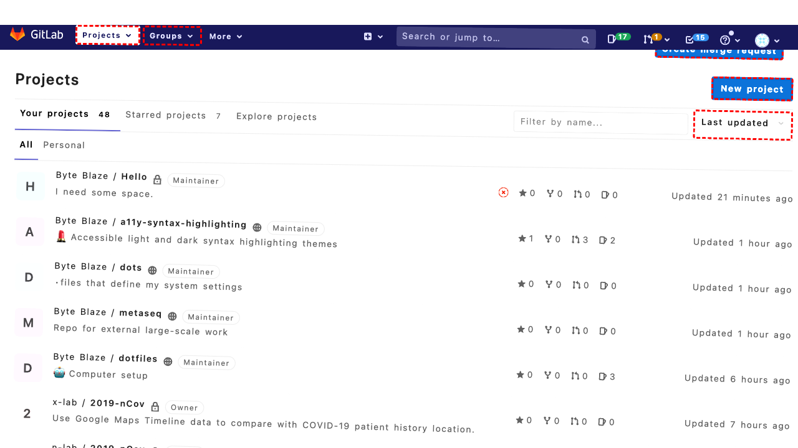

## Intent

Lookup orders that are processing

## RM

Thoughts: The user's intent is to "Lookup orders that are processing," which is an information-seeking task. The agent needs to navigate to the orders page and apply a filter for "Processing" status to retrieve the relevant information. The action history shows clicks on the Sales menu (bid 66) three times and then a click on Orders (bid 70), but the final state description indicates the agent is still on the Dashboard page and has not successfully navigated to the orders page. The bot's response is "None," meaning no information was provided to the user. Since the agent failed to reach the target page and did not provide any information or error message about the inability to complete the task, the execution is unsuccessful.

Status: failure

## Final Response 

## Captions

===============Looking at the goal "Lookup orders that are processing", I need to navigate to the Orders page and filter by the status "Processing". The current page is the Dashboard. I need to expand the Sales menu and click on Orders, then apply a status filter.

From the action trajectory examples, I see that for filtering orders by status, the steps are:
1. Click the Sales menu (bid 66) to expand it.
2. Click the Orders link (bid 70) to navigate to the orders listing page.
3. Select the status "Processing" in the Status dropdown (bid 638).
4. Click the Search button (bid 483) to apply the filter.

I can see the Sales menu item in the accessibility tree with bid 66. I'll start by clicking that to expand it.
===============I can see that the Sales menu is already focused according to the accessibility tree (it shows `focused` on the link). However, clicking it should expand the submenu to reveal the Orders link. Let me click it to expand.
===============I can see that the Sales menu item (bid 66) is already focused. Clicking it should expand the submenu to reveal the Orders link. After expanding, I need to click the Orders link (bid 70) to navigate to the orders listing page.
===============Looking at the current state, I've clicked the Sales menu (bid 66) three times, but I'm still on the Dashboard page. The Sales menu should have expanded to show the Orders link. However, I notice that in the accessibility tree, the Sales menu link (bid 66) is already focused, but clicking it might not have triggered the expansion due to how the menu works. Let me check if there's a different approach.

Actually, looking at the accessibility tree more carefully, I can see that the Sales menu (bid 66) is a link that has a submenu (list with bid 68). The Orders link (bid 70) is already visible in the tree as a child. This suggests the menu might already be expanded, or the tree shows all possible elements regardless of visibility.

I should proceed directly to clicking the Orders link (bid 70) to navigate to the orders page. Once there, I can apply the status filter for "Processing".

## Images




## Main Prompt

```md
User Intent: Lookup orders that are processing

Action History:
1: click("66")
2: click("66")
3: click("66")
4: click("70")


The detailed final state of the webpage:

```md
Looking at the current state, I've clicked the Sales menu (bid 66) three times, but I'm still on the Dashboard page. The Sales menu should have expanded to show the Orders link. However, I notice that in the accessibility tree, the Sales menu link (bid 66) is already focused, but clicking it might not have triggered the expansion due to how the menu works. Let me check if there's a different approach.

Actually, looking at the accessibility tree more carefully, I can see that the Sales menu (bid 66) is a link that has a submenu (list with bid 68). The Orders link (bid 70) is already visible in the tree as a child. This suggests the menu might already be expanded, or the tree shows all possible elements regardless of visibility.

I should proceed directly to clicking the Orders link (bid 70) to navigate to the orders page. Once there, I can apply the status filter for "Processing".
```

Bot response to the user: None.
```
