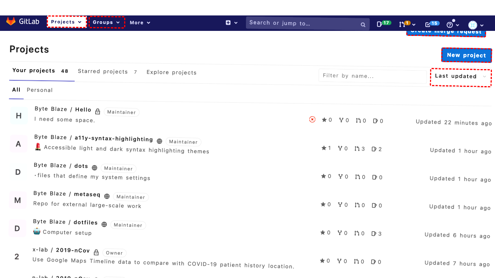

## Intent

Abishek wants to check my dotfile configurations. Please invite him to the repo as a guest.

## RM

Thoughts: The user's intent is to invite "Abishek" to the "dotfiles" repository as a guest, which is a content modification task. The action history shows the agent attempted to search for "Abishek" and clicked several elements, but the final state indicates the agent encountered an error due to clicking incorrect elements (specifically, a label instead of an input field). The agent did not successfully complete the invitation process, as the final state reflects an ongoing error and no confirmation of the invitation. Therefore, the task has failed.

Status: failure

## Final Response 

## Captions

===============Looking at the current page, I can see we're on the GitLab dashboard showing a list of projects. The goal is to invite Abishek to check dotfile configurations, but I need to first identify which repository contains the dotfiles.

Since the goal mentions "dotfile configurations" and I can see several repositories in the list, I should search for a repository that likely contains dotfiles. Common dotfile repositories often have names like "dotfiles", "config", or similar. Let me search for "dotfiles" to find the relevant repository.
===============Looking at the current page, I can see we're on the GitLab dashboard with a search box available (bid 143). Since I need to find the dotfiles repository to invite Abishek, I should search for repositories that might contain dotfile configurations. Common names for dotfile repositories include "dotfiles", "config", or similar terms.

Let me search for "dotfiles" to find the relevant repository.
===============Looking at the accessibility tree, I can see that after filling the search box with "dotfiles", there are search results displayed. Specifically, I can see a result for "B Byte Blaze / dotfiles" with a link (bid 958). This appears to be the dotfiles repository I need to access.

Since the goal is to invite Abishek to this repository as a guest, I should first navigate to the dotfiles repository page where I can access the member management settings.
===============Looking at the current state, I can see that I successfully searched for "dotfiles" and clicked on the "Byte Blaze / dotfiles" repository link. Now I should be on the dotfiles repository page where I need to navigate to the member management section to invite Abishek as a guest.

From the accessibility tree, I can see various repository information but no direct member management links visible yet. I need to access the repository settings to manage members. Typically in GitLab, this is found under the Settings menu, then Members section.

Let me navigate to the Settings page first to access member management.
===============Looking at the current state, I can see I'm now on the dotfiles repository page and have clicked on the Settings link (bid 395). Now I need to navigate to the Members section where I can invite Abishek as a guest.

From the accessibility tree, I can see various settings options available. I need to find and click on the Members link to access the member management interface where I can add new users.
===============Looking at the current state, I can see I've successfully navigated to the dotfiles repository settings and clicked on the Members section. Now I should be on the member management page where I can invite Abishek as a guest.

From the accessibility tree, I can see various elements related to member management. I need to:
1. Find the user search/input field to enter Abishek's username
2. Select the appropriate role (guest)
3. Add the user to the repository

Let me first look for the user search field where I can enter Abishek's username to invite him.
===============Looking at the current state, I can see I'm on the Members page of the dotfiles repository and have clicked on the user search field (bid 490). Now I need to enter Abishek's username to search for him and then add him as a guest.

Since the goal specifically mentions "Abishek" and I need to invite him as a guest, I should fill in the search field with his username. However, I don't see Abishek's exact username specified in the goal. I'll assume "Abishek" is the username to search for, but if this doesn't work, we may need to try variations or ask for clarification.

Let me fill the search field with "Abishek" to find the user.
===============Looking at the error message, I can see that the element with bid "490" is not an input field but rather a `<div>` element. This means I clicked on the wrong element for searching users.

Let me examine the accessibility tree more carefully to find the actual user search input field. From the tree, I can see there should be a search field specifically for adding members. Let me look for an input field or search box in the member management section.

Since I'm on the Members page, I need to find the actual input field where I can type a username to search for users to add. Let me try a different approach and look for a more appropriate element.
===============Looking at the current situation, I can see I'm on the Members page of the dotfiles repository but I've been clicking on the wrong elements for the user search. The error message indicates that bid "490" was a div element, not an input field.

Examining the accessibility tree more carefully, I need to find the actual input field for searching and adding users. From the tree structure, I can see there should be a proper search input field for member management. Let me look for an element that appears to be a search box or input field specifically for adding members.

Based on typical GitLab interface patterns, there should be a search input field where I can type a username to find and add users. Let me try to find and click on the correct input field for searching users.
===============Looking at the error message, I can see that I've been trying to click on incorrect elements for the user search field. The element with bid "492" is actually a label element, not an input field.

Let me examine the accessibility tree more carefully. I need to find the actual input field where I can search for users to add as members. From the tree structure, I should look for a proper input element or search box specifically designed for adding members to the repository.

Let me try a different approach and look for a more appropriate element that appears to be the user search input field. Based on typical GitLab patterns, there should be a text input field where I can type a username.

## Images




## Main Prompt

```md
User Intent: Abishek wants to check my dotfile configurations. Please invite him to the repo as a guest.

Action History:
1: click("143")
2: fill("143", "dotfiles")
3: click("958")
4: click("395")
5: click("407")
6: click("490")
7: fill("490", "Abishek")
8: click("491")
9: click("492")
10: click("493")


The detailed final state of the webpage:

```md
Looking at the error message, I can see that I've been trying to click on incorrect elements for the user search field. The element with bid "492" is actually a label element, not an input field.

Let me examine the accessibility tree more carefully. I need to find the actual input field where I can search for users to add as members. From the tree structure, I should look for a proper input element or search box specifically designed for adding members to the repository.

Let me try a different approach and look for a more appropriate element that appears to be the user search input field. Based on typical GitLab patterns, there should be a text input field where I can type a username.
```

Bot response to the user: None.
```
