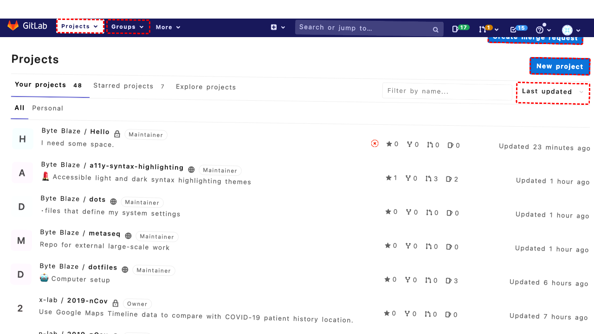
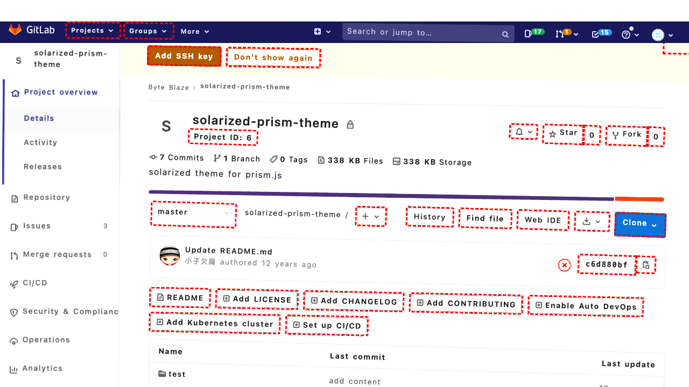
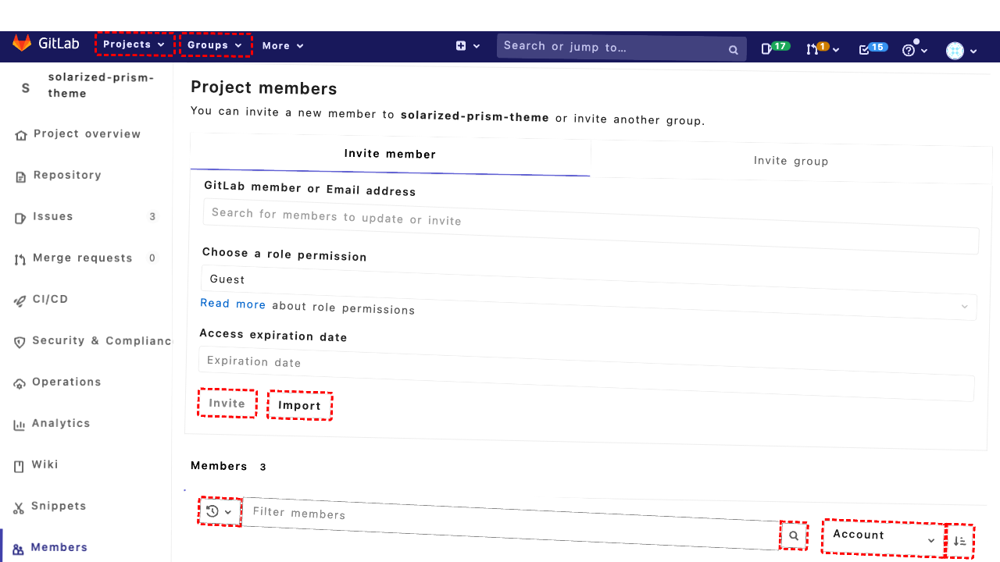
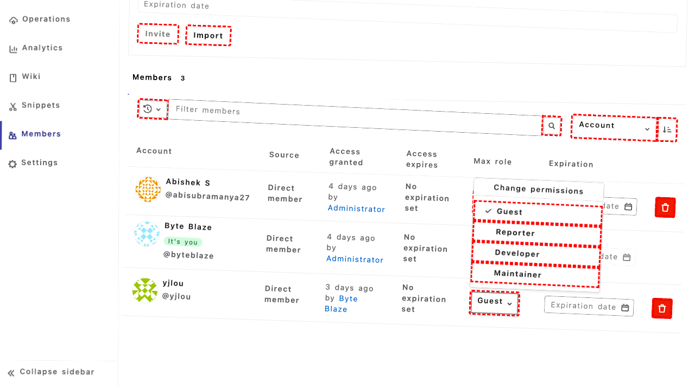
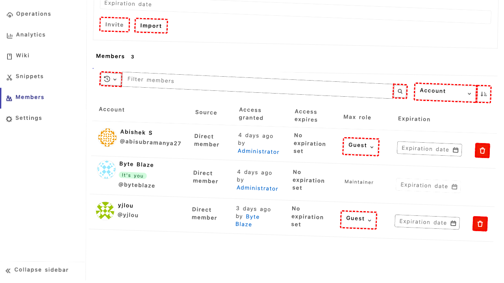

## Intent

yjlou wants to check my dotfile configurations. Please invite him to the repo as a guest.

## RM

Thoughts: The user's intent is to invite "yjlou" as a guest to the dotfiles repository. The action history shows that the agent attempted to add the user with `add_user_as_role('490', 'yjlou', '607', '512', 'dotfiles', 'guest')`, but the final state indicates the agent is still in the Members section and has not successfully located or used the correct search field to add the user. The bot response is "None," and the final state describes ongoing struggles to find the correct input, implying the invitation was not completed. Since this is a content modification task (adding a user to a repo), the failure to successfully modify the content (i.e., add the user) means the task is unsuccessful.

Status: failure

## Final Response 

## Captions

===============Looking at the current page, I can see we're on the GitLab dashboard showing various projects. To invite yjlou to check dotfile configurations, I need to first identify which repository contains the dotfiles. Since the goal mentions "dotfile configurations" but doesn't specify a particular repository, I should search for repositories that might contain dotfiles.

From the project list, I can see several repositories owned by "Byte Blaze" but none explicitly named "dotfiles". I'll search for repositories that might contain dotfiles using the search functionality.
===============Looking at the current page, I can see we're on the GitLab dashboard with a search box available (element ID 143). Since I need to find the repository containing dotfile configurations to invite yjlou, I should search for repositories that might contain dotfiles. Common dotfile repositories are often named "dotfiles" or contain "dot" in their name.

I'll search for "dotfiles" to see if there's a repository with that name.
===============Looking at the search results in the accessibility tree, I can see that there is a repository called "B Byte Blaze / dotfiles" in the search results (element ID 953). This appears to be the dotfiles repository I need to access. I should click on this repository link to navigate to the dotfiles project page where I can then manage members and invite yjlou as a guest.
===============Looking at the current state, I can see that I successfully searched for "dotfiles" and found the repository "Byte Blaze / dotfiles" in the search results. I clicked on it and now I need to navigate to the member management section to invite yjlou as a guest.

From the accessibility tree, I can see I'm on the dotfiles repository page. To invite a user, I need to:
1. Go to the project settings
2. Navigate to the members section
3. Add yjlou as a guest

I can see the repository header and various navigation options. I should look for the Settings link to access member management.
===============Looking at the current state, I can see I've successfully navigated to the dotfiles repository page and clicked on the Settings link (element ID 395). Now I need to navigate to the Members section to manage project members and invite yjlou as a guest.

From the accessibility tree, I can see various settings options. I should look for the "Members" link to access the member management interface where I can add new users.
===============Looking at the current state, I can see I've successfully navigated to the Members section of the dotfiles repository settings. Now I need to add yjlou as a guest. From the accessibility tree, I can see the member management interface where I can search for users and add them with specific roles.

I need to:
1. Search for the user "yjlou" in the member search field
2. Select the user from search results
3. Assign the "Guest" role
4. Add the user to the project

I can see the search field and add functionality available in the member management interface.
===============Looking at the error message, I see that the element with ID '490' is not a form field but appears to be a count badge element. This means I need to find the actual search input field for adding members.

From the current page context (Members section of repository settings), I should look for the proper search field to add members. Let me examine the accessibility tree more carefully to find the correct element ID for the member search field.

Since the high-level function failed due to incorrect element IDs, I'll manually locate and use the correct elements. I can see from the member management interface that there should be a search field to find users, then a way to select them and assign roles.

Let me try to find the actual search input field for adding members:
===============Looking at the error and the current state, I can see I'm in the Members section but clicked on an incorrect element (ID '490' which appears to be a count badge). I need to find the actual search input field for adding new members.

From the member management interface, there should be a search box specifically for finding users to add as members. Let me look for the correct search input field element.
===============Looking at the error and the current state, I can see I'm still in the Members section but having trouble locating the correct search input field. The element IDs I've been trying (490, 500) don't seem to be the correct search field for adding members.

Let me examine the accessibility tree more carefully. I need to find the actual input field where I can search for users to add as members. From the member management interface, there should be a clear search box or "Invite members" section.

Let me try a different approach and look for a more obvious "Invite members" button or section that might contain the search functionality:
===============Looking at the current situation, I can see I'm in the Members section of the dotfiles repository settings but have been struggling to find the correct search field for adding new members. The previous attempts with IDs 490, 500, and 509 were incorrect.

From the accessibility tree, I need to find the actual input field for searching and adding users. Let me look for elements that might be the search field - typically it would be a textbox element where I can type the username "yjlou".

Let me try clicking on element ID 510, which might be the search input field for adding members:

## Images









## Main Prompt

```md
User Intent: yjlou wants to check my dotfile configurations. Please invite him to the repo as a guest.

Action History:
1: click("143")
2: fill("143", "dotfiles")
3: click("953")
4: click("395")
5: click("407")
6: add_user_as_role('490', 'yjlou', '607', '512', 'dotfiles', 'guest')
7: click("490")
8: click("500")
9: click("509")
10: click("510")


The detailed final state of the webpage:

```md
Looking at the current situation, I can see I'm in the Members section of the dotfiles repository settings but have been struggling to find the correct search field for adding new members. The previous attempts with IDs 490, 500, and 509 were incorrect.

From the accessibility tree, I need to find the actual input field for searching and adding users. Let me look for elements that might be the search field - typically it would be a textbox element where I can type the username "yjlou".

Let me try clicking on element ID 510, which might be the search input field for adding members:
```

Bot response to the user: None.
```
