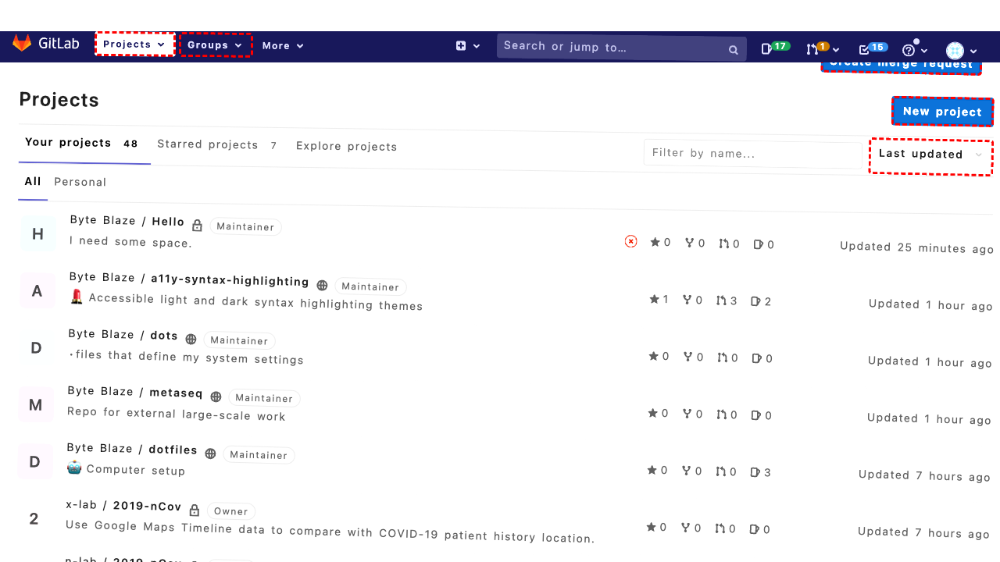
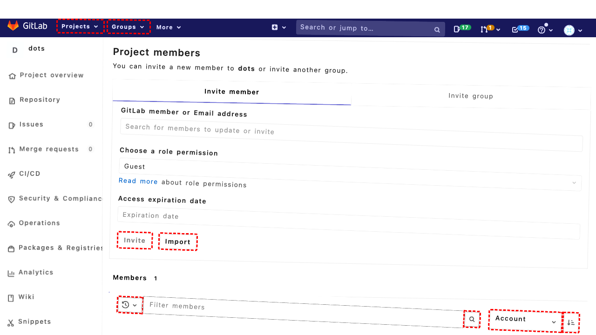
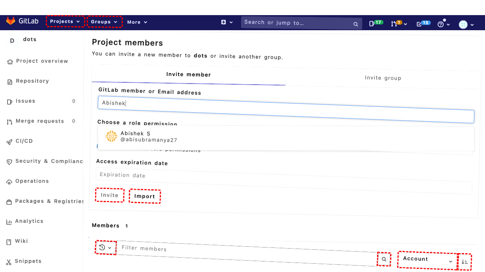
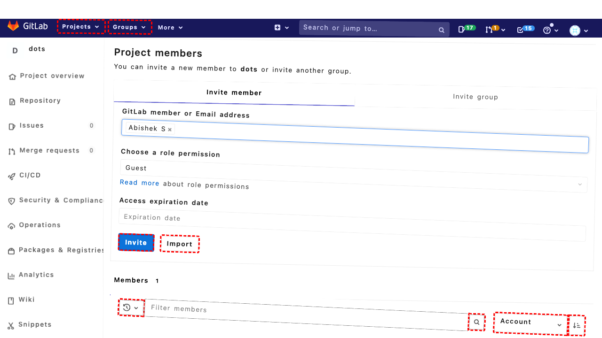
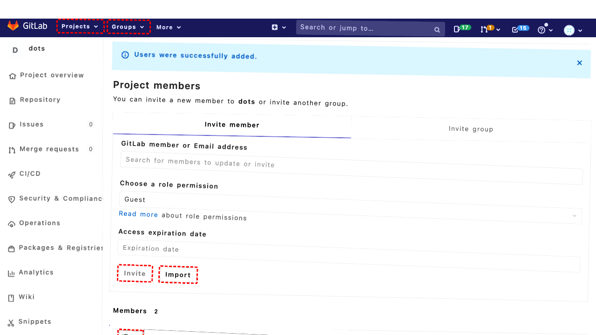

## Intent

Abishek wants to check my dotfile configurations. Please invite him to the repo as a guest.

## RM

Thoughts: This is a content modification task where the user wants to invite Abishek to a repository as a guest. The action history shows the agent performed a series of actions including searching for "Abishek" and clicking invite buttons. The final state of the webpage confirms "Abishek S @abisubramanya27" was successfully added as a "Guest" with access granted "just now." The bot's response to the user correctly reports the successful invitation, though it has a minor typographical omission (missing closing parenthesis after the username). However, since this is a content modification task, we only need to examine the action history and final webpage state, which clearly indicate the task was completed successfully.

Status: success

## Final Response "Successfully invited Abishek S (@abisubramanya27

## Captions

===============Looking at the current page, I can see we're on the GitLab dashboard with a list of projects. I need to invite Abishek to the "dots" repository (which appears to be the dotfiles configuration repo) as a guest.

First, I need to navigate to the "dots" repository. I can see it in the project list as "Byte Blaze / dots" with the description "⋅files that define my system settings". This matches the goal of checking dotfile configurations.

I'll click on the "Byte Blaze / dots" link to navigate to that repository.
===============Looking at the accessibility tree, I can see we're already on the "dots" repository page (Tab 0 shows "Byte Blaze / dots · GitLab" as the title). The page shows the repository contents with various configuration files.

To invite Abishek as a guest, I need to navigate to the Members section where I can add users to the project. I can see in the project navigation sidebar there's a "Members" link with ID "513".

Let me click on the Members link to go to the member management page.
===============Looking at the current page, I can see we're already on the Members page for the "dots" repository. The page shows the current member (Byte Blaze) and has an "Invite member" section where I can add new members.

I need to:
1. Fill in the search box with "Abishek" to find the user
2. The role is already set to "Guest" by default (as shown in the combobox)
3. Click the "Invite" button to add them

The search box has ID "616" and is currently showing "Search for members to update or invite". I'll fill it with "Abishek" to search for the user.
===============Looking at the current state, I can see that after filling "Abishek" in the search box, the autocomplete menu has appeared showing "Abishek S @abisubramanya27" as an option. This matches the user we want to invite. The role is already set to "Guest" by default, which is exactly what we need.

Now I need to select this user from the autocomplete menu. I can press "Enter" to select the highlighted option, or I could click on the specific user option. Since the user is listed in the autocomplete menu with ID "799", I'll click on it to select Abishek.
===============Looking at the current state, I can see that after clicking on "Abishek S" in the autocomplete menu, the user has been selected and appears in the invite section. The role is already set to "Guest" by default, which matches our requirement. Now I need to complete the invitation by clicking the "Invite" button, which has ID "638".
===============Looking at the current state, I can see that the action was successful - the page shows "Users were successfully added." message at the top, and in the members table, I can see "Abishek S @abisubramanya27" has been added as a "Guest" with access granted "just now". This confirms that Abishek has been successfully invited to the dots repository as a guest, which accomplishes the goal.

I should now send a confirmation message to the user that the task has been completed successfully.

## Images








## Main Prompt

```md
User Intent: Abishek wants to check my dotfile configurations. Please invite him to the repo as a guest.

Action History:
1: click("419")
2: click("513")
3: fill("616", "Abishek")
4: click("799")
5: click("638")
6: send_msg_to_user("Successfully invited Abishek S (@abisubramanya27) to the dots repository as a guest. They now have access to check your dotfile configurations.")


The detailed final state of the webpage:

```md
Looking at the current state, I can see that the action was successful - the page shows "Users were successfully added." message at the top, and in the members table, I can see "Abishek S @abisubramanya27" has been added as a "Guest" with access granted "just now". This confirms that Abishek has been successfully invited to the dots repository as a guest, which accomplishes the goal.

I should now send a confirmation message to the user that the task has been completed successfully.
```

Bot response to the user: "Successfully invited Abishek S (@abisubramanya27.
```
