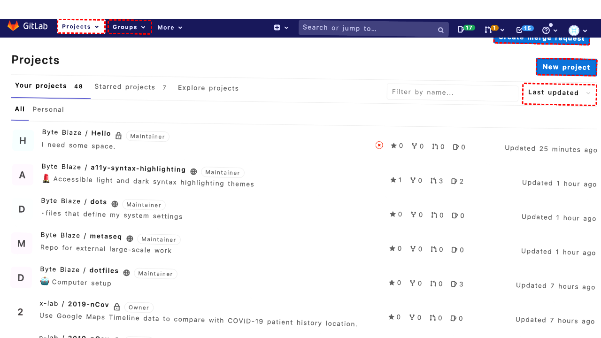
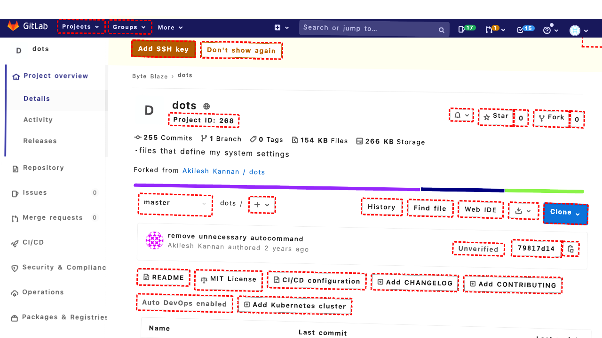
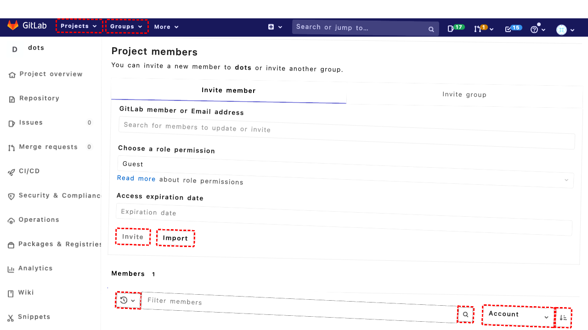
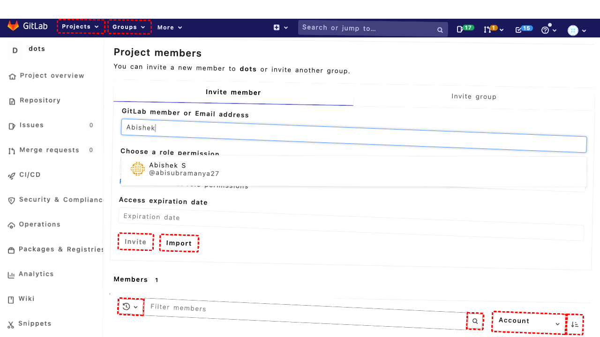
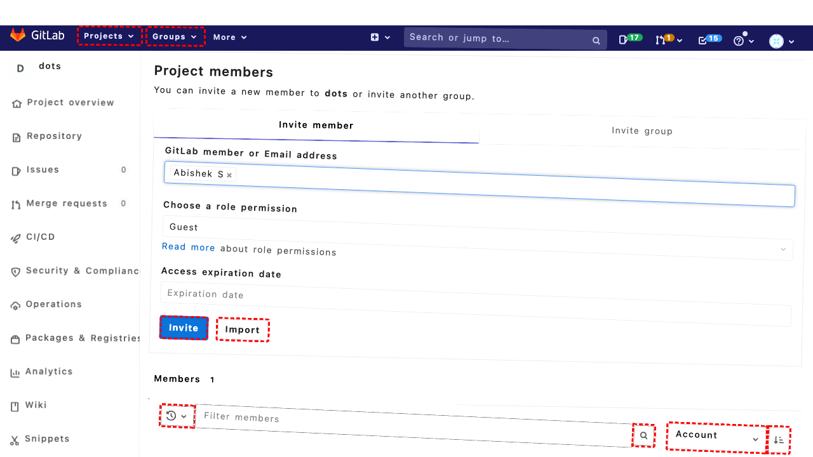
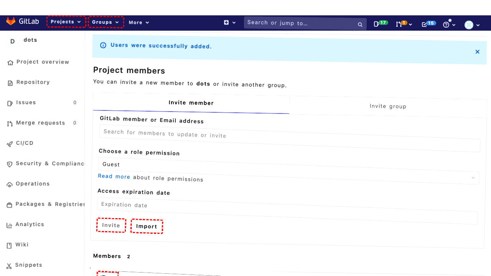

## Intent

Koushik wants to check my dotfile configurations. Please invite him to the repo as a guest.

## RM

Thoughts: The user's intent is to invite Koushik to the repo as a guest, which falls under the "Content modification" task type. The action history shows the agent attempted to fill and click various elements but encountered errors, as indicated by the final state description stating that elements like "492" don't exist and previous attempts failed. The agent did not successfully navigate to or use the correct interface for inviting members, and the final state reflects that the agent is still trying to find the right elements without having completed the task. Since the task is not accomplished (no successful invitation action is recorded), this is a failure.

Status: failure

## Final Response 

## Captions

===============Looking at the current page, I can see we're on the GitLab dashboard showing a list of projects. The goal is to invite Koushik to check dotfile configurations, but I don't see any obvious "dotfiles" repository in the current project list.

I need to first find the dotfiles repository. Let me search for it using the search functionality available on the page.
===============Looking at the current page, I can see we're on the GitLab dashboard with a search box available (bid 143). Since I need to find the dotfiles repository to invite Koushik, I should search for it first. The search box is already focused according to the accessibility tree, so I can directly type "dotfiles" to search for the repository.
===============Looking at the accessibility tree, I can see that after filling the search box with "dotfiles", there are search results showing below. Specifically, I can see a result for "B Byte Blaze / dotfiles" with bid 953. This appears to be the dotfiles repository I need to access to invite Koushik.
===============Looking at the current state, I successfully searched for "dotfiles" and clicked on the dotfiles repository link. Now I should be on the dotfiles repository page where I can navigate to the member management section to invite Koushik as a guest.

From the accessibility tree, I can see I'm now on the repository page. To invite Koushik, I need to:
1. Go to the repository settings
2. Navigate to the members section
3. Add Koushik as a guest

Let me first navigate to the settings page for this repository.
===============Looking at the current state, I successfully navigated to the dotfiles repository settings page. Now I need to access the member management section to invite Koushik as a guest. From the accessibility tree, I can see there should be a "Members" link in the settings sidebar that will allow me to manage repository members and add new users.
===============Looking at the current state, I can see I've successfully navigated to the Members section of the dotfiles repository settings. Now I need to add Koushik as a guest. From the accessibility tree, I can see there should be a search field to find users, and then I can add them with the appropriate role.

I need to:
1. Find the user search field
2. Search for "Koushik"
3. Select Koushik from the results
4. Set the role to "Guest"
5. Add them to the repository

Let me first locate and use the search field to find Koushik.
===============Looking at the current state, I've successfully navigated to the Members section of the dotfiles repository and clicked on the user search field (bid 490). Now I need to search for "Koushik" to find the user and then add them as a guest to the repository.
===============Looking at the error message, I see that the element with bid "490" is not an input field but appears to be a badge element. I need to find the actual search input field for adding members. Let me examine the accessibility tree more carefully to locate the proper search field for adding users to the repository.

From the current page context, I should be in the Members section where I can add users. I need to find the actual text input field where I can type "Koushik" to search for the user. Let me look for a proper input field in the member management interface.
===============Looking at the current situation, I realize I made an error in identifying the correct search field for adding members. The element with bid "490" appears to be a badge element rather than an input field.

From the accessibility tree, I can see I'm in the Members section of the repository settings. I need to find the actual input field where I can search for and add users. Let me look for a proper text input field that would allow me to search for "Koushik" to add them as a guest.
===============Looking at the current situation, I realize I've been trying to click on incorrect elements to add Koushik as a member. The error message indicates that element "492" doesn't exist, and previous attempts with "490" and "491" also failed because they weren't the correct input fields.

From the accessibility tree, I can see I'm in the Members section of the repository settings. I need to find the actual "Invite members" or user search functionality. Let me look more carefully at the available elements. I notice there might be a "Grant access" or "Invite members" button that I should click first to access the user search interface.

Let me try clicking on a more obvious element that would lead to the member invitation interface.

## Images









## Main Prompt

```md
User Intent: Koushik wants to check my dotfile configurations. Please invite him to the repo as a guest.

Action History:
1: click("143")
2: fill("143", "dotfiles")
3: click("953")
4: click("395")
5: click("407")
6: click("490")
7: fill("490", "Koushik")
8: click("491")
9: click("492")
10: click("493")


The detailed final state of the webpage:

```md
Looking at the current situation, I realize I've been trying to click on incorrect elements to add Koushik as a member. The error message indicates that element "492" doesn't exist, and previous attempts with "490" and "491" also failed because they weren't the correct input fields.

From the accessibility tree, I can see I'm in the Members section of the repository settings. I need to find the actual "Invite members" or user search functionality. Let me look more carefully at the available elements. I notice there might be a "Grant access" or "Invite members" button that I should click first to access the user search interface.

Let me try clicking on a more obvious element that would lead to the member invitation interface.
```

Bot response to the user: None.
```
