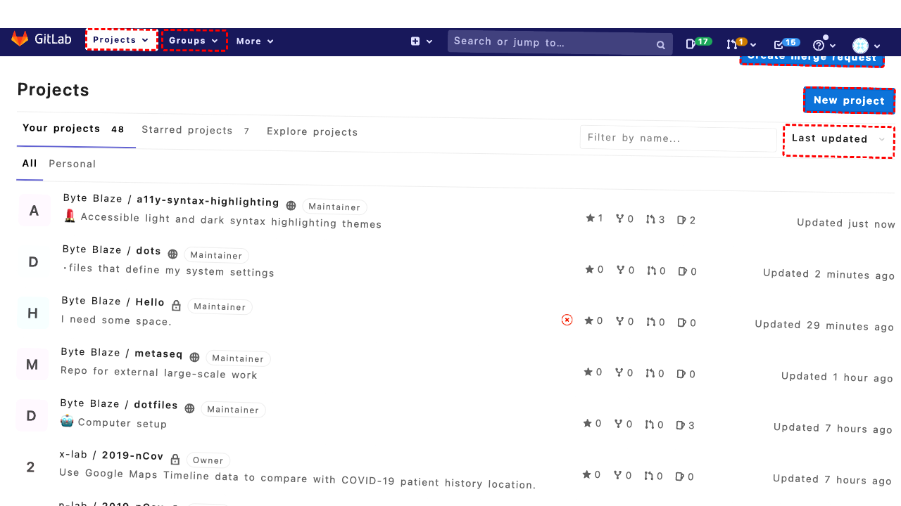
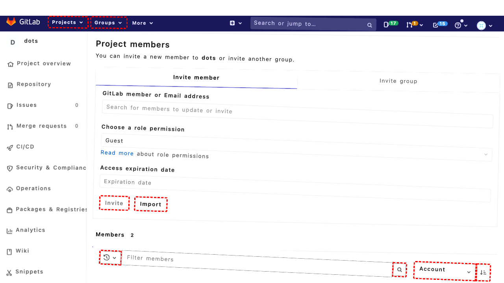
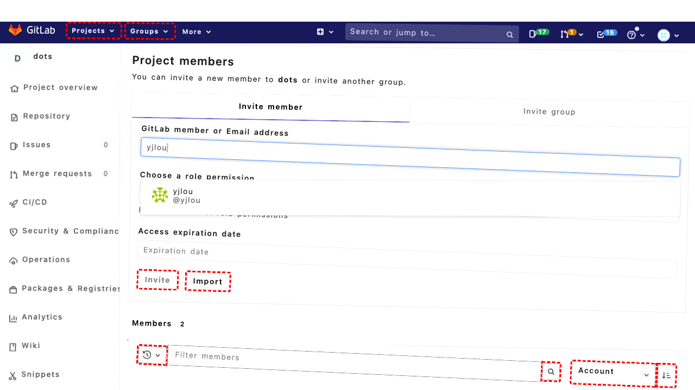
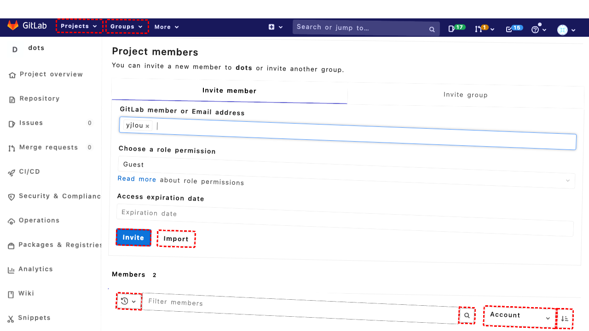
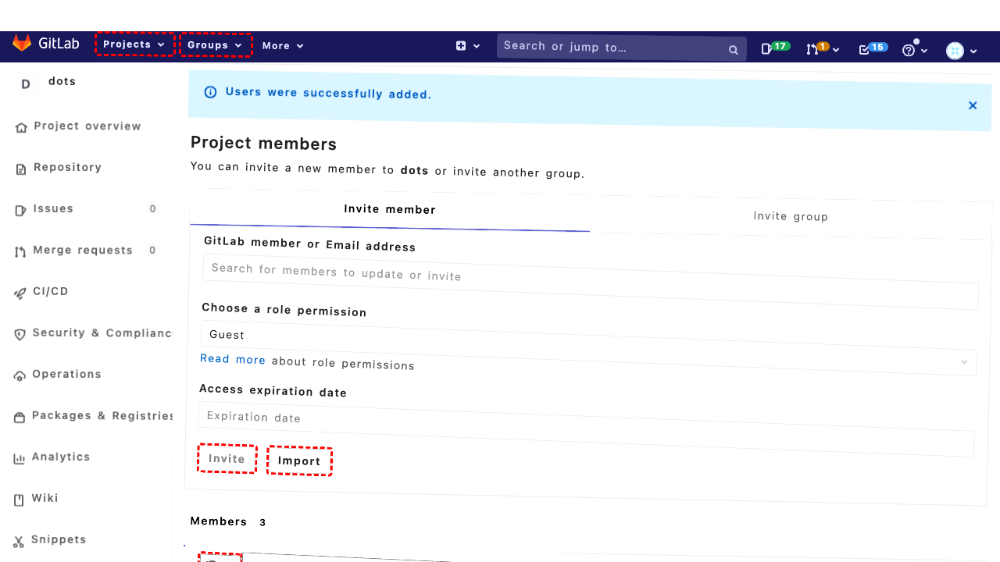

## Intent

Jakub Klinkovský wants to check my dotfile configurations. Please invite him to the repo as a guest.

## RM

Thoughts: The user's intent is to invite Jakub Klinkovský as a guest to the dotfiles repository, which is a content modification task. The action history shows the agent navigated to the repository settings and clicked on the "Members" link (action 10). However, the final state only describes being on the Members page, with no indication that an invitation was actually sent. The agent did not perform any actions to search for, select, or invite Jakub Klinkovský as a guest. Therefore, the task is incomplete and unsuccessful.

Status: failure

## Final Response 

## Captions

===============Looking at the goal, I need to invite Jakub Klinkovský to a dotfile configuration repository as a guest. First, I need to identify which repository contains the dotfile configurations. Since the goal mentions "my dotfile configurations," I should look for a repository that likely contains dotfiles.

From the current page, I can see several repositories owned by "Byte Blaze" (the current user). Common dotfile repositories often have names like "dotfiles" or contain configuration-related terms. Let me search for relevant repositories.

I'll use the search functionality to find repositories that might contain dotfiles.<｜end▁of▁thinking｜>I need to find the dotfile repository first. Looking at the repository list, I don't see any obvious dotfile repositories like "dotfiles" or similar names. Let me search for repositories that might contain configuration files. I'll use the search box to look for relevant terms.
===============Looking at the current state, I can see we're on the GitLab dashboard with a search box available (bid 143). Since I need to find the dotfile repository to invite Jakub Klinkovský, I should search for repositories that might contain dotfiles or configuration files. Common names for dotfile repositories include "dotfiles", "config", or similar terms.

Let me search for "dotfiles" to see if there's a repository with that name.
===============Looking at the search results, I can see there's a repository called "Byte Blaze / dotfiles" in the search suggestions (bid 953). This appears to be the dotfile repository I need to access. Let me click on this repository link to navigate to the dotfiles project page where I can then manage members and invite Jakub Klinkovský as a guest.
===============I can see from the search results that there is a "Byte Blaze / dotfiles" repository (bid 953). Now I need to navigate to this repository's page so I can access the member management settings to invite Jakub Klinkovský as a guest.
===============I see there was a timeout error when trying to click on the dotfiles repository link. The element might not be fully visible or loaded yet. Let me try a different approach - I'll press Enter after filling the search box to execute the search and then navigate to the dotfiles repository from the search results page.
===============Looking at the current situation, I successfully searched for "dotfiles" and pressed Enter to execute the search. Now I should be on the search results page where I can see the dotfiles repository. From the accessibility tree, I can see there are several repository links available in the search results.

I need to locate and click on the dotfiles repository link to navigate to its project page. Once I'm on the dotfiles repository page, I can then access the settings to invite Jakub Klinkovský as a guest.

Let me click on the dotfiles repository link from the search results.
===============Looking at the error message, the element with bid 953 is not visible on the page, which suggests it might be in a dropdown or search suggestions that aren't currently displayed. Since I already searched for "dotfiles" and pressed Enter, I should now be on a search results page where I can see actual repository results.

Let me examine the current accessibility tree more carefully. I can see there are several repository list items with links that might contain the dotfiles repository. Let me try clicking on a different element that represents the dotfiles repository from the search results.

Looking at the structure, I can see various repository links like "Byte Blaze / awesome_webagent", "Byte Blaze / webagent", etc. I need to find the one that matches "dotfiles". Let me try using the search_and_select_repository function which is designed for this exact scenario.
===============Looking at the current situation, I can see from the accessibility tree that there are two dotfiles repositories visible in the search results:
- "Administrator / dotfiles" (bid 285)
- "Byte Blaze / dotfiles" (bid 312)

Since the goal mentions "my dotfile configurations" and the current user appears to be "Byte Blaze" (based on the navigation menu showing "byteblaze" as the username), I should select the "Byte Blaze / dotfiles" repository. Let me click on that repository link to navigate to its project page.
===============Looking at the current state, I can see I successfully navigated to the "Byte Blaze / dotfiles" repository page. Now I need to access the member management settings to invite Jakub Klinkovský as a guest.

From the accessibility tree, I can see there's a "Settings" link in the sidebar (bid 395). This is where I can manage project members and invite new users. Let me click on the Settings link to access the project settings.
===============Looking at the current state, I can see I'm now on the Settings page for the dotfiles repository. From the accessibility tree, I can see there's a "Members" link in the settings sidebar (bid 407). This is exactly where I need to go to manage project members and invite Jakub Klinkovský as a guest. Let me click on the Members link to access the member management section.

## Images










## Main Prompt

```md
User Intent: Jakub Klinkovský wants to check my dotfile configurations. Please invite him to the repo as a guest.

Action History:
1: click("143")
2: fill("143", "dotfiles")
3: click("953")
4: click("953")
5: keyboard_press("Enter")
6: click("953")
7: search_and_select_repository("143", "dotfiles", "953")
8: click("312")
9: click("395")
10: click("407")


The detailed final state of the webpage:

```md
Looking at the current state, I can see I'm now on the Settings page for the dotfiles repository. From the accessibility tree, I can see there's a "Members" link in the settings sidebar (bid 407). This is exactly where I need to go to manage project members and invite Jakub Klinkovský as a guest. Let me click on the Members link to access the member management section.
```

Bot response to the user: None.
```
