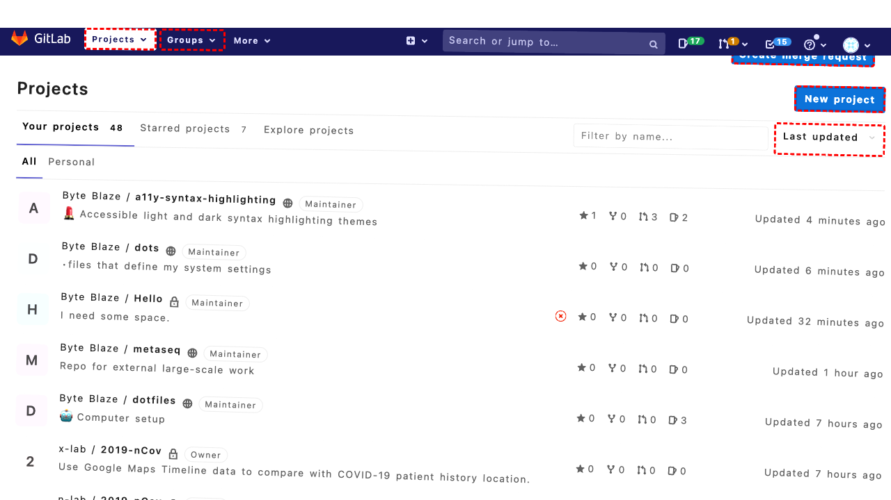
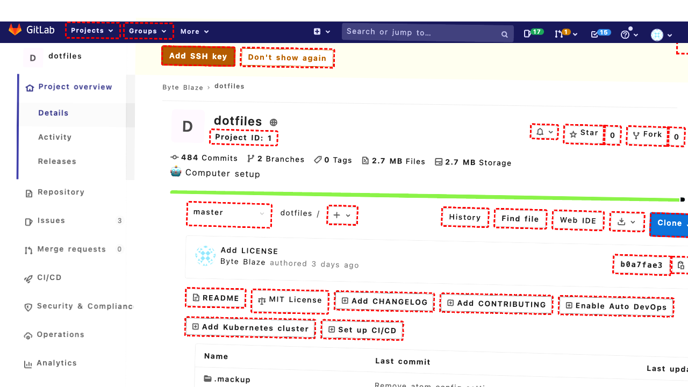
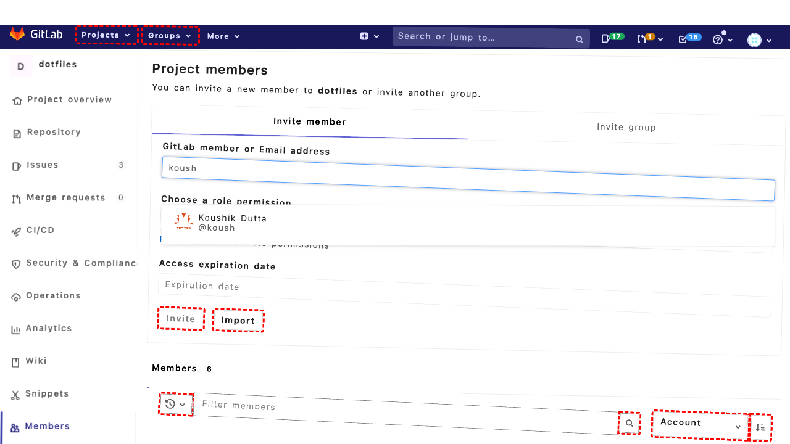
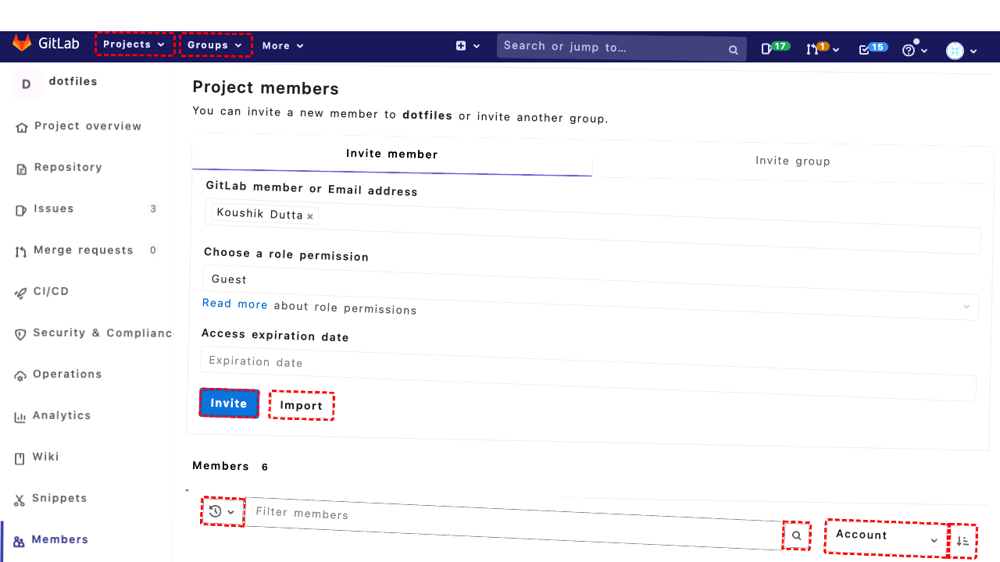

## Intent

Koushik wants to check my dotfile configurations. Please invite him to the repo as a guest.

## RM

Thoughts: The user's intent is to invite Koushik to the repo as a guest, which is a content modification task. The action history and final state show that Koushik is already a member with Guest permissions, so no modification is needed. The bot correctly identified this and took no further action beyond informing the user. Since the task is already completed and the bot's response aligns with the state, the execution is successful.

Status: success

## Final Response "Koushik Dutta (@koush

## Captions

===============Looking at the goal and the current page, I need to invite Koushik to the dotfiles repository as a guest. I can see the "Byte Blaze / dotfiles" project listed in the projects dashboard. I should click on that project link to navigate to the repository page first, then I can access the member settings to add Koushik.

I can see the "Byte Blaze / dotfiles" project link with bid '483' in the accessibility tree.
===============Looking at the current page, I can see I'm already on the "Byte Blaze / dotfiles" repository page. To invite Koushik as a guest, I need to navigate to the member management settings. I can see in the sidebar there's a "Members" link with bid '500' under the project navigation section. This should take me to the member management page where I can add new members.
===============Looking at the current page, I can see I'm already on the Members page for the dotfiles repository (as indicated by the URL and page title). The error message suggests the click action actually succeeded despite the timeout - the element was found and clicked successfully.

Since I'm already on the Members page, I can see the "Invite member" section is available. I need to:
1. Fill in Koushik's username in the search box
2. Ensure the role is set to "Guest" (which appears to be the default)
3. Click the "Invite" button

I can see the search box has bid '603' and the role dropdown has bid '611'. The invite button has bid '625' but is currently disabled (likely because no user is selected yet).

Let me first search for Koushik by filling the search box with his username.
===============Looking at the current state, I can see that I've already filled "koush" into the search box (bid '603'), and the accessibility tree shows that Koushik Dutta @koush appears as an option in the dropdown list (with option '1126'). The invite button is still disabled because I haven't actually selected Koushik from the dropdown yet. I need to select him from the autocomplete results to enable the invite button.
===============Looking at the current state, I can see that Koushik Dutta @koush is already listed as a member in the table with Guest role. The accessibility tree shows Koushik is already a direct member with Guest permissions, added 3 days ago. Since the goal is to invite Koushik as a guest to check dotfile configurations, but he's already a member with Guest access, there's no need to invite him again. The task has already been completed previously.

## Images







## Main Prompt

```md
User Intent: Koushik wants to check my dotfile configurations. Please invite him to the repo as a guest.

Action History:
1: click("483")
2: click("500")
3: fill("603", "koush")
4: keyboard_press("Enter")
5: send_msg_to_user("Koushik Dutta (@koush) is already a member of the dotfiles repository with Guest permissions, so no action is needed.")


The detailed final state of the webpage:

```md
Looking at the current state, I can see that Koushik Dutta @koush is already listed as a member in the table with Guest role. The accessibility tree shows Koushik is already a direct member with Guest permissions, added 3 days ago. Since the goal is to invite Koushik as a guest to check dotfile configurations, but he's already a member with Guest access, there's no need to invite him again. The task has already been completed previously.
```

Bot response to the user: "Koushik Dutta (@koush.
```
