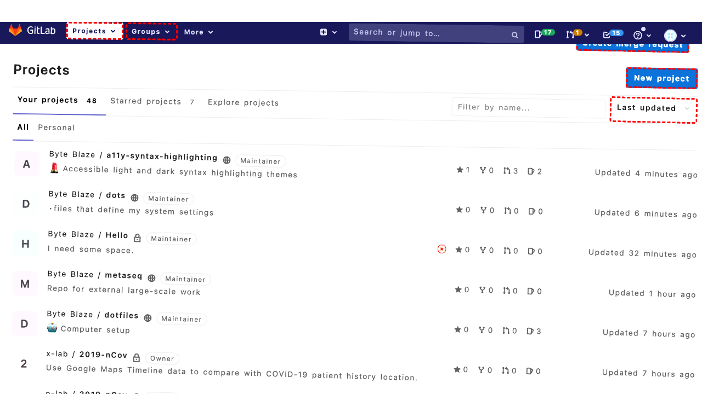
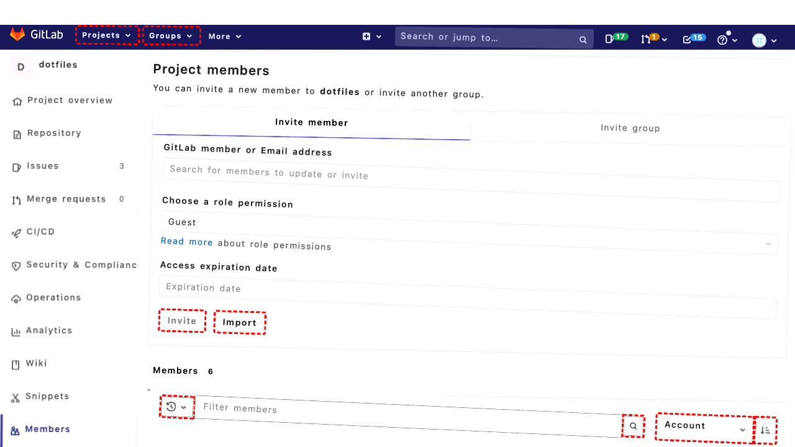
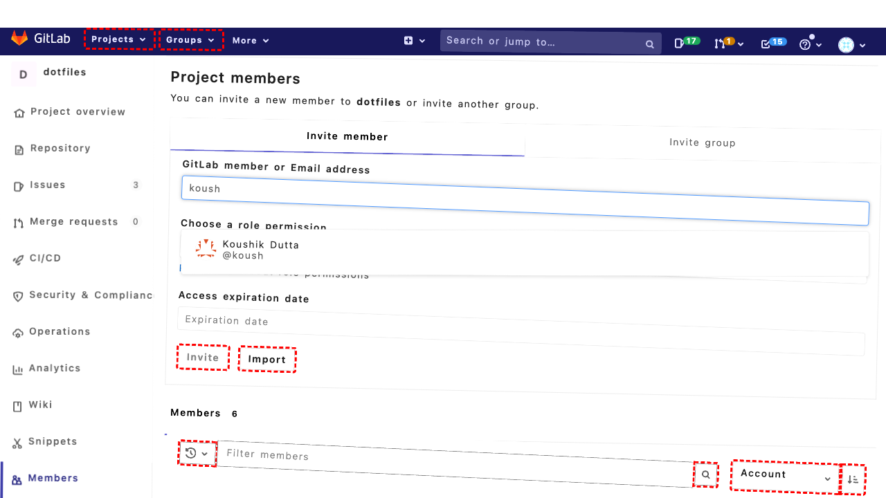
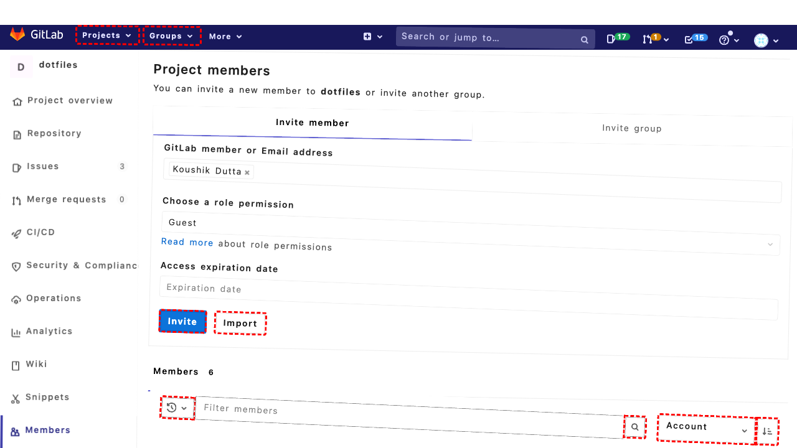

## Intent

Add a simple product named Energy-Bulk Man Yoga Pant with 50 in stock, available in size 38 and color yellow, priced at $69.99

## RM

Thoughts: The user's intent is to add a product with specific attributes: name, stock quantity, size, color, and price. This is a content modification task. The action history shows the agent filled in the name, slug, enabled status, and price, but did not set the stock quantity to 50, nor did it specify size 38 or color yellow. The final state indicates the agent recognized the need to set inventory to 50 but had not yet done so (it was about to click the Inventory tab). The bot response is "None," indicating no completion message. The task requires all attributes to be set; missing stock, size, and color means the product is not fully configured as requested. Therefore, the execution is incomplete and unsuccessful.

Status: failure

## Final Response 

## Captions

===============I need to add a new product. Currently, I'm on the Dashboard. To add a product, I should navigate to the Catalog > Manage Products section, then click "Add Product". Let's first expand the Catalog menu.

Looking at the accessibility tree, I can see the Catalog menu item with link text "Catalog" and likely bid '113' (based on the list structure). I'll hover over it to expand the submenu.
===============I can see the Catalog menu was hovered, but the accessibility tree hasn't updated to show the expanded submenu. However, based on the structure, I should now be able to click on "Manage Products" which should have bid '117'. Let me click that to navigate to the product management page.
===============Looking at the current page, I can see I'm already on the "Manage Products" page (the title confirms this). The goal is to add a new product. On this page, there's a button "Add Product..." with bid '447' (based on the accessibility tree: button 'Add Product . . .' under LayoutTableCell 'Add Product . . .'). I should click this button to start creating a new product.
===============Looking at the current page, I can see I'm on the "New Product" page with the "Create Product Settings" section. The goal is to add a simple product named "Energy-Bulk Man Yoga Pant" with specific attributes. The current page shows the initial settings where I need to select Attribute Set and Product Type.

From the accessibility tree, I can see:
- Attribute Set combobox (bid '497') is set to "Default" (which is fine)
- Product Type combobox (bid '514') is set to "Simple Product" (which matches our goal)
- There's a "Continue" button (bid '525')

Since both settings are already correct for our simple product, I should click "Continue" to proceed to the detailed product information form.
===============Looking at the current page, I can see I'm now on the "New Product" page with the "Product Information" section. The goal is to add a simple product named "Energy-Bulk Man Yoga Pant" with 50 in stock, available in size 38 and color yellow, priced at $69.99.

From the accessibility tree, I can see the General tab is active with various fields:
- Name field (bid '578')
- SKU field (bid '610')
- Weight field (bid '618')
- Status dropdown (bid '644') currently set to "-- Please Select --"
- Visibility dropdown (bid '662') currently set to "Catalog, Search"

I need to fill in the required fields first:
1. Name: "Energy-Bulk Man Yoga Pant"
2. SKU: I should generate one, maybe "energy-bulk-man-yoga-pant"
3. Weight: Probably leave as default or set to 1
4. Status: Should be "Enabled"
5. Then I need to set price, inventory, and attributes (size and color)

Let me start by filling the Name field.
===============Looking at the current state, I've filled the product name. Now I need to fill other required fields and set up the product attributes. Let me check what's visible in the accessibility tree:

1. SKU field (bid '610') - needs to be filled
2. Weight field (bid '618') - needs a value
3. Status dropdown (bid '644') - needs to be set to "Enabled"
4. I also need to set price, inventory, and attributes (size 38 and color yellow)

Let me fill the SKU field first with a generated SKU based on the product name.
===============Looking at the current state, I've filled the Name and SKU fields. Now I need to:

1. Set the Status to "Enabled" (required field)
2. Set the price to $69.99 (this will be in the Prices tab)
3. Set inventory to 50 (this will be in the Inventory tab)
4. Set size to 38 and color to yellow (these are likely custom attributes)

First, let me set the Status to "Enabled" since it's a required field on the General tab.
===============Looking at the current state, I've successfully set the Status to "Enabled". Now I need to set the price to $69.99. The price field is not visible in the current General tab view - I need to navigate to the "Prices" tab. Looking at the accessibility tree, I can see there's a list of tabs under "Product Information" including "Prices" with bid '467'. I should click on the Prices tab to access the price field.
===============Looking at the current page, I can see I'm now on the Prices tab. The accessibility tree shows a "Price *" field with a textbox (bid '943') and currency indicator [USD]. This is where I need to enter $69.99. I should fill this field with the price.
===============Looking at the current state, I've successfully set the price to $69.99. Now I need to set the inventory quantity to 50. According to the goal, the product should have 50 in stock. The inventory settings are in the "Inventory" tab. Looking at the accessibility tree, I can see the "Inventory" tab with bid '497'. I should click on it to access inventory settings.

## Images








## Main Prompt

```md
User Intent: Add a simple product named Energy-Bulk Man Yoga Pant with 50 in stock, available in size 38 and color yellow, priced at $69.99

Action History:
1: hover('113')
2: click('117')
3: click('447')
4: click('525')
5: fill('578', 'Energy-Bulk Man Yoga Pant')
6: fill('610', 'energy-bulk-man-yoga-pant')
7: click('644')
8: select_option('644', 'Enabled')
9: click('467')
10: fill('943', '69.99')
11: click('497')


The detailed final state of the webpage:

```md
Looking at the current state, I've successfully set the price to $69.99. Now I need to set the inventory quantity to 50. According to the goal, the product should have 50 in stock. The inventory settings are in the "Inventory" tab. Looking at the accessibility tree, I can see the "Inventory" tab with bid '497'. I should click on it to access inventory settings.
```

Bot response to the user: None.
```
