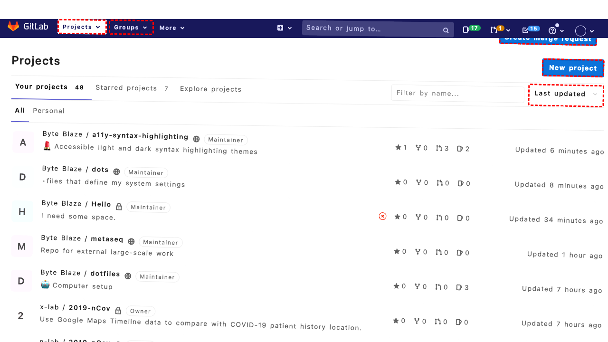

## Intent

Jakub Klinkovský wants to check my dotfile configurations. Please invite him to the repo as a guest.

## RM

Thoughts: The user's intent is to invite Jakub Klinkovský as a guest to the dotfiles repository so he can check the configurations. The action history and final state of the webpage confirm that Jakub Klinkovský is already a member with Guest permissions, meaning the desired state (him having access) is already achieved. The bot correctly identifies this and informs the user, so the task is successfully completed as the goal is met without needing further action.

Status: success

## Final Response "Jakub Klinkovský (@lahwaacz

## Captions

===============Looking at the current page, I can see we're on the GitLab dashboard with a list of projects. I need to invite Jakub Klinkovský to the dotfiles repository as a guest. I can see the "Byte Blaze / dotfiles" project in the list. To invite someone as a member with guest permissions, I need to navigate to the project's member settings.

First, I'll click on the "Byte Blaze / dotfiles" project link to open the project page.
===============Looking at the accessibility tree, I can see we're already on the "Byte Blaze / dotfiles" project page. The project navigation sidebar shows various options including "Members" which is exactly what I need to access to invite Jakub Klinkovský. I can see the "Members" link in the sidebar with ID "500".

I should click on the "Members" link to navigate to the member management page where I can add new members.
===============Looking at the current page, I can see we're already on the Members page for the dotfiles repository. The page shows a list of existing members, and I can see that Jakub Klinkovský (@lahwaacz) is already listed as a member with Guest role. This means he has already been invited to the repository as a guest.

Since the goal was to invite Jakub Klinkovský as a guest to check dotfile configurations, and he's already listed as a member with Guest permissions, the task has already been completed.

## Images




## Main Prompt

```md
User Intent: Jakub Klinkovský wants to check my dotfile configurations. Please invite him to the repo as a guest.

Action History:
1: click("483")
2: click("500")
3: send_msg_to_user("Jakub Klinkovský (@lahwaacz) is already a member of the dotfiles repository with Guest permissions, so he can already check your dotfile configurations.")


The detailed final state of the webpage:

```md
Looking at the current page, I can see we're already on the Members page for the dotfiles repository. The page shows a list of existing members, and I can see that Jakub Klinkovský (@lahwaacz) is already listed as a member with Guest role. This means he has already been invited to the repository as a guest.

Since the goal was to invite Jakub Klinkovský as a guest to check dotfile configurations, and he's already listed as a member with Guest permissions, the task has already been completed.
```

Bot response to the user: "Jakub Klinkovský (@lahwaacz.
```
