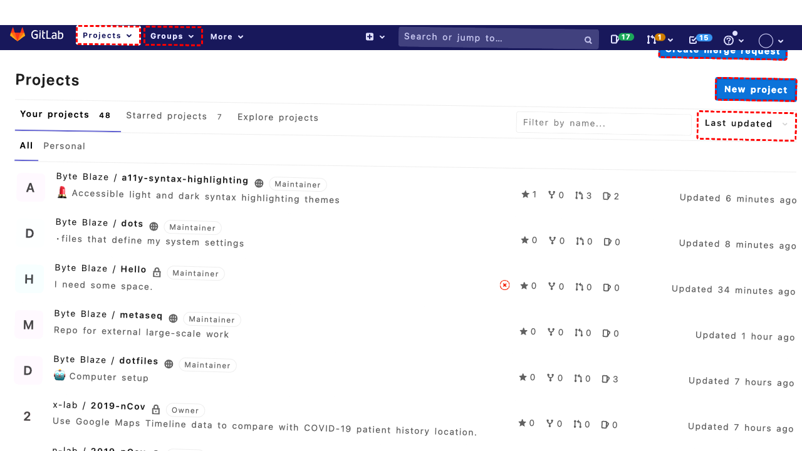
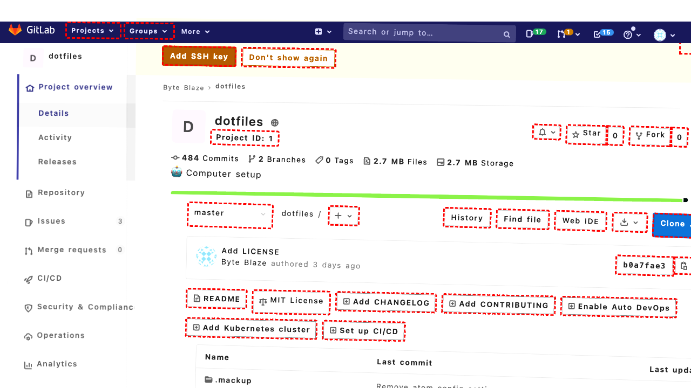

## Intent

Add a simple product named FancyBoy Man Causal Jeans with 42 in stock, available in size 34 and color Blue, priced at $169.99

## RM

Thoughts: The user's intent is to add a product with specific attributes: name "FancyBoy Man Causal Jeans", stock quantity 42, size 34, color Blue, and price $169.99. This is a content modification task (adding a product). Examining the action history, the bot performed actions including filling the product name, setting status to "Enabled", filling the price, and clicking on the inventory tab (action 10: click("497")). However, the final state indicates the bot is still in the process of setting the inventory quantity to 42, and no actions are recorded for setting the size or color. The bot's response is "None", and the final state is a description of what the bot intends to do next, not a confirmation of completion. The task requires all attributes to be set, but the inventory quantity, size, and color modifications are not completed based on the actions and final state. Therefore, the task is not successfully completed.

Status: failure

## Final Response 

## Captions

===============I need to add a simple product with specific attributes. First, I need to navigate to the product management page. Looking at the accessibility tree, I can see the "Catalog" menu (bid 113) and under it "Manage Products" (bid 117). I should click on "Catalog" to expand it, then click "Manage Products".
===============I need to expand the Catalog menu first, then click on "Manage Products" to go to the product listing page. From there, I can add a new product.

Looking at the current page, the Catalog menu is already focused (bid 113 is focused). I should click it to expand the submenu.
===============I need to add a new simple product. I've clicked the "Catalog" menu to expand it. Now I should click "Manage Products" (bid 117) to navigate to the product listing page where I can add a new product.
===============Looking at the current state, I can see I'm already on the "Manage Products" page (the title says "Manage Products / Catalog / Magento Admin"). I can see the "Add Product..." button (bid 447) at the top of the page. Since I need to add a new simple product, I should click this button to start the product creation process.
===============Looking at the current page, I'm on the "Create Product Settings" page where I need to select attribute set and product type. The goal is to add a simple product named "FancyBoy Man Causal Jeans" with specific attributes. The current page shows:

1. Attribute Set dropdown (bid 497) is set to "Default" - this is fine for a simple product.
2. Product Type dropdown (bid 514) is set to "Simple Product" - this is exactly what we need.
3. There's a "Continue" button (bid 525) to proceed to the next step.

Since both settings are already correct (Default attribute set and Simple Product), I should click "Continue" to move to the actual product creation form where I can enter the product name, stock, attributes, and price.
===============Looking at the current page, I'm on the "New Product / Manage Products / Catalog / Magento Admin" page, which is the product creation form. I can see the "General" tab is active with fields like Name, Description, SKU, etc. The goal is to add a simple product named "FancyBoy Man Causal Jeans" with 42 in stock, available in size 34 and color Blue, priced at $169.99.

I need to:
1. Fill in the product name in the "Name *" field (bid 578)
2. Set the status to "Enabled" (bid 644)
3. Set the price in the "Prices" tab (bid 467)
4. Set inventory to 42 in the "Inventory" tab (bid 497)
5. Set size and color attributes (these might be in the "General" section or as custom attributes)

First, I'll fill in the product name.
===============Looking at the current page, I've successfully filled in the product name "FancyBoy Man Causal Jeans". Now I need to set the product status to "Enabled" (currently shows "-- Please Select --" in the Status dropdown). The Status dropdown has bid 644. I need to select "Enabled" from the options.
===============Looking at the current state, I've filled the product name and set the status to "Enabled". Now I need to set the price to $169.99. The price field is in the "Prices" tab (bid 467). I should click on the "Prices" tab to access the price fields.
===============Looking at the current page, I can see I'm now on the "Prices" tab. I need to set the price to $169.99. The price field has bid 943 (labeled "Price *"). I should fill this field with the price.
===============Looking at the current state, I've successfully set the price to $169.99. Now I need to set the inventory quantity to 42. The inventory settings are in the "Inventory" tab (bid 497). I should click on that tab to access inventory settings.

## Images





## Main Prompt

```md
User Intent: Add a simple product named FancyBoy Man Causal Jeans with 42 in stock, available in size 34 and color Blue, priced at $169.99

Action History:
1: click("113")
2: click("113")
3: click("117")
4: click("447")
5: click("525")
6: fill("578", "FancyBoy Man Causal Jeans")
7: select_option("644", "Enabled")
8: click("467")
9: fill("943", "169.99")
10: click("497")


The detailed final state of the webpage:

```md
Looking at the current state, I've successfully set the price to $169.99. Now I need to set the inventory quantity to 42. The inventory settings are in the "Inventory" tab (bid 497). I should click on that tab to access inventory settings.
```

Bot response to the user: None.
```
