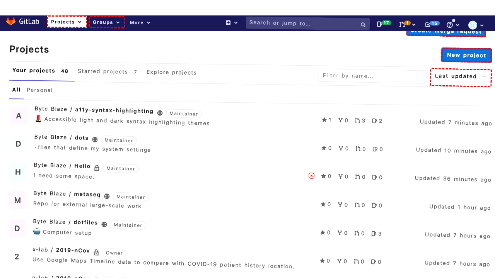
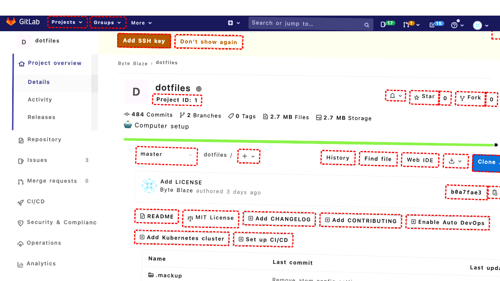
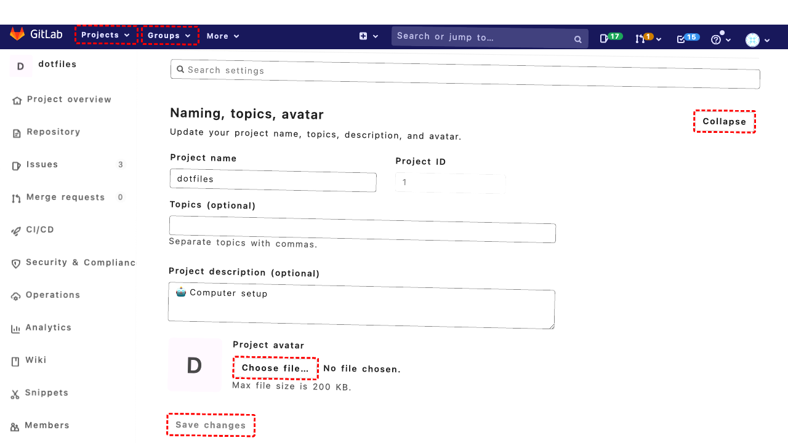
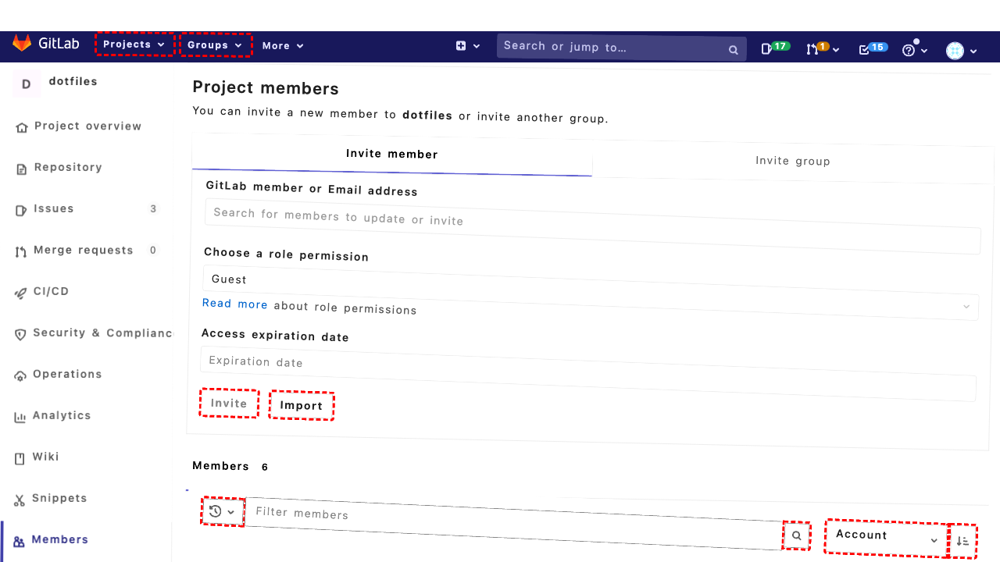

## Intent

Vinta wants to check my dotfile configurations. Please invite him to the repo as a guest.

## RM

Thoughts: The user's intent is to invite Vinta to the dotfiles repository as a guest, which is a content modification task. The action history and final state of the webpage indicate that Vinta is already a guest member of the repository, so the task is already accomplished. The bot correctly identifies this and informs the user, but the response is cut off ("Vinta Chen (@vinta."). However, since the task is already complete and the bot's actions and final state confirm this, the execution is successful despite the truncated response, as content modification tasks do not require considering the bot's response.

Status: success

## Final Response "Vinta Chen (@vinta

## Captions

===============Looking at the current page, I can see we're on the GitLab dashboard with a list of projects. I need to invite "Vinta" to the dotfiles repository as a guest. I can see the "Byte Blaze / dotfiles" project in the list.

First, I need to navigate to the dotfiles repository page, then go to the member settings to add Vinta as a guest.

I'll click on the "Byte Blaze / dotfiles" project link to navigate to that repository.
===============Looking at the accessibility tree, I can see we're already on the "Byte Blaze / dotfiles" repository page. The current page shows the repository files and README content. To invite Vinta as a guest, I need to navigate to the project settings and then to the members section.

From the accessibility tree, I can see there's a "Settings" link in the project navigation sidebar with the label "Settings". I should click on that to access the project settings where I can manage members.

The Settings link appears to have bid "509" based on the accessibility tree structure.
===============Looking at the accessibility tree, I can see we're currently on the "General · Settings" page for the dotfiles repository. To invite Vinta as a guest, I need to navigate to the Members section where I can add users to the project.

In the project navigation sidebar, I can see there's a "Members" link under the "Settings" section. The Members link has bid "493" according to the accessibility tree. This is where I can add new members to the project with specific roles like "Guest".

I should click on the Members link to access the member management page.
===============Looking at the current page, I can see we're already on the Members page for the dotfiles repository. The accessibility tree shows the "Invite member" tab is available with a search box for "GitLab member or Email address" (bid "603") and a role dropdown set to "Guest" (bid "611").

Since Vinta is already listed as a member with "Guest" role in the table below, it appears Vinta has already been invited as a guest to this repository. The goal has already been accomplished.

I should inform the user that Vinta is already a guest member of the dotfiles repository.

## Images






## Main Prompt

```md
User Intent: Vinta wants to check my dotfile configurations. Please invite him to the repo as a guest.

Action History:
1: click("483")
2: click("509")
3: click("493")
4: send_msg_to_user("Vinta Chen (@vinta) is already a guest member of the dotfiles repository. They were added 3 days ago and have Guest permissions.")


The detailed final state of the webpage:

```md
Looking at the current page, I can see we're already on the Members page for the dotfiles repository. The accessibility tree shows the "Invite member" tab is available with a search box for "GitLab member or Email address" (bid "603") and a role dropdown set to "Guest" (bid "611").

Since Vinta is already listed as a member with "Guest" role in the table below, it appears Vinta has already been invited as a guest to this repository. The goal has already been accomplished.

I should inform the user that Vinta is already a guest member of the dotfiles repository.
```

Bot response to the user: "Vinta Chen (@vinta.
```
