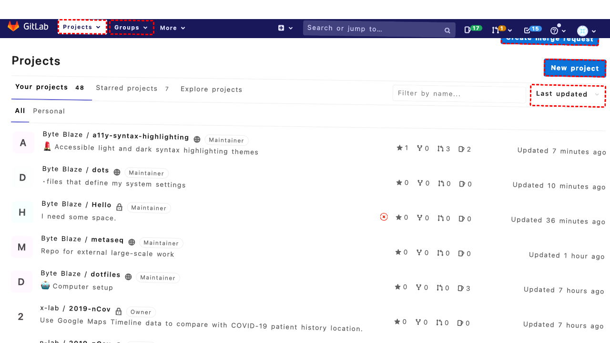
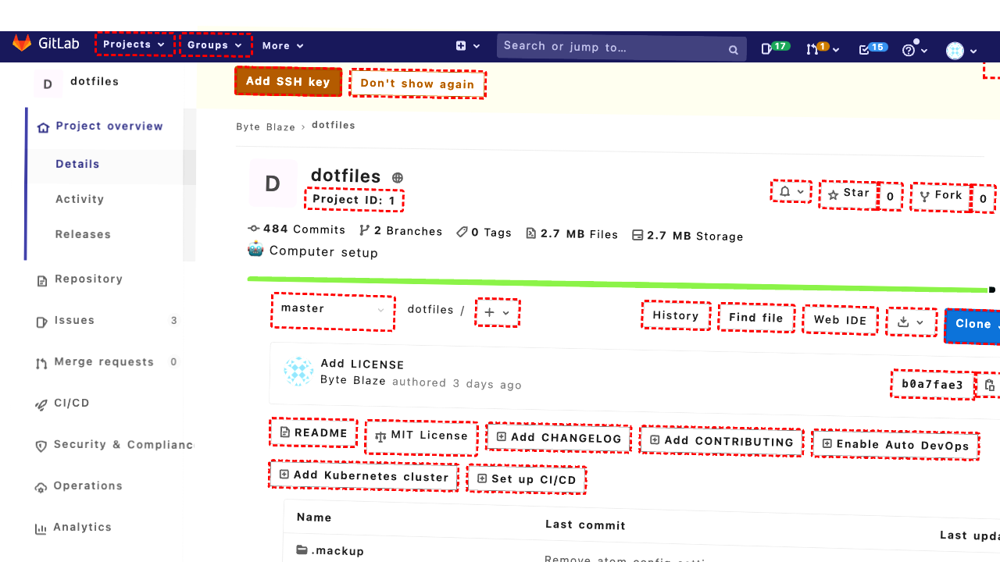
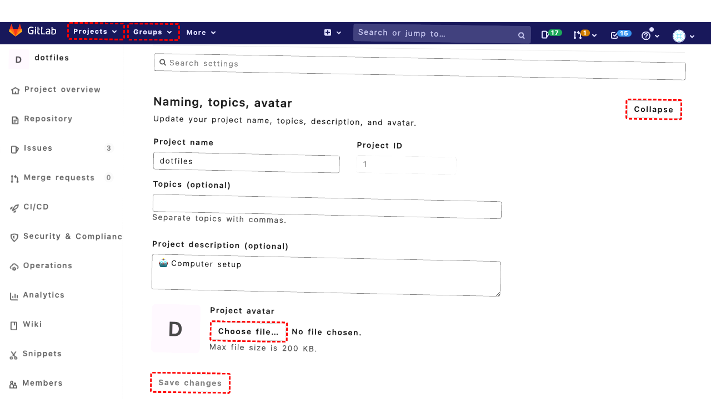

## Intent

Star the top five most stared repos in Gitlab

## RM

Thoughts: The user's intent is to star the top five most starred repos in GitLab, which is a content modification task. The action history shows multiple clicks and go_back actions, but there is no clear indication that the agent successfully starred any repositories. The final state description mentions that the agent successfully starred one repository (byteblaze/millennials-to-snake-people) and intends to star another, but it does not confirm that the top five were actually starred. Since the task requires modifying content (starring) for five specific repos and the final state only confirms one, the task is incomplete and thus a failure.

Status: failure

## Final Response 

## Captions

===============Looking at the current page, I can see we're on the GitLab dashboard showing a list of projects. To star the top five most starred repos, I first need to identify which repositories have the most stars. From the accessibility tree, I can see star counts for some repositories:

- a11yproject/a11yproject.com: 22 stars
- primer/design: 21 stars
- byteblaze/a11y-webring.club: 2 stars
- byteblaze/empathy-prompts: 7 stars
- byteblaze/millennials-to-snake-people: 6 stars
- byteblaze/accessible-html-content-patterns: 1 star
- byteblaze/a11y-syntax-highlighting: 1 star

The top five most starred repos appear to be:
1. a11yproject/a11yproject.com (22 stars)
2. primer/design (21 stars)
3. byteblaze/empathy-prompts (7 stars)
4. byteblaze/millennials-to-snake-people (6 stars)
5. byteblaze/a11y-webring.club (2 stars)

I need to click on each of these repository links to navigate to their individual pages where I can star them. Let me start with the most starred repository.
===============Looking at the current page, I can see we're on the a11yproject.com repository page. I can see there's an "Unstar" button (bid 532) which means this repository is already starred. The star count shows 22 stars. Since the goal is to star the top five most starred repos, and this one is already starred, I should move on to the next repository.

I need to go back to the dashboard to see the other repositories and navigate to the next most starred one.
===============Looking at the current state, I can see we're back on the GitLab dashboard showing the list of projects. I can see that the a11yproject/a11yproject.com repository (22 stars) was already starred, so I need to move to the next most starred repository, which is primer/design with 21 stars.

From the accessibility tree, I can see the primer/design repository link has bid 594. I need to click on this link to navigate to its repository page where I can star it.
===============Looking at the current page, I can see we're on the primer/design repository page. I can see there's a "Star" button (bid 496) with a star count of 21 displayed next to it (bid 499). This repository is not currently starred, so I need to click the "Star" button to star it.
===============Looking at the current state, I can see we successfully starred the primer/design repository (21 stars). Now I need to go back to the dashboard to find and star the next most starred repository, which is byteblaze/empathy-prompts with 7 stars.
===============Looking at the current state, I'm back on the GitLab dashboard. I can see that I've successfully handled the top two most starred repositories:
- a11yproject/a11yproject.com (22 stars) - already starred
- primer/design (21 stars) - just starred

Now I need to star the third most starred repository: byteblaze/empathy-prompts with 7 stars. From the accessibility tree, I can see this repository link has bid 693. I need to click on this link to navigate to its repository page where I can star it.
===============Looking at the current page, I can see we're on the byteblaze/empathy-prompts repository page. I can see there's an "Unstar" button (bid 491) which means this repository is already starred. The star count shows 7 stars. Since this repository is already starred, I don't need to take any action here. I should go back to the dashboard to find and star the next most starred repository, which is byteblaze/millennials-to-snake-people with 6 stars.
===============Looking at the current state, I'm back on the GitLab dashboard. I can see that I've successfully handled the top three most starred repositories:
- a11yproject/a11yproject.com (22 stars) - already starred
- primer/design (21 stars) - just starred
- byteblaze/empathy-prompts (7 stars) - already starred

Now I need to star the fourth most starred repository: byteblaze/millennials-to-snake-people with 6 stars. From the accessibility tree, I can see this repository link has bid 826. I need to click on this link to navigate to its repository page where I can star it.
===============Looking at the current page, I can see we're on the byteblaze/millennials-to-snake-people repository page. I can see there's a "Star" button (bid 531) with a star count of 6 displayed next to it (bid 534). This repository is not currently starred, so I need to click the "Star" button to star it.
===============Looking at the current state, I can see we successfully starred the byteblaze/millennials-to-snake-people repository (6 stars). Now I need to go back to the dashboard to find and star the fifth and final most starred repository, which is byteblaze/a11y-webring.club with 2 stars.

## Images






## Main Prompt

```md
User Intent: Star the top five most stared repos in Gitlab

Action History:
1: click('526')
2: go_back()
3: click('594')
4: click('496')
5: go_back()
6: click('693')
7: go_back()
8: click('826')
9: click('531')
10: go_back()


The detailed final state of the webpage:

```md
Looking at the current state, I can see we successfully starred the byteblaze/millennials-to-snake-people repository (6 stars). Now I need to go back to the dashboard to find and star the fifth and final most starred repository, which is byteblaze/a11y-webring.club with 2 stars.
```

Bot response to the user: None.
```
