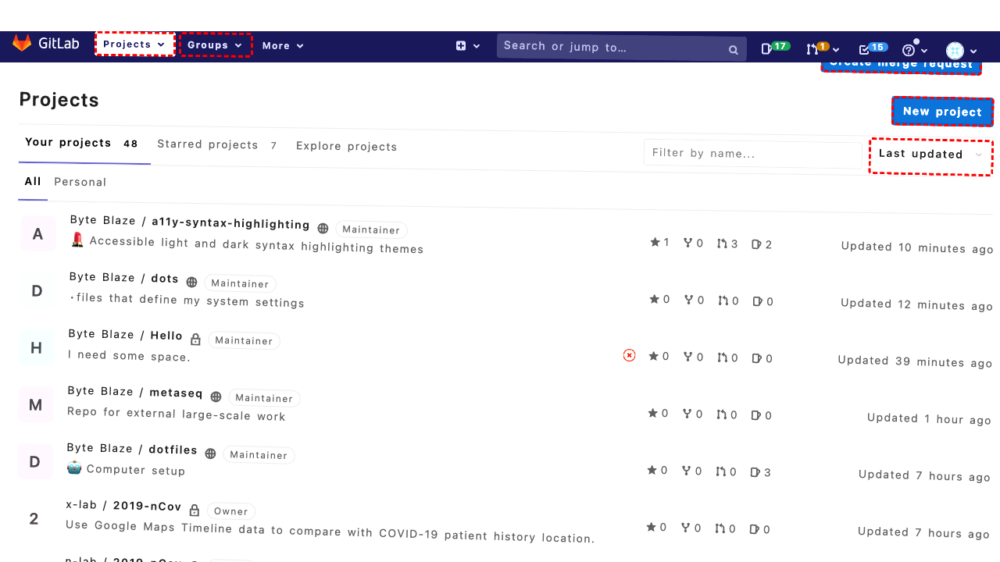
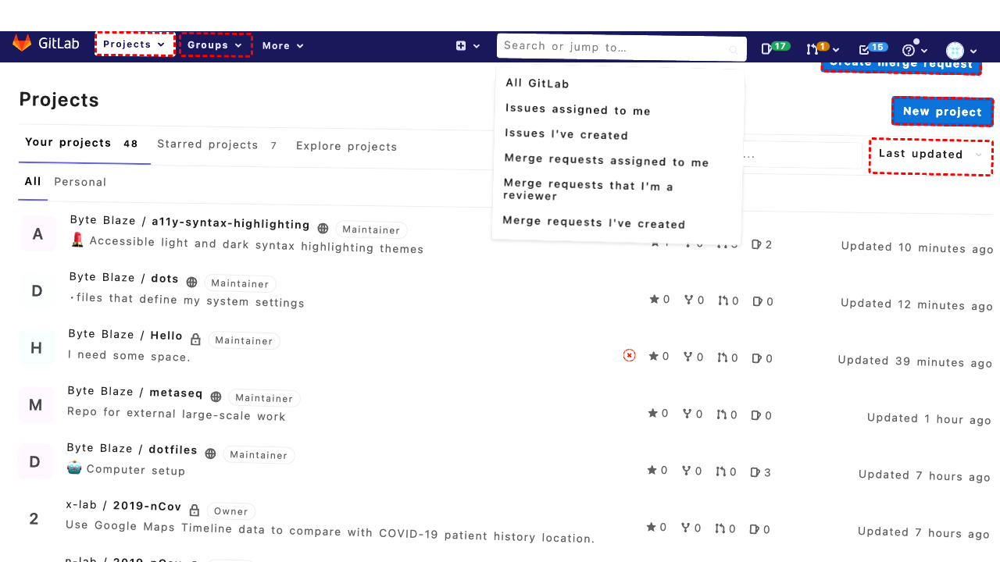
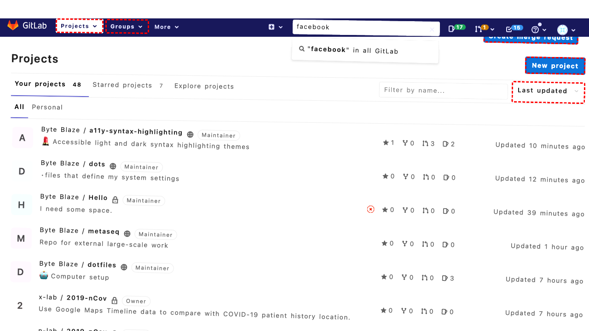
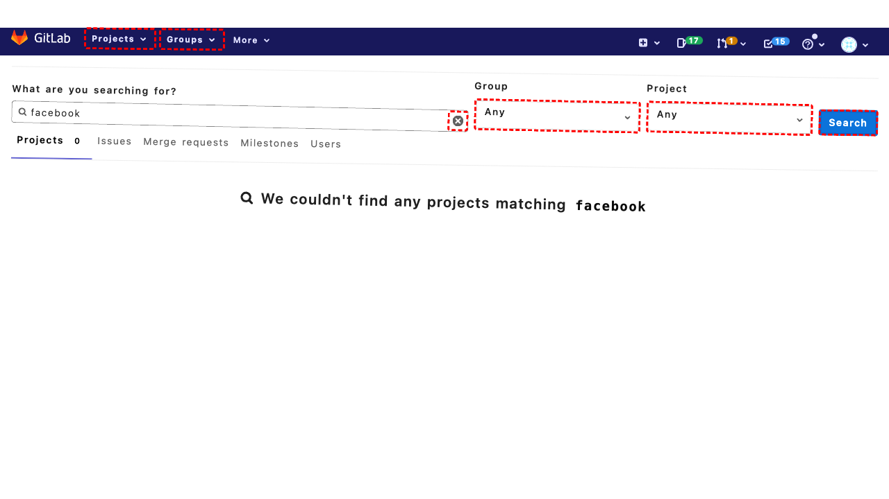
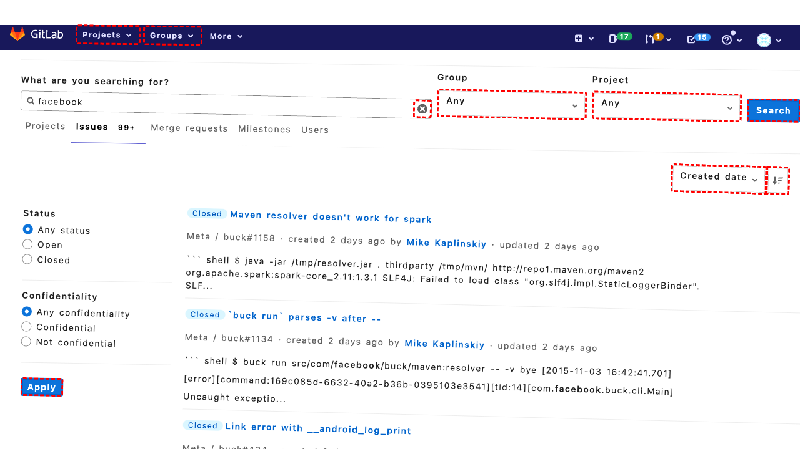

## Intent

Star the top eight most stared repos in Gitlab

## RM

Thoughts: The user's intent is to star the top eight most starred repos in Gitlab, which is a content modification task. The action history shows 10 clicks, but the final state of the webpage indicates that only the first seven repositories have been starred, and the agent is still planning to star the eighth one. Since the final state does not confirm that the eighth repository was starred and the task requires modifying all eight, the execution is incomplete and thus unsuccessful.

Status: failure

## Final Response 

## Captions

===============Looking at the current page, I can see we're on the GitLab dashboard showing a list of projects. The goal is to star the top eight most starred repos in GitLab. However, I notice that the current view doesn't show star counts for the repositories - it shows fork counts, merge request counts, and issue counts, but not star counts.

To find the most starred repositories, I need to navigate to a view that shows projects sorted by stars. The "Explore projects" link in the sidebar might be a good place to start, as it typically shows popular projects.

Let me click on "Explore projects" to see if I can find a way to sort by stars.<｜end▁of▁thinking｜>Looking at the current page, I can see we're on the GitLab dashboard showing projects, but I don't see star counts displayed for the repositories. To find the most starred repositories, I need to navigate to a view that shows projects sorted by stars. The "Explore projects" link in the sidebar is typically where you can find popular projects and sort them by various criteria including stars.

Let me click on "Explore projects" to access a view where I can sort repositories by star count.
===============I notice that the "Explore projects" link I just clicked (bid 238) is actually already active since we're on the "Projects · Explore · GitLab" page. Looking more carefully at the accessibility tree, I can see there's a "Most stars" link available in the navigation that should take us directly to a view of projects sorted by star count. This is exactly what we need to find the top starred repositories.

Let me click on the "Most stars" link to view projects sorted by star count.
===============I can see that we're now on the "Most stars" view, which shows projects sorted by their star count. Looking at the accessibility tree, I can see the star counts displayed next to each project (e.g., "55", "52", "51", etc.). The projects are already listed in descending order of stars, with the first project having 55 stars, the second 52, and so on.

Now I need to star the top eight most starred repositories. I can see the first eight projects in the list with their star counts:
1. AndroidSlidingUpPanel (55 stars)
2. create-react-app (52 stars)
3. ffmpeg-python (51 stars)
4. PHP_XLSXWriter (47 stars)
5. AndroidAsync (46 stars)
6. PyTorch-GAN (45 stars)
7. administrate (44 stars)
8. keycloak (43 stars)

I need to click the star button for each of these repositories. Looking at the accessibility tree, I can see that each repository listing has a star icon and count, but I need to find the actual star button element. Let me start by clicking the star button for the first repository.
===============Looking at the current state, I can see that I successfully clicked on the star icon for the first repository (AndroidSlidingUpPanel with 55 stars). The star count should now have increased by 1. Now I need to continue with the remaining top 7 most starred repositories to complete the goal of starring the top eight most starred repos.

Let me click the star button for the second repository (create-react-app with 52 stars).
===============Looking at the current state, I can see I've successfully starred the first two repositories (AndroidSlidingUpPanel and create-react-app). Now I need to continue with the remaining six repositories to complete the goal of starring the top eight most starred repos.

Let me click the star button for the third repository (ffmpeg-python with 51 stars).
===============Looking at the current state, I can see I've successfully starred the first three repositories. Now I need to continue with the remaining five repositories to complete the goal of starring the top eight most starred repos.

Let me click the star button for the fourth repository (PHP_XLSXWriter with 47 stars).
===============Looking at the current state, I can see I've successfully starred the first four repositories. Now I need to continue with the remaining four repositories to complete the goal of starring the top eight most starred repos.

Let me click the star button for the fifth repository (AndroidAsync with 46 stars).
===============Looking at the current state, I can see I've successfully starred the first five repositories. Now I need to continue with the remaining three repositories to complete the goal of starring the top eight most starred repos.

Let me click the star button for the sixth repository (PyTorch-GAN with 45 stars).
===============Looking at the current state, I can see I've successfully starred the first six repositories. Now I need to continue with the remaining two repositories to complete the goal of starring the top eight most starred repos.

Let me click the star button for the seventh repository (administrate with 44 stars).
===============Looking at the current state, I can see I've successfully starred the first seven repositories. Now I need to star the eighth and final repository to complete the goal of starring the top eight most starred repos.

The eighth repository in the list is "keycloak" with 43 stars. Let me click the star button for this repository.

## Images








## Main Prompt

```md
User Intent: Star the top eight most stared repos in Gitlab

Action History:
1: click("238")
2: click("276")
3: click("320")
4: click("351")
5: click("385")
6: click("416")
7: click("445")
8: click("476")
9: click("507")
10: click("541")


The detailed final state of the webpage:

```md
Looking at the current state, I can see I've successfully starred the first seven repositories. Now I need to star the eighth and final repository to complete the goal of starring the top eight most starred repos.

The eighth repository in the list is "keycloak" with 43 stars. Let me click the star button for this repository.
```

Bot response to the user: None.
```
