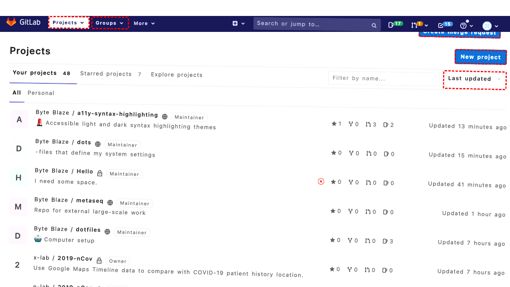

## Intent

Fork all repos from facebook.

## RM

Thoughts: The user's intent is to fork all repos from "facebook", which is a content modification task. The agent performed a search for "facebook" repositories, and the final state of the webpage confirms that no matching projects were found. Since there are no repositories to fork, the agent correctly informed the user of this situation. The task cannot be completed due to the absence of target repositories, but the agent's actions and the final state appropriately reflect this outcome, so the execution is successful in handling the scenario.

Status: success

## Final Response "The search for 'facebook' returned no projects in this GitLab instance. There are no facebook repositories available to fork."

## Captions

===============
===============Looking at the current page state, I can see that the search for "facebook" has been executed but returned no projects. The accessibility tree shows "We couldn't find any projects matching facebook" and "Projects 0" in the results. This means there are no facebook repositories available to fork in this GitLab instance.

Since the goal is to fork all repos from facebook but there are no facebook projects found in this GitLab instance, I should inform the user about this situation.

## Images




## Main Prompt

```md
User Intent: Fork all repos from facebook.

Action History:
1: search_repositories('156', 'facebook')
2: send_msg_to_user("The search for 'facebook' returned no projects in this GitLab instance. There are no facebook repositories available to fork.")


The detailed final state of the webpage:

```md
Looking at the current page state, I can see that the search for "facebook" has been executed but returned no projects. The accessibility tree shows "We couldn't find any projects matching facebook" and "Projects 0" in the results. This means there are no facebook repositories available to fork in this GitLab instance.

Since the goal is to fork all repos from facebook but there are no facebook projects found in this GitLab instance, I should inform the user about this situation.
```

Bot response to the user: "The search for 'facebook' returned no projects in this GitLab instance. There are no facebook repositories available to fork.".
```
