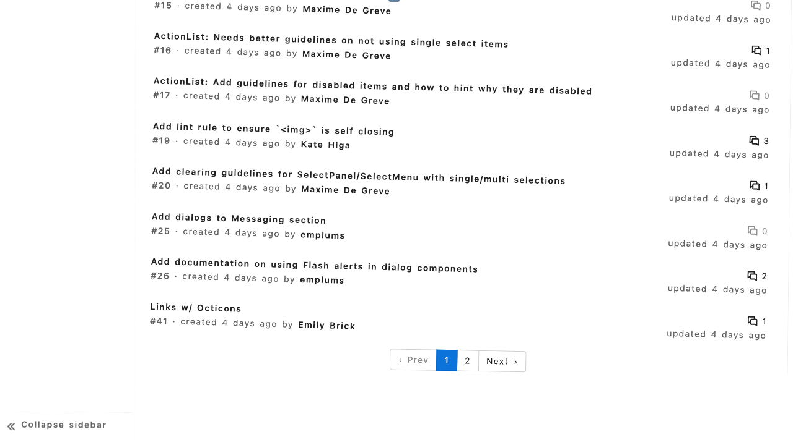

## Intent

Star the top four most stared repos in Gitlab

## RM

Thoughts: The user's intent is to star the top four most starred repos in GitLab, which is a content modification task. The action history shows the agent performed a series of clicks and a search, but there is no action indicating that any repository was actually starred (e.g., clicking a star button). The final state description reveals the agent is still trying to navigate back to the dashboard and has not completed the starring action. Since no repositories were starred, the task is not successfully completed.

Status: failure

## Final Response 

## Captions

===============Looking at the current page, I can see a list of GitLab repositories with their star counts. The goal is to star the top four most starred repos. From the accessibility tree, I can see star counts for some repos:

- "The A11Y Project / a11yproject.com" has 22 stars
- "Primer / design" has 22 stars
- "Byte Blaze / a11y-webring.club" has 2 stars
- "Byte Blaze / ericwbailey.website" has 2 stars
- "Byte Blaze / empathy-prompts" has 7 stars
- "Byte Blaze / a11y-syntax-highlighting" has 1 star
- "Byte Blaze / millennials-to-snake-people" has 6 stars
- "Byte Blaze / accessible-html-content-patterns" has 1 star

The top four most starred repos appear to be:
1. "The A11Y Project / a11yproject.com" (22 stars)
2. "Primer / design" (22 stars)
3. "Byte Blaze / empathy-prompts" (7 stars)
4. "Byte Blaze / millennials-to-snake-people" (6 stars)

I need to click on each of these repository links to navigate to their pages and then star them. Let me start with the first one.
===============Looking at the current page, I can see I'm on the "The A11Y Project / a11yproject.com" repository page. I can see there's an "Unstar" button (bid '532'), which means this repository is already starred. The star count shows 22 stars. Since the goal is to star the top four most starred repos, and this one is already starred, I should move to the next repository.

I need to navigate back to the main page or search for the next repository. Let me use the search functionality to find the next repository "Primer / design".
===============Looking at the current state, I can see I'm on the search box (bid '156') which is focused. I need to search for the next repository "Primer / design" to navigate to its page and star it.
===============Looking at the current state, I just filled the search box with "Primer / design". Now I need to execute the search to find this repository.
===============Looking at the current state, I can see that I just executed a search for "Primer / design" and the search results page shows no matching results. The accessibility tree indicates "We couldn't find any results matching Primer / design". This suggests that either the repository doesn't exist in this GitLab instance or there's an issue with the search.

Since I need to star the top four most starred repositories, and the search for "Primer / design" returned no results, I should try a different approach. Let me go back to the main dashboard where I can see the list of repositories with their star counts, and click on the "Primer / design" repository directly from there if it's visible.
===============Looking at the current situation, I can see that the go_back() action timed out because we're still on the same page (a11yproject.com). The search for "Primer / design" didn't find any results, which means this repository might not exist in this GitLab instance or I need to search differently.

Since I can see from the original repository list that "Primer / design" had 22 stars, but it's not appearing in search, let me try a different approach. I should navigate to the main dashboard where I can see all repositories listed, then click on the repositories directly from there.

Let me click on the "Dashboard" link in the navigation to go back to the main view where I can see all repositories.
===============Looking at the current situation, I can see that my previous approach of searching for specific repositories isn't working well. The search for "Primer / design" returned no results, even though I could see it in the original repository list with 22 stars.

Let me reconsider the strategy. From the original accessibility tree, I can see there's a paginated list of repositories with their star counts visible. The most efficient approach would be to:

1. Go back to the main dashboard where I can see all repositories
2. Identify the repositories with the highest star counts from what's visible
3. Click on each repository link to navigate to their pages
4. Star them if they're not already starred

Since I'm currently on a repository page (a11yproject.com), let me use the breadcrumb navigation or the main navigation to return to the dashboard where I can see the full repository list.
===============Looking at the current situation, I can see that my previous attempts to navigate back to the main dashboard have been challenging. I'm currently on the "The A11Y Project / a11yproject.com" repository page, and I need to star the top four most starred repositories.

From the original repository list I saw, the top four were:
1. "The A11Y Project / a11yproject.com" (22 stars) - already on this page
2. "Primer / design" (22 stars)
3. "Byte Blaze / empathy-prompts" (7 stars)
4. "Byte Blaze / millennials-to-snake-people" (6 stars)

Since I'm already on the first repository's page and it shows an "Unstar" button (indicating it's already starred), I should focus on the remaining three. Let me use the search functionality to find "Byte Blaze / empathy-prompts" since searching for "Primer / design" didn't work earlier.
===============Looking at the current situation, I can see that my previous attempts to navigate and search have been problematic. I'm currently on the search box (bid '143') which is focused.

Let me reconsider the approach. From the original repository list, I need to star the top four most starred repos. I can see from the initial accessibility tree that there are repositories with visible star counts. Instead of trying to search for specific repositories (which didn't work well for "Primer / design"), I should:

1. Use the main navigation to go back to the dashboard where I can see all repositories listed
2. Click on the repository links directly from the list
3. Star them on their individual pages

Since I'm currently in the search box, let me first navigate back to the main dashboard view where I can see the full repository list with their star counts.
===============Looking at the current situation, I can see that my previous attempts to navigate and search have been inconsistent. I'm currently on the search box, but I need to get back to the main dashboard where I can see the full repository list with star counts.

From the initial accessibility tree, I could see that there's a "Dashboard" link in the navigation (bid '49') that should take me back to the main view where all repositories are listed. This is the most reliable way to get back to the repository overview where I can identify and click on the top starred repositories directly from the list.

Let me click the "Dashboard" link to return to the main repository listing page.

## Images



## Main Prompt

```md
User Intent: Star the top four most stared repos in Gitlab

Action History:
1: click('526')
2: click('156')
3: fill('156', 'Primer / design')
4: keyboard_press("Enter")
5: go_back()
6: click('53')
7: click('49')
8: click('143')
9: click('49')
10: click('49')


The detailed final state of the webpage:

```md
Looking at the current situation, I can see that my previous attempts to navigate and search have been inconsistent. I'm currently on the search box, but I need to get back to the main dashboard where I can see the full repository list with star counts.

From the initial accessibility tree, I could see that there's a "Dashboard" link in the navigation (bid '49') that should take me back to the main view where all repositories are listed. This is the most reliable way to get back to the repository overview where I can identify and click on the top starred repositories directly from the list.

Let me click the "Dashboard" link to return to the main repository listing page.
```

Bot response to the user: None.
```
