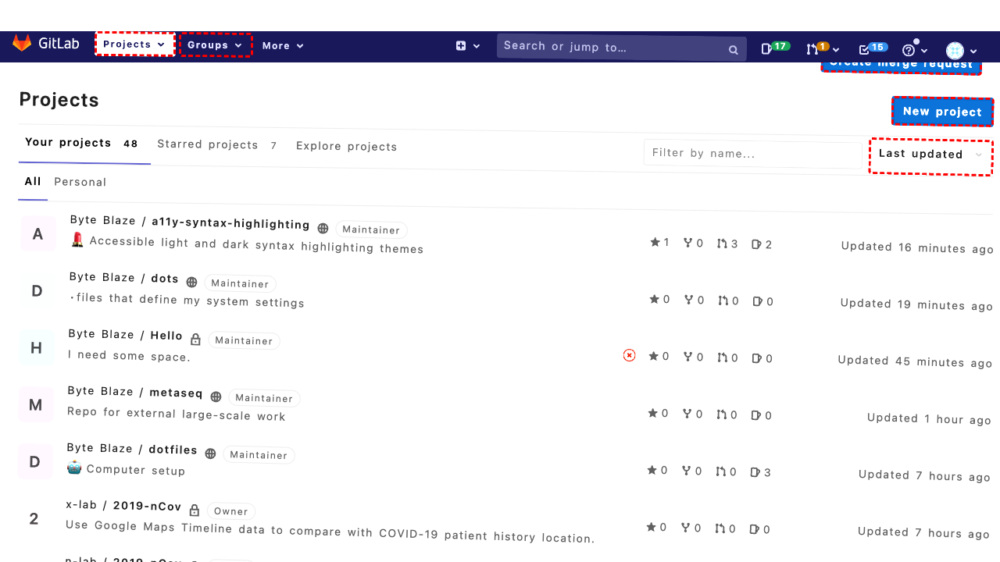
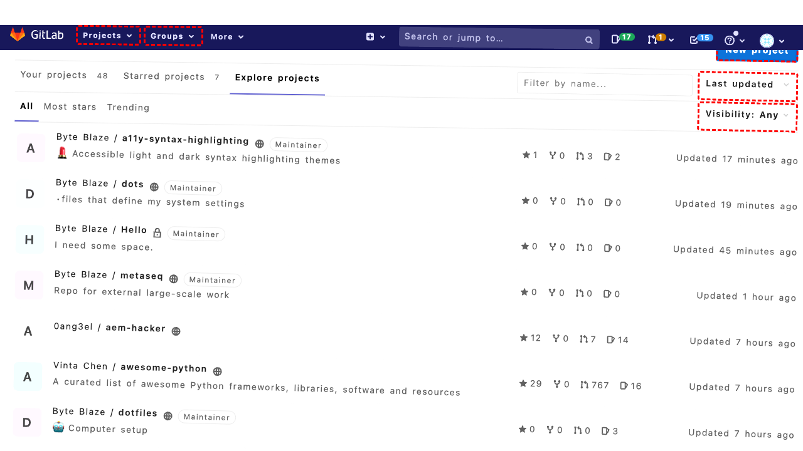
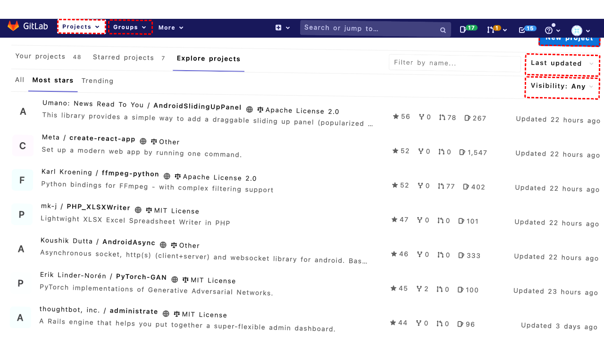
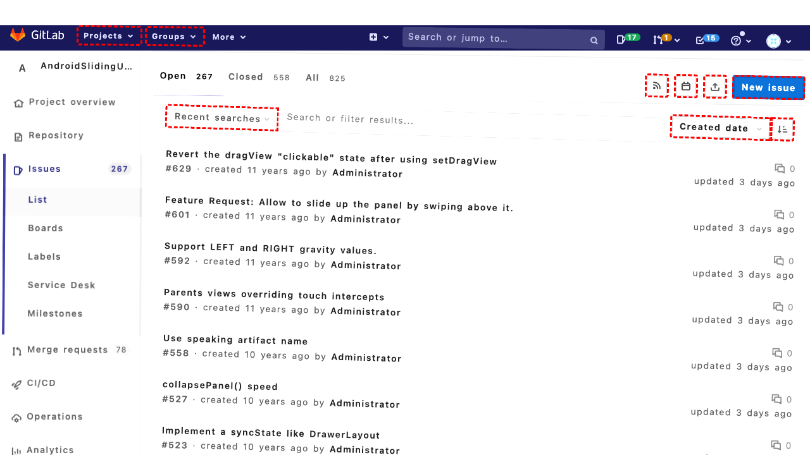
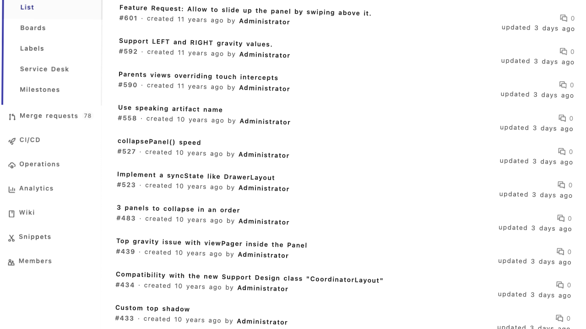
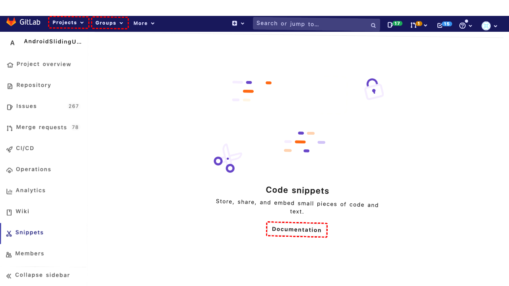

## Intent

Star the top eight most stared repos in Gitlab

## RM

Thoughts: The user's intent is to star the top eight most starred repos in Gitlab, which is a content modification task. The action history shows the agent performed a series of clicks and one scroll, but the final state indicates only the first project was successfully starred, and the agent encountered an error with the second star button. The agent's internal reasoning mentions needing to scroll to make more projects visible and planning to continue, but the action history does not show successful starring of eight repos. Since the task requires modifying content (starring eight repos) and the final state confirms only one was starred, the execution is incomplete and thus a failure.

Status: failure

## Final Response 

## Captions

===============Looking at the current page, I can see a list of GitLab projects but I need to find the top eight most starred repos. The current view shows various projects but doesn't clearly display star counts for all of them. I can see some projects have star counts (like "Byte Blaze / a11y-syntax-highlighting" has 3 stars, "Byte Blaze / empathy-prompts" has 9 stars), but I need a better way to identify and sort by star count.

I should navigate to the "Explore projects" section which typically shows projects sorted by popularity/stars, or use the search functionality to find the most starred repositories.

Let me first click on "Explore projects" to see if that gives me a better view of popular projects.
===============Looking at the current page, I can see that I'm already on the "Explore projects" page (based on the URL and page title), but the projects aren't sorted by star count. I need to sort the projects by "Most stars" to identify the top eight most starred repositories. I can see there's a "Most stars" link in the list that should sort the projects accordingly.

Let me click on the "Most stars" link to sort the projects by star count.
===============Looking at the current page, I can see that I've already navigated to the "Explore projects" page and clicked on "Most stars" to sort by star count. Now I need to identify the top eight most starred repositories from the list and star them.

From the accessibility tree, I can see several projects with their star counts displayed (like "Meta / create-react-app" with 1,547 stars, "Keycloak / keycloak" with 1,604 stars, etc.). The projects appear to be sorted by star count in descending order, with the highest starred projects at the top.

I need to star the first eight projects in this list. I can see star buttons next to each project (represented by image elements). Let me star the first project by clicking its star button.
===============Looking at the current state, I can see I'm on a GitLab issues page for a specific project (AndroidSlidingUpPanel), not on the "Explore projects" page where I was trying to find the most starred repositories. The history shows I was attempting to navigate to explore projects and sort by stars, but I seem to have ended up on a different page.

I need to navigate back to the main GitLab dashboard or explore page to find the most starred repositories. From the accessibility tree, I can see there's a "Dashboard" link at the top that should take me to the main dashboard where I can then navigate to explore projects.

Let me click the "Dashboard" link to get back to the main page.
===============Looking at the current state, I can see I'm on a GitLab dashboard page showing various projects, but I need to find the top eight most starred repositories. The current view doesn't show star counts clearly for all projects, and I need to navigate to a page where I can see projects sorted by star count.

From the accessibility tree, I can see there's a "Explore projects" link that should take me to a page where I can find and sort popular projects. Let me click on that to get to the explore page.
===============Looking at the current state, I can see I'm on the "Explore projects" page, but the projects aren't sorted by star count yet. I need to sort them by "Most stars" to identify the top eight most starred repositories. From the accessibility tree, I can see there's a "Most stars" link in the list that should sort the projects accordingly.

Let me click on the "Most stars" link to sort the projects by star count.
===============Looking at the current state, I can see I'm on the "Explore projects" page and have just clicked "Most stars" to sort by star count. The page should now display projects in descending order of star count. From the accessibility tree, I can see several projects with their star counts displayed (like "Meta / create-react-app" with 1,547 stars, "Keycloak / keycloak" with 1,604 stars, etc.).

Now I need to star the top eight most starred repositories. I can see star buttons represented by image elements next to each project. Let me start by starring the first project in the list by clicking its star button.
===============Looking at the current state, I can see I'm on the "Explore projects" page sorted by "Most stars" and I've just clicked to star the first project. Now I need to continue starring the next seven most starred repositories to complete the goal of starring the top eight most stared repos.

From the accessibility tree, I can see the projects are listed with their star counts, and I should continue clicking the star buttons for the next seven projects in the list. Let me star the second project.
===============Looking at the error message, it seems the star button for the second project wasn't visible and couldn't be scrolled into view. This suggests I may need to scroll down to see more projects or the page layout has changed. Let me first scroll down to ensure all the top projects are visible, then continue starring the remaining top repositories.
===============Looking at the current situation, I can see I'm on the "Explore projects" page sorted by "Most stars" and have successfully starred the first project. The error with the second star button suggests I need to scroll to make more projects visible. After scrolling, I should continue starring the remaining top repositories to reach the goal of starring the top eight most starred repos.

Let me continue with the third project now that I've scrolled to make more content visible.

## Images









## Main Prompt

```md
User Intent: Star the top eight most stared repos in Gitlab

Action History:
1: click("298")
2: click("327")
3: click("375")
4: click("74")
5: click("298")
6: click("327")
7: click("375")
8: click("410")
9: scroll(0, 300)
10: click("445")


The detailed final state of the webpage:

```md
Looking at the current situation, I can see I'm on the "Explore projects" page sorted by "Most stars" and have successfully starred the first project. The error with the second star button suggests I need to scroll to make more projects visible. After scrolling, I should continue starring the remaining top repositories to reach the goal of starring the top eight most starred repos.

Let me continue with the third project now that I've scrolled to make more content visible.
```

Bot response to the user: None.
```
