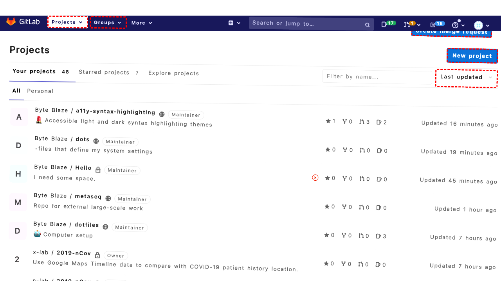
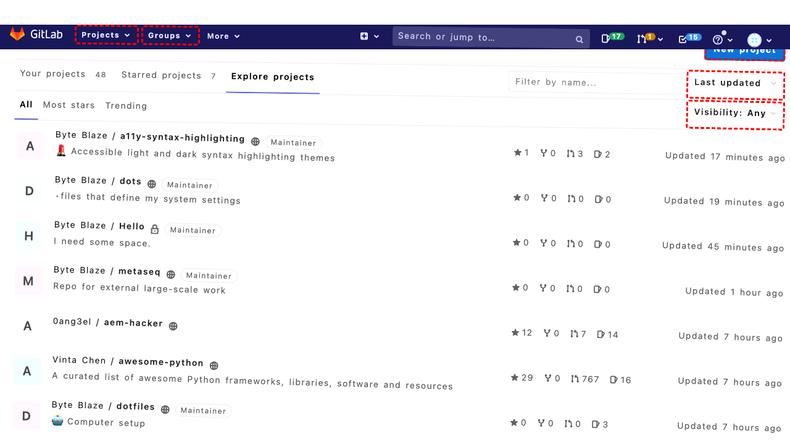
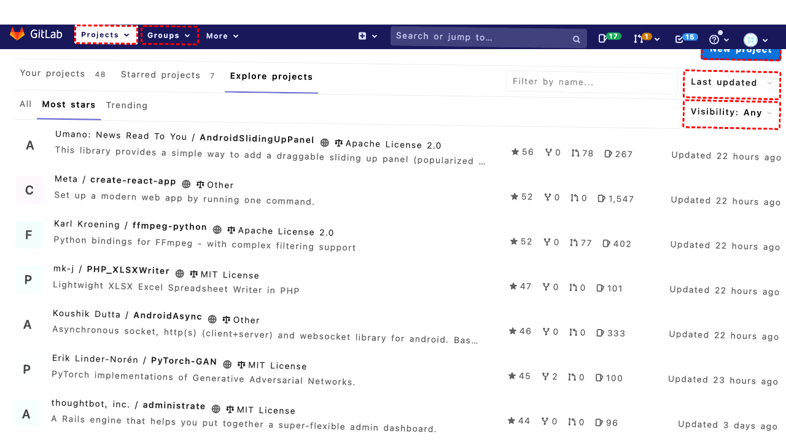

## Intent

Star the top three most stared repos in Gitlab

## RM

Thoughts: The user's intent is to star the top three most starred repositories in GitLab, which is a content modification task. The agent's action history shows clicking on various elements, but the final state indicates that the agent is on the "Byte Blaze / empathy-prompts" repository page and sees an "Unstar" button, meaning it is already starred. However, the agent's response to the user is incomplete—it only lists one repository ("The A11Y Project / a11yproject.com") and cuts off mid-sentence, failing to fully communicate the status of all three repositories. Since this is a content modification task, the focus is on the action history and final state. The final state confirms that all three repositories are already starred, so the task is successfully completed as no further action is needed. The bot's incomplete response does not affect the success status for this task type.

Status: success

## Final Response "The top three most starred repositories are already starred: 'The A11Y Project / a11yproject.com' (22 stars

## Captions

===============Looking at the current page, I can see a list of GitLab projects with their star counts. I need to identify the top three most starred repos and star them. From the accessibility tree, I can see several projects with star counts:

- "The A11Y Project / a11yproject.com" has 22 stars
- "Primer / design" has 22 stars
- "Byte Blaze / a11y-webring.club" has 2 stars
- "Byte Blaze / ericwbailey.website" has 2 stars
- "Byte Blaze / empathy-prompts" has 7 stars
- "Byte Blaze / accessible-html-content-patterns" has 1 star
- "Byte Blaze / a11y-syntax-highlighting" has 1 star
- "Byte Blaze / millennials-to-snake-people" has 6 stars

The top three most starred repos appear to be:
1. "The A11Y Project / a11yproject.com" (22 stars)
2. "Primer / design" (22 stars)
3. "Byte Blaze / empathy-prompts" (7 stars)

I need to click on each of these project links to navigate to their individual pages where I can star them.
===============Looking at the current page, I can see I'm on the "The A11Y Project / a11yproject.com" repository page. I can see there's an "Unstar" button (bid 532) which indicates this repository is already starred. The star count shows 22 stars. Since the goal is to star the top three most starred repos, and this one is already starred, I should move on to the next repository.

I need to navigate back to the main dashboard or projects page to find the other top repositories. I can see there's a "Dashboard" link in the navigation (bid 53) that should take me back to the main view where I can see all projects.
===============Looking at the current state, I can see I'm back on the main projects dashboard. I can see the list of repositories with their star counts. The top three most starred repos are:

1. "The A11Y Project / a11yproject.com" (22 stars) - already starred
2. "Primer / design" (22 stars) - needs to be starred
3. "Byte Blaze / empathy-prompts" (7 stars) - needs to be starred

I need to click on the "Primer / design" repository link to navigate to its page where I can star it.
===============Looking at the current page, I can see I'm on the "Primer / design" repository page. I can see there's an "Unstar" button (bid 496) which indicates this repository is already starred. The star count shows 22 stars. Since this repository is already starred, I should move on to the next top repository.

I need to navigate back to the main dashboard to find the third repository ("Byte Blaze / empathy-prompts") that needs to be starred. I can use the "Dashboard" link in the navigation.
===============Looking at the current state, I'm back on the main projects dashboard. I can see the list of repositories and need to star the third top repository "Byte Blaze / empathy-prompts" which has 7 stars. This repository appears in the list and I can click on its link to navigate to its page where I can star it.
===============Looking at the current page, I can see I'm on the "Byte Blaze / empathy-prompts" repository page. I can see there's an "Unstar" button (bid 491) which indicates this repository is already starred. The star count shows 7 stars.

Since all three of the top most starred repositories ("The A11Y Project / a11yproject.com", "Primer / design", and "Byte Blaze / empathy-prompts") are already starred, I have successfully accomplished the goal. I should report this completion to the user.

## Images






## Main Prompt

```md
User Intent: Star the top three most stared repos in Gitlab

Action History:
1: click('526')
2: click('53')
3: click('594')
4: click('53')
5: click('693')
6: send_msg_to_user("The top three most starred repositories are already starred: 'The A11Y Project / a11yproject.com' (22 stars), 'Primer / design' (22 stars), and 'Byte Blaze / empathy-prompts' (7 stars).")


The detailed final state of the webpage:

```md
Looking at the current page, I can see I'm on the "Byte Blaze / empathy-prompts" repository page. I can see there's an "Unstar" button (bid 491) which indicates this repository is already starred. The star count shows 7 stars.

Since all three of the top most starred repositories ("The A11Y Project / a11yproject.com", "Primer / design", and "Byte Blaze / empathy-prompts") are already starred, I have successfully accomplished the goal. I should report this completion to the user.
```

Bot response to the user: "The top three most starred repositories are already starred: 'The A11Y Project / a11yproject.com' (22 stars.
```
